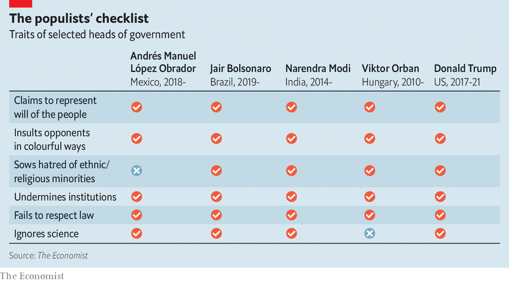
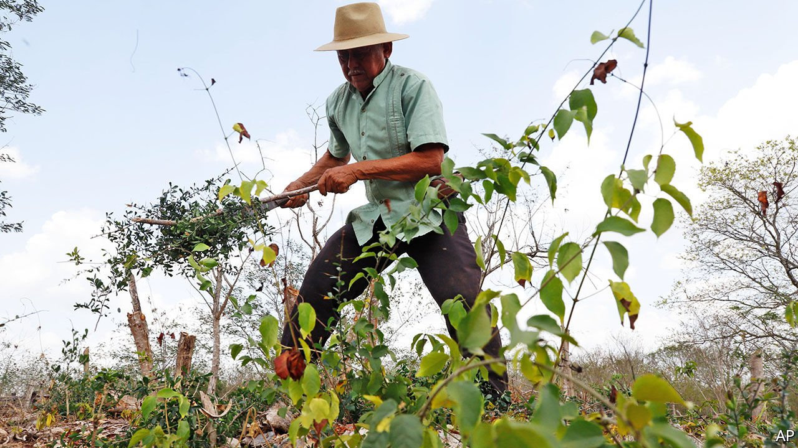
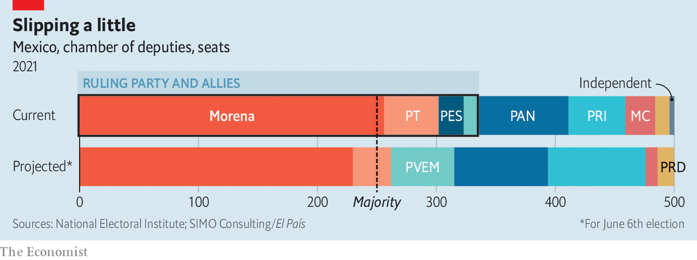

###### The puritan from Tepetitán

# Mexico’s populist president faces a crucial test in elections in June 

##### The vote could either curb him or empower him to take Mexico back to the 1970s 

 

> May 27th 2021 

THE PLAQUE beneath a bust of President Andrés Manuel López Obrador in his home town proclaims him “the face of hope” and a “tireless fighter for the rights of Mexicans”. That is certainly how the people there see him.

“Andrés Manuel is different,” says Heberto Priego Colomé, a pensioner sitting in the shade in Tepetitán, a settlement of 2,000 souls in Tabasco state in southern Mexico. “He’s normal. He’s sincere. He talks to the people.” He has also “sent lots and lots of help”. The old man gestures to a fancy new plaza with a basketball court and a diving board from which younger folk can plunge into a river. When the president visited, he threw a party on the plaza.


Mr Priego Colomé ticks off other benefits Tepetitán’s favourite son has brought: bigger public pensions, a training programme for the young, a scheme whereby old rural folk are paid to plant trees, and a new refinery that will bring jobs to Tabasco. When the river flooded last year, the president sent every household in the affected areas a fridge, a mattress, a stove, a fan, some pans and a blender, plus 8,000 pesos ($400). Some had received 10,000 pesos after earlier floods.

Mr López Obrador is not a conventionally skilled orator. He rambles and repeats himself. But he connects with Mexico’s have-nots and makes them feel seen and respected. Rarely has a Mexican president attracted such adulation—and loathing. To his supporters, who are largely rural, hard-up or old, he is the first national leader since the 1930s who truly cares about them. To his detractors, he is an incompetent demagogue who could drag Mexico back to its pre-democratic past.

At elections on June 6th Mexicans will have a chance to endorse one or other of these views. Mr López Obrador is not on the ballot—he is not halfway through his six-year term. But they will be voting for the lower house of the national legislature, 15 state governorships, 30 out of 32 state assemblies and thousands of local posts such as mayor. Voters can either boost Mr López Obrador’s party, Morena, or clip its wings.

Mr López Obrador has attracted far less global attention than other populist leaders. But look closer and he appears astonishingly similar to them (see table). In his eyes, Mexicans fall into two groups: the people, whose authentic will he represents, and the elite, who are to blame for all Mexico’s ills. He sees himself as on a historic mission to sweep away the rotten habits of the past and establish a republic of virtue.

 


If he is on a mission from God, his opponents must be working for the other side, and he lets them know it. Mr López Obrador’s predecessor, Enrique Peña Nieto, is a “spineless, immoral, unpredictable sycophant”. Others he has called “apprentice pickpocket” or “reverend thief”. In his daily two- to three-hour-long press conferences, he blasts individuals, such as critical journalists. Some have received death threats from his supporters.

He is ostentatiously austere. On assuming office, he halved the presidential salary and put the presidential jet up for sale; he flies economy class. The poor applaud such gestures. But by cutting his own pay, he also cut that of top civil servants; no government employee may earn more than the head of state. Many of the best-qualified quit. “Mexico was building a civil service that was professional and serious. That’s now broken,” says Montserrat Ramiro, a former energy regulator. On May 25th the United States downgraded its rating of the safety of flying over Mexico, citing regulatory laxity. A buyer has yet to be found for the presidential plane.

Few would quarrel with Mr López Obrador’s diagnosis that too much of Mexico’s political class was corrupt and ignored the vast majority of Mexicans. His goals are good: to raise incomes, improve public services, cut crime and eliminate corruption. But criticisms that he selects the wrong policies to achieve them, implements them ineptly and tries to nobble any institution that gets in his way hit the mark.

Not his finest hour

Consider his record on covid-19. The official death toll is 220,000, which is bad enough. The Economist’s excess-death model estimates that as of May 10th, 477,000 more Mexicans had died than would normally be expected—a rate 68% higher than in Brazil, a bungler too.

The toll is partly down to Mexico’s crowded cities and overweight population. But a panel commissioned by the World Health Organisation also found “major deficiencies in decision-making” by the government. Mr López Obrador was slow to act, set aside too little money and slashed research funding. He failed to wear a mask in public and said Mexicans could curb the spread of the virus by not lying or stealing.

The infection rate is falling, but the human cost has been immense. Gregoria, who sells single cigarettes and tamales in Mexico City, says two of her brothers died of covid-19, aged 52 and 62. She adds that the pandemic has driven away her customers; the government has given her no help.

Mr López Obrador has done little to mitigate the economic impact of the pandemic because he is terrified of debt. A currency crisis in 1994 taught him that too much debt can cripple the government and let foreign creditors boss Mexico around. So his fiscal response to covid-19 has been among the most parsimonious in Latin America. Mexico’s credit rating remains tolerably firm. But more than 1m Mexican businesses went bust in the past two years. The economy shrank by 8.5% last year.

Even as bars remain open, schools have been closed for 14 months (some are reopening as teachers get jabbed). Teachers’ unions have strained to keep them shut. They are very powerful: in one state, Oaxaca, a union controls the distribution of federal funds to the state government. Mr Peña Nieto tried to curb the unions’ power. Mr López Obrador has restored it.

The president’s policies are an eclectic mix of statism, nationalism and nostalgia for the 1970s. Take energy. Back in the 1970s, oil prices were high and Mexico’s state oil monopoly was a mainstay of the economy, especially in Mr López Obrador’s home state. Like a boutique that stocks bell-bottoms, he is trying to revive a questionable old fashion. He has all but banned foreign investment in Mexican oil and is pouring cash into an $8bn refinery in Tabasco, to be run by Pemex, the mega-lossmaking national oil firm.

Mr López Obrador has ordered CFE, the state electricity provider, to buy state-generated power first, rather than the cheapest option. This is often from dirty oil—so high in sulphur that its use is banned in most ships. Cheaper, cleaner options exist, but these are usually produced by private and often foreign firms, which Mr López Obrador distrusts. His policies have raised questions about $26bn of private investments already made in solar and wind energy in Mexico. This deters investors.

Fed up with bureaucratic delays, Mr López Obrador has turned to the army, which follows orders promptly. It now watches the border, runs ports, helps catch criminals, distributes textbooks and vaccines, and is building 2,700 branches of “the Bank of Wellbeing”, a state-run bank to disburse cash to the needy. Men in uniform are also building a hopelessly uneconomic $7bn railway loop around his home state, paid for by the taxpayer. On completion the army will own it and pocket the income. For now the army is relatively clean—and respected. That may change if its leaders are tempted by the vast sums of money they suddenly control.

Mr López Obrador’s crusade against corruption has been selective. He has imposed tougher punishments for bribe-taking officials and clamped down on firms that sell facturas (bills that can be used for tax deductions). However, fewer government contracts are put out to tender than in the past. Mexicans tell pollsters they are asked to pay bribes as much as before.

The president’s vow to curb violence has proved hollow, too. The murder rate, five times that of the United States, has barely budged. Gangs control huge swathes of territory, corrupt the police and pull the strings of local mayors.

Could try harder

It is not Mr López Obrador’s fault that drugs are illegal in the United States, nor that this generates vast profits for Mexican criminals. Nonetheless, his efforts to stem the mayhem have been limp. He blames poverty for crime, and promises to create more jobs for the young. But at the same time he has replaced the federal police with a more militarised outfit, the National Guard, under command of the army.

Under the slogan of “hugs, not bullets”, he has taken a soft approach to gangs. In 2019 he freed a drug kingpin’s son, hoping to buy a respite from the killing. He did not get one. The implied message to the gangs has been “You can do what you like and we won’t ask for anything in return,” says Jorge Castañeda, an ex-foreign minister.

For many, Mr López Obrador’s gravest flaw is disregard for the rule of law. He cancelled a half-built new airport for Mexico City. After the decision was challenged in court, he called an unlawful referendum, in which a tiny electorate gave him a green light. Claiming that the people had spoken, he pressed ahead.

This has become a habit. He used a similar plebiscite to “approve” a gas pipeline, and another to halt construction of an American-owned brewery. Such shenanigans appal business folk. “We have lost certainty for investment, and for the future of Mexico as a democracy,” says one. Foreign direct investment (FDI) should be booming, as firms scramble to diversify their supply chains away from China. Mexico has a sophisticated industrial base and the world’s biggest national market on its doorstep, where demand for manufactured goods has been strong in the past year and which is starting a post-lockdown boom. Yet FDI has fallen under Mr López Obrador. A rise in the first quarter of this year included few new projects. “Firms are investing only to maintain existing projects,” says Luis Rubio, an economist.

A bad way to run things

Mr López Obrador is trying to inject the “people’s will” into criminal justice, too, proposing a referendum on whether to prosecute five of his predecessors for corruption. He has also pressed an independent-minded judge to resign and signed a law extending the term of the friendly chief justice of the Supreme Court. The court will rule as to whether this is legal—which it plainly is not. Mr López Obrador’s critics fear he is trying to set a precedent. For a Mexican president to stand for a second term is taboo. But what if he were merely to extend his first term, perhaps claiming that the people demanded it?

Mr López Obrador assails institutions as eagerly as children thwacking a piñata. He stifles the media by leaning on businesses not to advertise in critical outlets. He cuts the budgets of recalcitrant agencies. He wants to abolish INAI, the transparency agency, arguing that such a body is unnecessary when the president is an honest fellow like himself. He has threatened the institute that oversees elections, too. Critics fear he will do away with it and have elections run by the presidential office.

His social programmes have done some good. His pensions rises and the minimum wage have helped many. His schemes to support young and rural people are well-meaning. Some 330,000 Mexicans aged 18-29 get 4,310 pesos a month through year-long apprenticeships. Over 420,000 old rural folk are paid to plant trees.

Yet both programmes are badly designed. Some farmers chop down trees so they can be paid to plant more. Some plant species that wilt in the local soil. The youth programme is chaotic. No one checks if the young people receiving cash are actually learning anything. Some employers demand kickbacks. The handouts are portrayed as personal gifts from the president.

His economic record is dismal. Some economists predict real GDP per person will be lower at the end of his term than at the beginning. Mexico should be doing far better. Joe Biden’s stimulus should turbocharge Mexican exports, even as Mexican emigrants send chunks of their stimulus payments back home. The country’s economic sluggishness is the fault of “covid, not our policies”, says Claudia Sheinbaum, the ruling-party mayor of Mexico City. On May 21st Mr López Obrador said he planned to replace the respected central-bank governor with an (unnamed) economist “strongly in favour of moral economics”.

 


On a collapsed overpass in Mexico City, someone has scrawled: “Was it worth the bribe?” At least 26 people died when a train fell off it in May. Bystanders speculate that someone took a backhander to ignore shoddy construction or maintenance. “It had cracks. You could see them,” fumes Gabriel Gonzáles, a local taco seller. He complains about rising prices, the baleful effect of covid-19 on his business, and the lack of government support. The president’s party, Morena, “is as bad as the rest of them,” he grumbles.

The election on June 6th may not deliver as big a blow to the president’s party as it deserves. To oversimplify, it hinges on whether Mr López Obrador’s personal popularity outweighs his woeful record. His approval rating is a healthy 61%, yet polls show most Mexicans are unhappy about the economy, public safety and corruption.

Morena is less popular than the president. It is ahead of its rivals in the polls, but its lead is slipping. A few months ago its leaders said they expected to win a two-thirds majority of the 500 federal deputies, a dozen of the 15 governor races and the vast majority of the local congresses. Now they are tempering expectations.

The campaign has been dirty. The opposition say it is no coincidence that, when Morena’s candidate for governor of the rich northern state of Nuevo León flagged in the polls, the attorney-general opened criminal cases against the two leading opposition candidates. More than 30 candidates have been murdered.

 


Nonetheless Mr López Obrador is expected to keep control with the help of allied parties (see chart). The opposition—the Institutional Revolutionary Party (PRI), which ruled Mexico for seven decades until 2000, and the National Action Party (PAN)—are a mess. Given Mr López Obrador’s record, they should be doing far better. But neither has worked out why the president is so popular. (It is because previous regimes were so self-serving and out of touch.) Neither offers a compelling vision. A newer party, the centre-left Citizens’ Movement (CM), shows more promise. It controls Jalisco and may win Nuevo León; together, these big industrial states generate 15% of GDP.

Going rogue

The opposition’s greatest fear has been that Mr López Obrador might win enough power to change the constitution. For that, he would need two-thirds of both houses of the legislature and a majority of state legislatures. That seems unlikely: he does not have a majority in the upper house, whose seats are not in play in this election. But his critics now worry that if he does badly at the polls, he may double down on extralegal means of transforming the country.

His party will dominate the poorer states of the south. The opposition will dominate the richer north. More than ever, there will be two Mexicos: one, a dynamic and integrated part of North America; the other, remote, backward and resentful. And one charismatic politician, sure of his own righteousness, will be stirring up rage for at least three more years. ■

