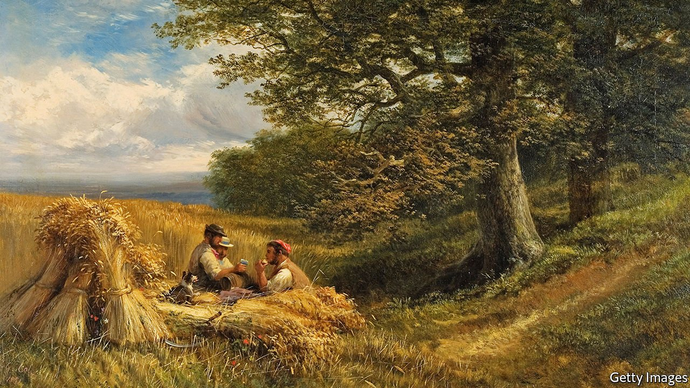

###### Literature and society

# A drive to make nature writing more working-class 

##### It has been bourgeois since John Clare 

 

> May 27th 2021 

“WE CAN SEE cow parsley,” says the nature writer Natasha Carthew, standing next to the river in Bath. “Nettles, thistle…” Today, however, Ms Carthew is more interested in a different species: the modern nature writer. This breed, she says, can be recognised by its distinctive winter coat (a “tweed jacket”); by its “lamenting” cry as it talks about sunsets and whatnot; and by its frequent appearance in particular habitats, namely “the moors, the Lakes, the Peaks” and “the Robert Macfarlane table in Waterstones”.

The entire publishing industry has been colonised by the middle and upper classes. A study last year of literary types found that only 13% came from a working-class background. So Ms Carthew has launched the “Nature Writing Prize for working-class writers”, now in its second year, to “burst the stereotype of what it means to be a nature writer” and allow other species to thrive.


Emoting in the open air might seem an egalitarian pursuit. Fields are free, while pens and paper cost mere pennies. It is not so simple, says Ms Carthew. One cannot wander lonely as a cloud if one is working in a call centre, and it is easier to write about the questing vole in a plashy fen if one owns the fen. Such accusations make the publishing industry squirm: like most liberal elites, publishers are happier to be seen as liberal than elite. Steps therefore are being taken. Surveys have been conducted, working-class networks have been launched, hands have been wrung. There remains an uncomfortably large number of people in the industry called Sophie.

The question of who actually is working class in Britain is tricky. The nature-writing prize is open to those who “self-identify” as working class. Partly, says Ms Carthew, this is “just easier. I’m not going to have a tickbox… Council house? Single parent?” Her approach also reflects a significant social and cultural change. For many Britons today, class is less a state of employment than a state of mind. Although the proportion of Britons employed in working-class jobs has declined in recent decades (it now hovers around 25%) a study conducted by academics at Oxford University found that the share of British people identifying as working class remains stable, at around 60%.

“We like to identify with groups that are viewed as disadvantaged. There is almost a one-downmanship with all this,” says Jonathan Rose, author of “The Intellectual Life of the British Working Classes”. For working-class nature writers however, history offers hope. Britain has a fine tradition of celebrating such authors, who were believed—with reason—to know their physical environment intimately. The poet John Clare may have been, as the subtitle of his books proclaimed, a “Northamptonshire Peasant Poet” but was wined and dined by literary London (he winced at the sound of his hobnailed boots on its marble floors).

Back at the river, Ms Carthew argues that widening access will widen the genre. She writes not merely about sublime sunsets but about concrete and crumbling railways. She points to a homeless shelter beside the river: “To me that’s nature.” The man within might, she suggests, be a poet too. When questioned by The Economist the man demurs. He is, he confirms, a passionate nature lover. He loves to watch the cormorants. He does not write about nature. “I just enjoy it. Because that’s what we’re supposed to do.”■

