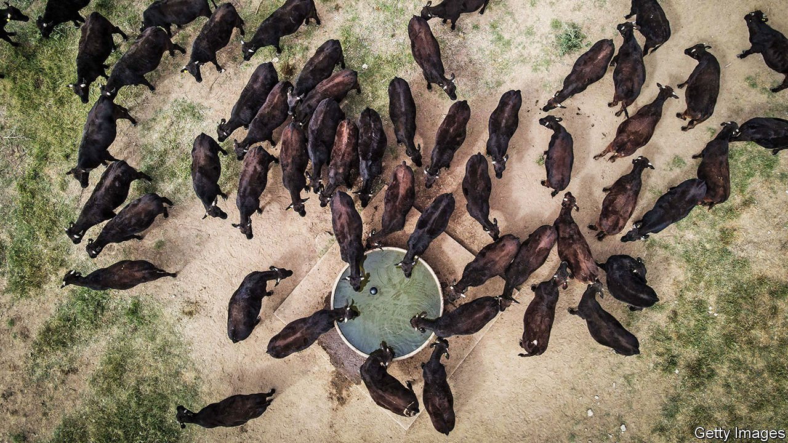

###### Free-trade deals

# Britain’s trade deals lack transparency 

##### A row over the latest, with Australia, shows why negotiators must be more open 

 

> May 29th 2021 

CABINET SPLITS always excite Westminster. So it proved after the Financial Times reported a bust-up between Liz Truss, the trade secretary, and George Eustice, the environment secretary, over a planned free-trade deal with Australia. At issue was Ms Truss’s desire to offer Australian beef-producers unlimited tariff- and quota-free access to the British market, upsetting Mr Eustice’s farmers. Minette Batters, president of the National Farmers’ Union, said such an agreement would throw British family farms “under a bus”. Boris Johnson eventually came down on Ms Truss’s side after invoking the free-trade heritage of another Conservative prime minister, Robert Peel.

The prime minister is right to have done so. Brexit has created an opportunity to escape the European Union’s  and to strike more adventurous trade deals with third countries. The Australians insisted on far more generous access for beef and lamb as the price of any agreement. And, as Ms Truss asked rhetorically: if Britain cannot strike a free-trade deal with an old friend like Australia, who can it do deals with?


For all the noisy opposition of farmers (especially in Northern Ireland, Scotland and Wales) the quantities involved are small. Ms Truss’s trade department estimates that the entire deal with Australia would add a maximum of just 0.02% to GDP in the long term. Last year Britain imported some 560 tonnes of beef and veal from Australia. Were that number to rise tenfold, as Australian producers hope, it would still be less than 3% of more than 200,000 tonnes imported from the EU each year. Ms Truss also promises a 15-year transition before tariffs and quotas are lifted in full. A more justifiable fear for British farmers, suggests Sam Lowe of the Centre for European Reform, a think-tank, is that the deal becomes a model for bigger future ones with Latin America and the United States. Yet such deals are far off and could be debated on their merits.

The argument has revealed the absence of a trade strategy. Brexiteers say they want free trade everywhere. Yet they remain shtum about the barriers erected with Britain’s biggest trading partner, the EU. Almost all the trade deals done by Ms Truss so far have been rollovers of those formerly in place through Britain’s EU membership. Australia would be the first significant new one. But why is the focus of such deals so much on farming (or in some cases fish), which are tiny shares of a GDP that is 80% composed of services? How is Britain going to lead the charge towards greater liberalisation of services trade around the world?

Indeed, argues David Henig of ECIPE, a think-tank focused on trade, it seems as if the only post-Brexit strategy is to sign free-trade deals as quickly as possible. That fosters a sense of desperation, which puts Britain in a weak bargaining position against some of the world’s toughest negotiators. The latest deal appears to be of greater benefit to Australia than it is to Britain. Just wait for the battle that is likely with the Americans, who take no prisoners in trade talks.

That points to another concern over the deal: the lack of transparency in negotiating it. Public support for free trade is often fragile, because producers who lose out shout louder than consumers who gain. Protests from special interests, greens and others have often sunk free-trade negotiations, ranging from Seattle in 1999 through Doha in 2008 to a planned transatlantic trade and investment partnership in 2016. Yet the British government conducts its negotiations, including those affecting controversial food-safety standards, largely in secret. Parliamentary scrutiny is allowed only after trade deals are signed.

The risk of this triggering a popular backlash against freer trade is all the greater because of the government’s reputation. Ms Batters’s adverse reaction to the Australian trade deal was so strong partly because she claims that Mr Johnson promised he would die rather than sell farmers down the river in order to secure trade deals. She is not the first, and will not be the last, to discover that the prime minister has a habit of making promises that he does not intend to keep.■

For more coverage of matters relating to Brexit, visit our 

