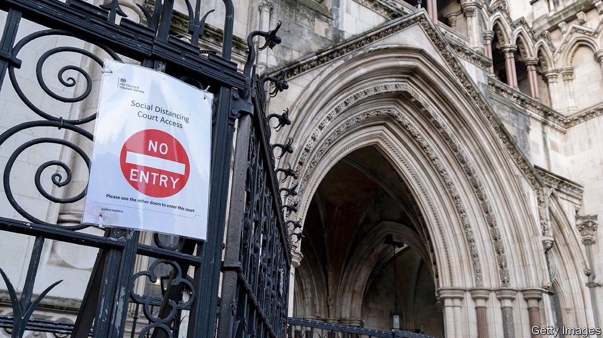

###### Zoom justice

# Covid-19 has pushed English lawyers online 

##### Not everybody is happy about that 

 

> May 29th 2021 

MORE THAN a year ago, a typical working day for Danielle Manson might have begun with a two-and-a-half-hour railway journey from London to Leeds. She might then travel to Bradford, before spending over three hours on the train back to London. At each stop she would rush into a court building, don a wig and spend 15 minutes deciding the parameters of an upcoming case.

Such a schedule never made much sense, and covid-19 made it impossible. But Ms Manson and the legal system as a whole have found ways to keep working over the past year, which are in some respects superior to what they did before. The year has served as an extended pilot for video-conferencing—something hitherto viewed with suspicion by a conservative judiciary. Ms Manson hopes that pre-trial administration, which accounts for half of her work, will remain online.


The Cloud Video Platform, a sort of Zoom for courts, was scheduled for a small-scale test before the pandemic struck. It quickly became widespread. Technologically disagreeable courtrooms and prisons were fitted with special kit. Before that happened, “it was like trying to run video-conferencing through old dial up Wi-Fi,” says one senior barrister. More than 20,000 hearings now use remote technology each week, up from 550 in March 2020, according to the Ministry of Justice. The technology has been used for everything from divorce proceedings to a 12-week High Court trial.

“Online justice is not secondary justice, it’s justice,” argues David Wolfson, the justice minister. “You don’t get justice from dust motes in the air, and you don’t get justice because there are wood panels on the walls.” Other supporters argue that online justice frees courtroom space for hearings that need to be conducted in person and enables barristers to be present at all of their trials. In Scotland jury trials have used video technology, with jurors watching cases unfold from the comfort of cinema seats. Jodie Blackstock of JUSTICE, a charity, argues that with the right technology online jury trials should be used in England and Wales, as remand prisoners will have their cases heard quicker.

The need for change is overwhelming. Thanks to a combination of covid-19 and government funding cuts that predate it, a backlog of cases waiting to be heard in the crown courts has reached more than 57,000. In December 2020 fully 15% of the prison population were people awaiting trial, up from 12% at the end of 2019. Judges worry that more cases will not reach conclusions: evidence is likely to be compromised the longer trials go unheard.

Not everyone is a believer. The Bar Council, which represents barristers, argues that interactions are less satisfactory online because cross-examination and assessing evidence are much harder. (“A lot of them are desperate thesps…and see the online platform as not providing the same opportunities,” says a sceptical observer.) Some want assurances that video hearings in the family courts will be drastically curtailed. A family barrister says that watching parents being separated from their children over the phone has been difficult. Barristers nonetheless believe that remote hearings should stick around for procedural work or short cases.

The technology is probably here to stay. The Police, Crime, Sentencing and Courts bill includes a clause to keep the new methods after the pandemic. It will also enable criminal courts to make use of new technology as it develops. Lord Wolfson’s vision is for Britain to create a platform for the online resolution of disputes, which will allow for tailored procedures for different sorts of trials. He hopes that other countries will copy it, and that this will reinforce the global clout of the English legal system. It is an ambitious idea. If technology only helps to clear a huge domestic backlog, that will be something.■

