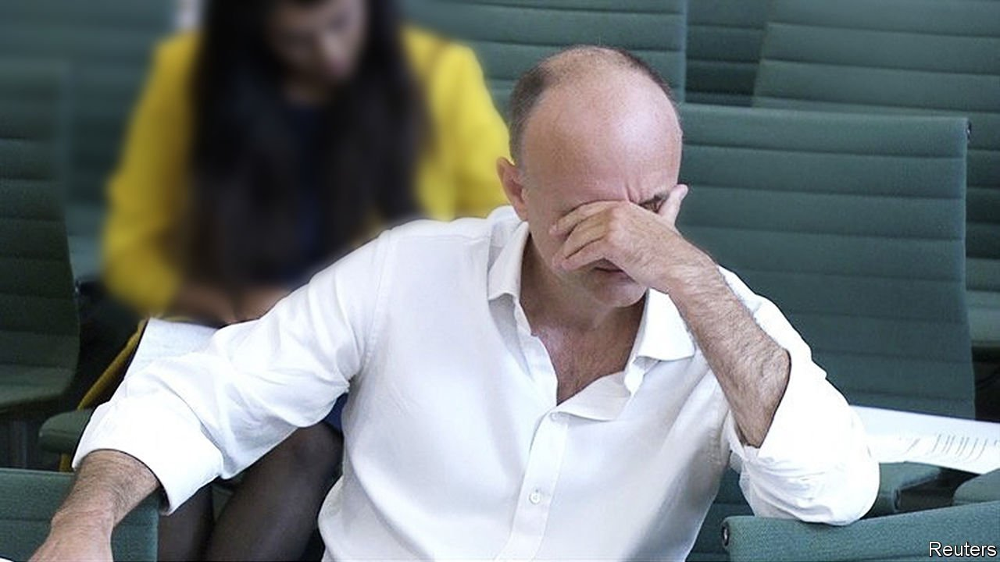

###### British politics

# Dominic Cummings takes aim at the British state 

##### The prime minister will try to shrug it off. Officials should listen 

 

> May 26th 2021 

IT WAS THE evening of March 13th last year when Helen MacNamara, one of the most senior officials in the British government, strode into Boris Johnson’s study. Fifty-four Britons had died from covid-19 and nearly 800 had tested positive. Ms MacNamara had just learnt that plans for such a situation, which were assumed to be extensive, did not exist. “I think we are absolutely fucked,” she declared. “I think we are going to kill thousands of people.”

That, at least, was the account given by Dominic Cummings, formerly Mr Johnson’s chief adviser, as he spoke on May 26th to a House of Commons committee investigating the government’s handling of the pandemic. His seven hours of testimony were the first on-the-record account of decision-making at the heart of government. Mr Cummings did not disappoint those who hoped for a savage attack on his erstwhile boss, with whom he parted ways in November. But he also offered a scathing assessment of the performance of the British state.


Mr Johnson was simply unfit for office, his former adviser argued. He lurched between policies “like a shopping trolley smashing from one side of the aisle to the other” and was occupied with his divorce, his finances and his fiancée, who went “completely crackers” at newspaper stories about her dog. Mr Johnson, who would later be hospitalised with covid-19, at first thought the virus was a “scare story” and wanted to be infected on television. For that reason, Mr Cummings said, he was kept away from early crisis meetings.

His more chilling analysis was that Britain’s scientific establishment, its civil service and the entire political system were incapable of dealing with the crisis. Matt Hancock, the health secretary, was accused of repeatedly lying about the extent of the government’s preparations. Top officials went skiing in February. When the system at last kicked into gear it was too late.

Many observers at the time described a populist government failing to “follow the science”. In fact, much of the scientific advice it received was dubious. Concluding that vaccines were some way off, and that Britons would not tolerate aggressive restrictions, scientific advisers saw “herd immunity” via mass infection as the only option. It took outside input—solicited by Mr Cummings from Demis Hassabis of DeepMind, an artificial-intelligence firm, and Sir Timothy Gowers, a mathematician—to force a change of plan.

Even when the right choices were made, organisational barriers got in the way. The Civil Contingencies Secretariat, the government’s emergency-planning unit, collapsed. Systems for furloughing workers, shielding the vulnerable and buying protective kit had to be designed from scratch. “There wasn’t even a plan to bury all the bodies,” Mr Cummings said. Officials tallied hospital figures using iPhone calculators. Meetings had to be moved from the cabinet-office situation room because security rules banned laptops.

It was damning testimony. On May 27th, Mr Johnson conceded that his government didn’t understand the risks posed by asymptomatic transmission, and acknowledged that the government had found the decision to impose lockdowns “incredibly difficult”. Events in elderly care homes had been “tragic”, he said. Mr Hancock denied that he’d lied about the pandemic, and in a retort to Mr Cummings, who left in November 2020, said the “operation and function” of government had been easier in recent months. Downing Street must now hope that Britons are in a forgiving mood. They might be, for the vaccination programme has been as impressive as the initial response was inept. Many want to forget the past year and enjoy the pub. Mr Cummings has made a career portraying himself as a hero battling the system, but he is now a figure of tabloid ridicule. Only 14% of Britons trust him to tell the truth, against 38% for Mr Johnson.

He is only the first to give evidence. Mr Hancock will appear before the same committee in a fortnight. Scientific advisers will speak at some point, too, with one open question being how far their advice was tailored to the prime minister’s libertarian instincts. Given Mr Cummings’s role in the Brexit referendum and the Tory election campaign, he bears heavy responsibility for the fact, which he bemoaned, that the political system forced a choice between Mr Johnson and Jeremy Corbyn, Labour’s former leader.

Witnesses to inquiries are not always saints. They often have scores to settle and failures to hide. Yet Mr Cummings’s analysis of the failings of the British state, particularly in the early stages of the pandemic, tallies with a large volume of evidence about those chaotic weeks. Such inquiries should not be measured by whether they “cut through with punters”, as Westminster jargon has it. They should be judged by whether they manage to change the system so the same mistakes are not made again. Seven exhausting hours of testimony should help to achieve that.■

Correction (May 27th 2021): This article originally misspelled Helen MacNamara’s name. Sorry

A version of this article was published online on May 26th 2021. It was updated on May 27th

