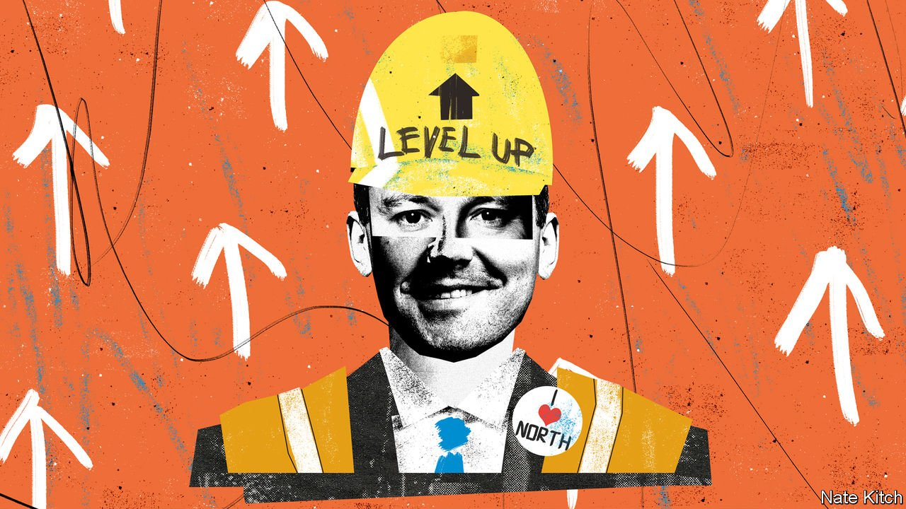

###### Bagehot

# The British government’s vague “levelling-up” idea gets a champion 

##### Can one of the Conservative Party’s cleverest MPs make sense of it? 

 

> May 27th 2021 

EVER SINCE he stood on the steps of Downing Street the day after his 2019 election triumph and promised to “unite and level up” the country, Boris Johnson has been tormented by the question of what “levelling up” means. What exactly is being “levelled up”—individual opportunities or entire regions? How can anybody tell if it is happening? Isn’t “levelling up” from Westminster and Whitehall a contradiction in terms? It is “a slogan without a purpose”, one Downing Street insider recently complained.

Lost in the recent fuss about Carrie Symonds’s over-the-top wallpaper and Dominic Cummings’s acid reflux is the fact that Mr Johnson is at last attempting to make sense of levelling up. He has appointed a new adviser on the subject and given him the job of producing a “landmark” white paper later this year. Mr Levelling Up will head a small team in the Cabinet Office and work closely with Michael Gove, the Chancellor of the Duchy of Lancaster and a fount of ideas about rebalancing the country, and Sir Michael Barber, a former adviser to Tony Blair.


It would be tempting to dismiss this as just another empty gesture were it not for the man who has been appointed to do the job. Neil O’Brien is as close to the perfect candidate as you could get. He has been thinking about the subject for years, knows his way around the corridors of Westminster, Whitehall and, to a lesser extent, local government, and manages to be both optimistic and realistic. If anybody in today’s Tory party deserves to inherit David (now Lord) Willetts’s old title of “two brains”, it is Mr O’Brien.

When he received his last big promotion, to co-chairman of the Conservative Party’s internal think-tank, the Policy Board, the Yorkshire News described him as “a previously obscure MP whom even political obsessives would have struggled to identify”. In fact he has been a big figure within the Tory political machine for years. He directed the Policy Exchange think-tank and was a special adviser to George Osborne (as chancellor) from 2012 to 2016 and then to Theresa May (as prime minister). He has been MP for Harborough in the Midlands since 2017.

He gets on well with all factions in the party. He voted to leave the EU in 2016 and co-founded the hawkish China Research Group, but also keeps in touch with his old boss and panda-hugger, Mr Osborne. He believes that the Tories should fight harder to contain the “woke revolution rolling through western institutions”. But he has also fought a feisty Twitter war against professional culture-warriors such as James Delingpole who have tried to extend the war on woke to a war on masks and lockdowns.

Mr O’Brien started thinking about “levelling up” when the rest of his party was obsessed with Notting Hill Man and Woman. In 2014 he wrote a paper, “Northern Lights”, arguing that the Tories should venture beyond their southern comfort zone. In his years with Mr Osborne he was involved with the Northern Powerhouse project. Since becoming an MP he has formed a Levelling Up Taskforce with 40 others and has written a column for the Conservative Home website in which he often returns to the subject.

His fascination is rooted in personal experience. During his formative years he was surrounded by reminders of fading northern might. His parents were from Glasgow, one of the industrial engines of the British empire; he grew up in Huddersfield, a former Victorian boom town; and his brother moved to Liverpool, Britain’s leading example of economic decline.

Even the talented Mr O’Brien will struggle to make sense of his new portfolio. The prime minister wants him to think about the subject in the broadest possible terms. It is not just about promoting economic development in Britain’s poorer regions or spreading opportunities more evenly, but also about tackling inequalities in the provision of public services (particularly education, transport and law and order) and improving “pride in place” by sprucing up high streets and civic buildings. The job could easily spiral out of control or fall between the cracks in Whitehall. It is notable that other successful examples of driving change from Downing Street, such as Mr Blair’s education reforms, have focused on one department.

Moreover, Mr O’Brien’s most innovative ideas don’t mesh well with the orthodoxy in his party and in the Treasury. He believes in the power of manufacturing (“the view that manufacturing is a relic of the past is itself a relic of the past”). Manufacturing provides a larger proportion of the better-paid and more productive jobs in Britain’s poorer areas than in its richer ones: in the north-east the median wage in manufacturing is 22% higher than the average, for example. He is also a fan of the state’s ability to encourage innovation, citing the example of the Asian tigers, which have avoided many of Britain’s destabilising inequalities, and calls for more investment in the “D” rather than just the “R” side of research and development. It is easy to imagine Treasury officials blocking, diluting and otherwise subverting any such policies.

Our friend in the south

Yet Mr O’Brien will not be an easy man to sandbag. He knows his subject better than the Treasury mandarins or the party stick-in-the-muds: read him in Conservative Home debating precisely how to measure household income or running through the demography of the party’s new seats in the north. He has lots of levers to pull, from special grants (such as the Towns Fund and the Levelling Up Fund) to business funds. Many of his long-term passions, such as increasing infrastructure spending, raising capital allowances and shifting resources from the bloated university sector to the under-funded vocational sector are now mainstream in his party. And much levelling up can be achieved not by spending more but by stopping giving preferential treatment to the south-east, as Britain does in spending on research, transport infrastructure and housing. At the very least, the government’s “slogan without a purpose” is now a slogan with a powerful champion.■

