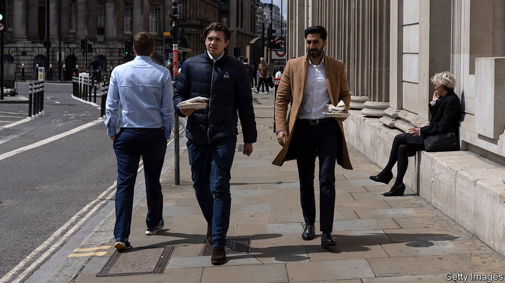

###### The City of London

# The Square Mile is a ghost town. It will stay that way 

##### But companies are beginning to adapt 

 

> May 29th 2021 

“PEOPLE ARE raring to get back in,” says Catherine McGuinness of the City of London Corporation, the municipal governing body for the financial district. “There’s a real atmosphere of excitement—we had some green shoots last summer, but now it just feels a lot more real.” The Lord Mayor talks of a growing light at the end of the tunnel.

Few places in the rich world have been more profoundly affected by covid-19, because few depend so heavily on commuters. In 1857 Building News, an architectural journal, declared that “except for business purposes, the City may be said to be now uninhabited”. These days fewer than 10,000 people make their homes in the Square Mile, although its pubs, restaurants and barbers were created to serve the 542,000 who normally work in the district. By comparison, New York’s somewhat larger financial district has 64,000 residents and 307,000 daily workers.


The Square Mile is quiet even compared with other parts of central London. In the West End, the number of people leaving Oxford Circus Underground station during the working week stands at 35% of the level in early March 2020, just before covid-19 struck. Bank station, in the City, is only 15% as busy as it was. Offices in the financial district are sitting empty. CBRE, a large property manager, puts the vacancy rate at 12.4%. The highest it reached after the financial crisis was 9.4%.

The City of London Corporation has created a £50m ($70m) fund to assist small businesses. It has also announced plans to build 1,500 new homes over the next decade. But its core recovery plan is to promote the City as a business hub, and entice white-collar workers back.

The success of Britain’s vaccination programme notwithstanding, that will be difficult. In New Zealand, almost a year after the lifting of most pandemic restrictions, 62% of financial-services employees say they are working at least one day a week from home, and 26% are not visiting their offices at all. Three economists, José María Barrero, Nicholas Bloom and Steven Davis, have studied American white-collar workers. They estimate that employees paid between $100,000 and $150,000 will spend 35% of their working hours at home. Those paid over $150,000 (which is true of many financial-services workers) will toil from home 43% of the time—just over two days a week.

Although a few banks such as JP Morgan and Goldman Sachs are hounding employees back into offices, most firms in London expect a blend of home and office working. But that will be hard to implement. Nick South of the Boston Consulting Group points out that because few white-collar workers are members of just one team, it is hard to draw up rotas that allow for both face-to-face collaboration and remote work. Employees may end up dialling in by default. And employee surveys routinely show that some people are extremely reluctant to return to the office. “You ignore these people at your peril,” says Mr South.

One clue to how London’s financial-services firms will respond comes from the property market. Mat Oakley of Savills, an estate agent, says that 96% of office space let in the Square Mile so far in 2021 has been grade A, meaning it is of high quality and built in the last ten years. The historical average is 65%. Firms seem to have concluded that in order to entice workers back, they will have to offer them plusher surroundings.■

