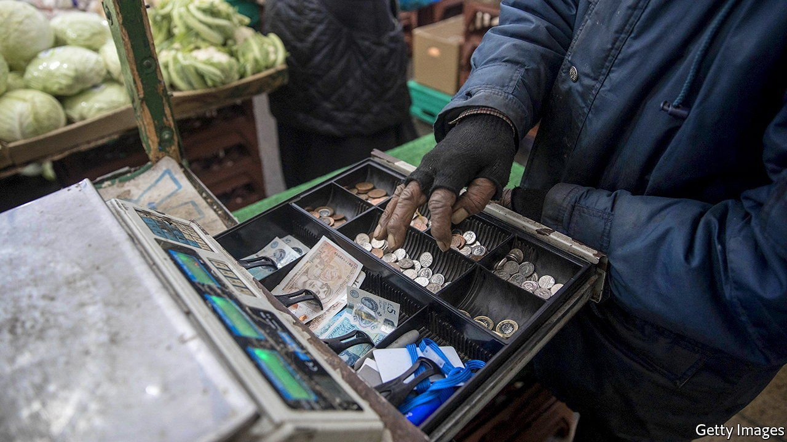
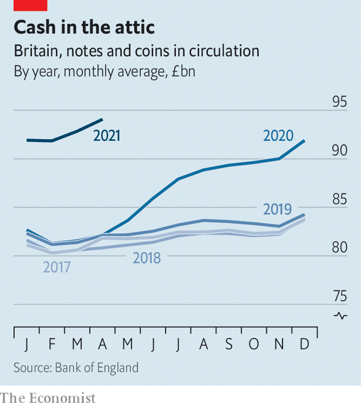

###### Money

# The pandemic has seen a surprising surge in cash use 

##### Look to the black economy 

 

> May 27th 2021 

EVEN BEFORE covid-19, a surprising quantity of coins and banknotes were at large in Britain. The rise of internet shopping and contactless payment cards pushed the share of transactions involving physical money down from over two-thirds in the early 2000s to under a quarter by 2019. Yet over the same period the value of banknotes in circulation rose from just over 2% of GDP to over 3%. Demand for cash as a medium of exchange has fallen but demand for physical money as a store of value has more than compensated. And over the past 15 months, even as many pubs and retailers have insisted on cashless payment, the amount of money in circulation has risen even further (see chart).

 


A decade of low inflation and extremely low interest rates explains some of the appeal of old-fashioned notes. The opportunity cost of keeping savings in a liquid but non-interest-bearing form has rarely been lower. But that cannot explain the jump in the amount of money in circulation since March 2020.


Graham Moody of LINK, the company that runs Britain’s ATM network, says that cash machines were busy in the days before the first national lockdown in March 2020. Panicked consumers stockpiled money at the same time as they emptied supermarkets of toilet paper and pasta. After that, he says, “usage fell like a stone”. Total withdrawals from cash machines between April and December 2020 were 35% lower than the year before. But as the amount of cash entering circulation fell, the amount leaving circulation fell even faster.

It is likely that some of the extra notes are not actually changing hands. Saving rates have been historically high since the pandemic began, and some of that is probably in the form of physical money. Households and small businesses have made fewer trips to the bank, just as they have made fewer trips of all kinds. Some of the cash that would have normally been paid into bank accounts is probably sitting in wallets and tills.

But there is another, more worrying, explanation for the surge in cash. Treasury officials suspect that much of the rise has been caused by growth in the undeclared cash-in-hand economy since the early months of 2020. Four million Britons are still furloughed from their jobs; some of them are no doubt looking to top up their incomes. For those who choose to work in the shadows, cash is still king.

