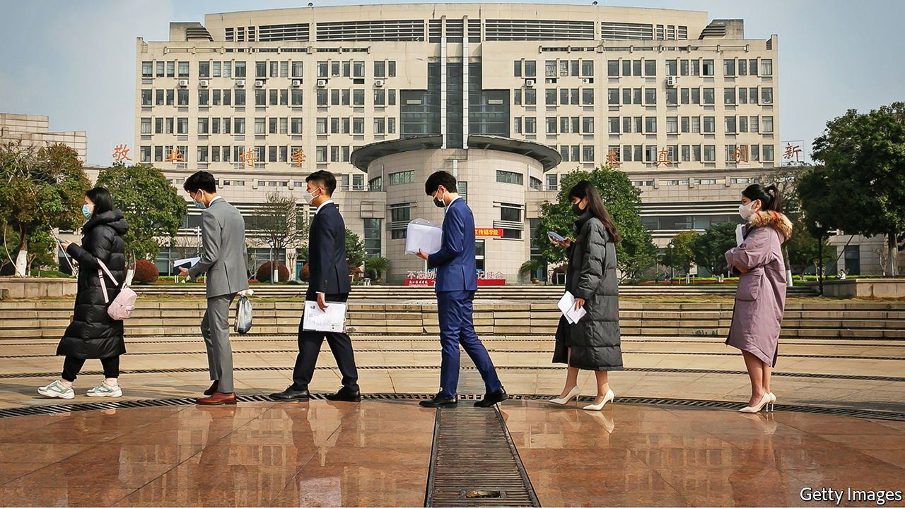

###### Serve the elite

# Education in China is becoming increasingly unfair to the poor 

##### The hukou system of household registration exacerbates a huge divide 

 

> May 27th 2021 

A FTERXIONG XUAN’ANG gained the capital’s best score in China’s university-entrance exam in 2017, he was interviewed by Beijing’s media. The son of diplomats, Mr Xiong acknowledged that his upbringing had been privileged. “All the top scorers now come from wealthy families,” he said. “It is becoming very difficult for students from rural areas to get into good universities.” His honesty drew much praise online.

Since 1998, when China began a huge expansion of university enrolment, the number of students admitted annually has quadrupled to nearly 10m. About one third of high-school students now proceed to undergraduate courses. Data are patchy, but experts agree that the share of rural students at China’s best universities (the top 1%) has shrunk. Only 0.3% of rural students make it into them, compared with 2.8% of urban ones. Most other tertiary institutions are far inferior.


Around the world, students from poor backgrounds struggle to compete with their richer counterparts. In China the divide is particularly stark. The main cause is the hukou system, which makes it very difficult to gain free access to state-provided services outside the place where one’s household is registered. This means that in cities, the children of migrants from the countryside are usually shut out of local state schools. They have to attend shoddy private ones that charge fees, or go to their parents’ village for an education that is free but also bare-bones.

The situation is made worse by the way that university places are allocated. The best universities are concentrated in the biggest and richest cities such as Beijing and Shanghai. They offer a disproportionate number of places to students with local hukou. China’s two most prestigious universities, Peking University and Tsinghua, are in Beijing. Their acceptance rate is around 1% for local students but only a tenth of that for applicants from places outside the capital, according to state television. More students from Beijing are admitted to Tsinghua every year than the combined number of successful applicants from Guangdong and Shandong. The population of those two provinces is ten times bigger than Beijing’s.

In a paper published in 2015, scholars from Tsinghua and Stanford University said students with hukou in the poorest fifth of counties were seven times less likely than their urban counterparts to get a university place and 14 times less likely to attend an elite one. In those counties, the odds were even more stacked against girls and ethnic minorities. “It is really, really clear that it is now much, much harder for a poor, rural kid to get into a good university,” says Scott Rozelle of Stanford. He estimates that around 75% of urban children go to university compared with 15% of rural ones. Nearly 80% of children under 14 have rural hukou. But writing in 2017, Wu Xiaogang, now of NYU Shanghai, a Sino-American joint-venture university, said less than 17% of students in elite universities had rural household-registration before taking up their places. The pattern has not changed since then, says Mr Wu. “If anything, it may be even worse now.”

That is because inequalities in society are becoming more pronounced. The children of wealthy families have access to the best schools as well as to after-school tutoring and extra-curricular activities. Their parents can afford homes in good catchment areas. China offers nine years of free, compulsory education, but fees are levied at state-run senior secondary schools. In poor areas, charges can amount to more than 80% of net income per person, one of the highest such burdens in the world. Some students prefer to start work: a typical unskilled factory hand can earn in a month what a poor farmer earns in a year.

The national university-entrance exam was suspended for the final decade of Mao Zedong’s rule. Since its relaunch in 1977, universities mostly have relied on test scores for admission. In 2003 China began to allow some universities to recruit students with special talents such as in sports and arts. Again, the wealthy have been the main beneficiaries: only they can afford to pay for the training needed.

For decades state-funded feeder schools in poorer areas played a vital role in offering good students from the countryside a chance to get into university. But many have closed as a result of migration into cities. Meanwhile, competition has grown for places in good senior secondary schools. Ma Hang attended primary school in his home village. But the best junior high school in the county would not accept village students unless they paid extra fees or had powerful connections. His parents managed to use such a connection to get him into the school. He says that set him on a path that led him to a feeder high school and then to university.

Rural children in China face obstacles at every stage of development. Babies are more likely to be undernourished and lack parental attention. By the time they enter primary school, many have ailments such as anaemia, poor vision and worms. Around 60% of students from the poorest counties suffer from at least one of these afflictions, says Mr Rozelle.

Those who, despite the odds, make it to elite universities often feel socially isolated. In 2020 a student from the countryside took to social media to describe being “lost and confused” at university after leaving the “straightforward environment” of school, where passing tests was the focus. More than 100,000 students, many with rural backgrounds, weighed in, sharing their own experiences of feeling like misfits and lamenting their job prospects. They coined a new term in Chinese: xiao zhen zuotijia, meaning “small-town swot”.

Wang Jianyue, a country-born physics whizz, can relate to their complaints. He chose to study finance at university, thinking it would be easier to find a job with such a specialism. It was only after he saw several of his classmates get internships at big financial firms using their parents’ connections that he “truly understood the gap” between himself and them. Mr Wang changed his focus to computer science. Unlike some other small-town swots, he has, to his relief, got a job offer. ■

