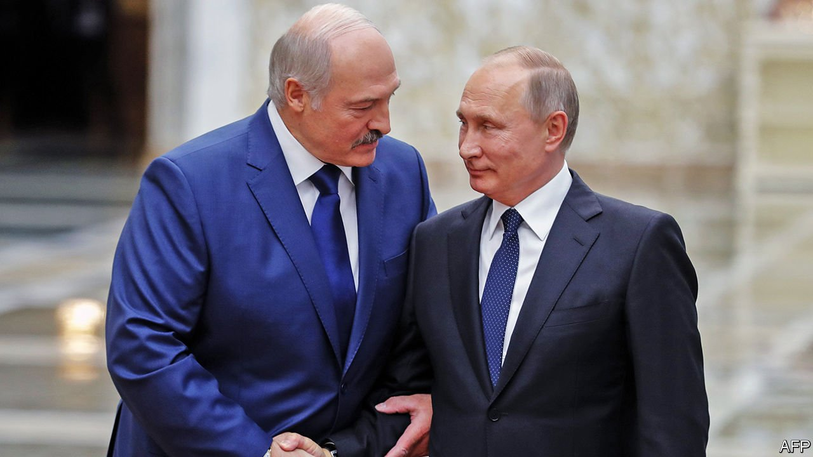
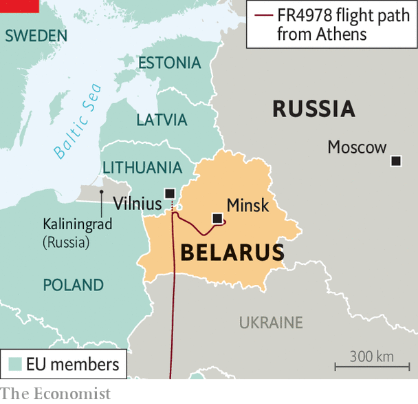

###### An ever deeper union

# Having hijacked a Ryanair plane, Belarus draws closer to Russia 

##### Only Vladimir Putin wants to be friends with Alexander Lukashenko 

 

> May 26th 2021 

BELARUSIAN DISSIDENTS expect to be arrested in Belarus. But until May 23rd they thought they were safe in the West. That was when Roman Protasevich, a 26-year-old Belarusian journalist and activist, boarded a Ryanair jet that was due to fly from one EU country (Greece) to another (Lithuania). To his horror and the world’s astonishment, Belarus’s autocratic government hijacked it.

The plane was passing through Belarusian airspace and about to cross into Lithuania, where Mr Protasevich had been living in exile. Suddenly, the pilots were told there was a bomb on board. A MiG-29 fighter jet was scrambled to intercept the plane and escort it to Minsk, Belarus’s capital, though this was not the nearest airport. On arrival Mr Protasevich was arrested, along with his Russian girlfriend, Sofia Sapega.


No bomb was found. The alert was plainly a ploy. Alexander Lukashenko, Belarus’s dictator, has been rattled by mass protests against his theft of an election last year. Mr Protasevich co-founded Nexta (“someone” in Belarusian), an internet channel that covered, galvanised and in part organised those protests. He now faces a 15-year jail sentence. In a video “confession” Mr Protasevich, with a bruise on his forehead and part of his neck apparently covered by make-up, said he was being treated fairly. A similarly distressing video was aired of Ms Sapega, who is now being charged with instigating “mass disorder”.

 


Western governments competed to express their fury. The EU’s leaders demanded the release of the two young people, closed European airports to Belarus’s state airline and advised their own carriers to avoid its airspace. So did Britain. The most politically significant step came from neighbouring Ukraine, which banned the import of electricity from Belarus, placing itself squarely in the Western camp.

Britain, the EU and America are now working on new economic sanctions against Mr Lukashenko’s regime. Belarusian opposition leaders who live in exile, as those who are not in prison tend to, say it should include a boycott of Belarusian potash and petrochemicals, the country’s main exports, as well as many more travel bans and asset freezes on named individuals and state-controlled entities. Getting 27 EU members to agree on lists is likely to take time. But if Western leaders once held back because they reasoned that such moves would push Belarus closer to Russia, Mr Lukashenko’s actions have made their concerns less salient: his outrages have locked him firmly into Russia’s orbit.

The Kremlin is delighted. Margarita Simonyan, the boss of RT, Russia’s state propaganda channel, praised Mr Lukashenko’s piratical skills: “Never thought I would be jealous of Belarus. But now I am jealous. The old man has done it beautifully.” Russian TV channels disseminated the Belarusian dictator’s lies about the bomb threat having come from Hamas, which the EU designates as a Palestinian terrorist group. Sergei Lavrov, Russia’s foreign minister, provided the rationale. “Russia will never leave Belarus in trouble…and will always come to the rescue of our neighbour and strategic ally. We have common history and spiritual values.”

The main commonality between the two regimes, however, is a fear of popular uprisings that might drive both from power. Last summer, as protests engulfed Belarus, it seemed that another “colour revolution” in a former Soviet state might topple another dictator. Vladimir Putin, who disapproves of such things, stepped in, offering economic help and pledging to provide security cadres to prop up Mr Lukashenko’s forces in case they wobbled. He also dispatched a team of Russians to take over parts of the Belarusian propaganda machine if necessary. The aim was not to empower Mr Lukashenko, whom he distrusts, but to secure his grip on Belarus, which he sees as an essential battleground in his confrontation with the West.

For years Mr Lukashenko had cleverly played Russia against the West, blackmailing both to extract money. When Mr Putin pushed for a deeper union between Russia and Belarus two years ago, so that he could preside over a new empire, Mr Lukashenko resisted, taking on the unlikely role of champion of Belarusian independence. But by stealing the election and then ordering the mass arrests, mass beatings and mass torture of those who objected, he has destroyed the last speck of legitimacy he had at home and alienated the foreign powers that had previously tolerated him. Now he has only one possible ally left, a judo enthusiast in Moscow.

The melding together of Russia and a once-reluctant Belarus continues. Mr Putin met Mr Lukashenko on April 22nd and praised progress in deepening the “union state” between the two countries. A few days earlier, Russia’s FSB, the security service that now plays a dominant role in Russian politics, said it had co-operated with the Belarusian KGB (as it is still called) to uncover a Western plot to assassinate Mr Lukashenko. Whichever country came up with this conspiracy theory, Mr Putin cited it last month in a telephone conversation with Joe Biden, whom he is to meet in Geneva on June 16th.

In Belarus the plot was instantly turned into a propaganda film, “To Kill the President”. In the words of Nikolai Karpenkov, one of Mr Lukashenko’s generals, it “clearly showed that this soft, kind opposition fighting for peaceful changes are in fact bloody-minded dogs preparing a military coup, murder and kidnapping.” The Belarusian security services claimed they were, in fact, fighting terror, rather than propagating it: “We are ready to act. As soon as the order comes, we will find and purge them…we will make the world freer.” Hijacking the Ryanair flight to arrest Mr Protasevich was part of the “counter-terrorist” operation that stems from this deepening collaboration with Russia, and was perhaps also intended to secure Belarus financial assistance in the event of harsher sanctions; a cynical deal indeed.

Belarus is testing new limits to what Freedom House, an American NGO, calls “transnational repression”. Authoritarian regimes such as those in Russia, China and Rwanda have long targeted domestic dissidents beyond their borders. Some will now be tempted to copy Mr Lukashenko’s novel tactics. Exiled dissidents of every nationality will be more nervous about boarding planes. Belarusian dissidents will wonder if they are safe flying over Russia, which is much harder to avoid than their homeland. When Mr Biden meets Mr Putin in three weeks’ time, the democrat and the despot will have even more to discuss. ■

A version of this article was published online on May 26th, 2021

