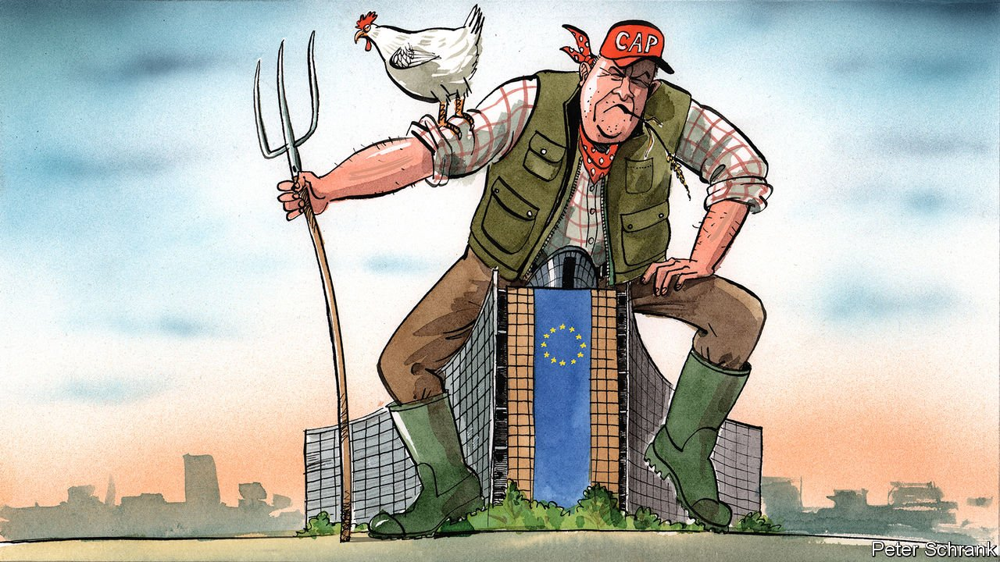

###### Charlemagne

# How farmers still rule Europe 

##### Politicians dare not crimp their exorbitant privileges 

 

> May 29th 2021 

ARMED WITH a device designed for throwing tennis balls for dogs, it is possible to launch an egg a very satisfying 60 metres. Head to the Quartier Leopold in Brussels on the right day and you can see farmers from across Europe firing a wide range of produce an impressive distance at Belgian riot police. It is during these regular protests at the European Union’s headquarters that the ingenuity, bravery and diligence of the European farmer truly shows itself. In one episode a pair of tractors slowly drove through a barbed-wire barricade, as cops scattered. When an armoured police van turned up, the farmers drove into that too. It took two water cannons at full blast to make the tractors retreat. Over the years, grumpy farmers have covered stoic Belgian riot police in hay, eggs, and milk direct from the udder.

A riot can be the voice of the unheard. It can also be a tantrum of the ludicrously privileged. European farmers are politically powerful in the same way that the sky is blue: it is a fact so universally acknowledged that it is usually not worth mentioning. This power was apparent this week in the final negotiations between diplomats, members of the European Parliament and officials over the terms under which farmers will receive €270bn ($330bn) in 2023-27. That the farmers will get the cash is a given. The debate is about how many conditions will be attached, with the options ranging from not a lot to very few indeed.


The Common Agricultural Policy (CAP) is a tumour in the EU’s body politic. Sucking up a third of the group’s budget, it is a neat illustration of its struggle to change itself for the better. What began six decades ago as a quid pro quo between France and Germany (farming bungs in exchange for market access) is still in place. It is an odd form of redistribution. About 20% of farms get 80% of the money. Aristocrats, agri-giants and the Catholic church all take a juicy cut. Companies linked to Andrej Babis, the billionaire Czech prime minister, got €34m ($42m) one year. Money is shifted from European taxpayers to landowners, in a frankly feudal farce. Usually, there is a pretence that things will improve. This time, the European Commission has given up. “We have to acknowledge that there will be no revolution in the CAP,” said Frans Timmermans, the commissioner tasked with making Europe greener.

History is littered with once-mighty interest groups that have withered. Coalminers in Germany and Poland will have cash thrown at them as their industries are phased out as part of the plan for a “just transition” to a green economy. But this amounts to a free bar at a wake. By contrast, farmers remain as powerful as ever. Partly this is down to the nature of food. People care more about what they put in their mouths than how they heat their homes or the bodywork of their Audis. Unlike coal or steel, food is not truly fungible. An Italian may spurn a tomato from Spain, never mind one flown in from Morocco, or a genetically modified American one. For a continent without a common tongue, snobbery about domestic produce provides a universal language.

The way the EU cooks up agricultural policy helps farmers keep their outsized power. Normally, policymaking in Brussels is a bazaar, with everything for sale at the right price. Officials from countries haggle with each other, surrendering on one topic to get what they want on another file. As a system it is opaque, but it works. By contrast, farming is insulated from the other subjects of haggling, sealed off in its own special committee. The result is that governments try to grab as much cash as they can, rather than question whether it should be there in the first place.

For all the talk of the EU’s democratic deficit, agriculture is an area where the EU suffers from a surplus of democracy. Dead-eyed technocrats would happily chop farming subsidies. European politicians will not let them. In France any self-respecting presidential candidate must spend time sniffing cheese at agricultural fairs. Farming generates barely 1% of European GDP. But its fate has outsized importance. Rather than left or right, the political battleground across much of Europe is a fight between urban centres and the rural periphery. Britain’s exit removed one of the few big governments that was less neuralgic about the future of farming (as its current enthusiasm for free-trade deals with agricultural powerhouses like Australia attests). For most of the EU, slashing subsidies would be an assault on a politically potent rural hinterland. It is a fight few want to have.

Farmers versus Swedish teenagers

Luckily, some do. Greta Thunberg, a young Swedish climate activist, has joined a cabal of NGOs hammering the EU for not doing enough to curb agriculture’s environmental effects. At the moment, whatever ambition the EU has for climate policy melts away when it comes to farming, even though its emissions rival much heavier industries. Farmers can no longer brush off the concern. Environmental policy has gone from the hobby-horse of sandal-wearers to an existential policy debate. From now on, the farmers will have a fight on their hands. Things can get better. After all, the CAP used to be even worse. The days when European taxpayers paid to overproduce products that were then dumped on poor countries are over. But it took years of concerted campaigning to shift the butter mountains and the wine lakes.

It is too late to make a difference this time, as talks over the €270bn come to a close. A slow grinding fight led by the likes of Ms Thunberg is necessary if the CAP is to be overhauled. Ensuring that farmers do their bit for the climate, and stopping the transfer of cash to those who do not need it would be a start. The story of European policymaking is one of path dependency in which errors take years (and usually a big crisis) to unpick. Until then, the CAP will remain a scar on the EU, a visible reminder of how hard it is to undo past mistakes. Should it ever look like being fixed, though, it will be wise to avoid the EU quarter in Brussels. Imagine how grumpy the farmers will be if they actually lose for once. ■

