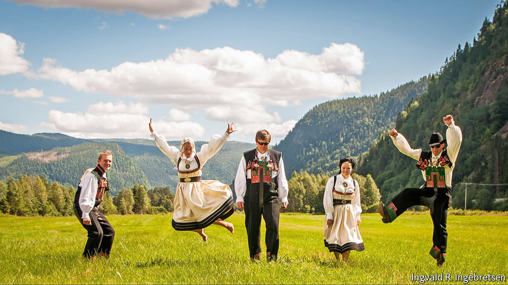

###### Fiddlers of the fjords

# Norwegian folk music is worth preserving, says the UN 

##### And could be used to liven up local-council meetings 

 

> May 29th 2021 

SETESDAL, A WINDING valley to the north of Kristiansand in southern Norway, was once a place of traditions little changed since medieval times. Chief among these were song and dance marked by improvisation and a beat as visceral as the blues. Birth, death and every step in between happened to music. But over the years radio, TV and then the internet wormed their way into its hamlets. Now only a handful of stalwarts know the old tunes and dances. Fearing that they might disappear, UNESCO, the UN’s culture agency, gave Setesdal a listing at the end of 2019.

A UN convention on safeguarding “intangible cultural heritage”, agreed in 2003, requires states to act to preserve whatever is listed within their jurisdiction within six years. “For us, this was an alarm bell,” says Annbjorg Lien, who has the job of reviving folk traditions in the Setesdal municipality.


Setesdolen, the local newspaper, has started printing stev, four-line ditties sung in a call-and-response fashion. These are common at weddings and other celebrations. Ms Lien says there is now talk of permitting them in local-council business. This would certainly liven up dull planning-committee meet ings. From this autumn schools will incorporate traditional music and dance into the curriculum, and those who teach these skills will earn good wages.

The children seem keen. Given the electronica-like pulse of a typical Setesdal session, it’s easy to see why. But their enthusiasm, and that of the wider population, may also reflect a craving for community, especially after the torments of lockdown. “People want to know who they are, where they’re from, what they’re about. Only a soulful experience can provide that insight,” says Ms Lien, a keen fiddler herself.

