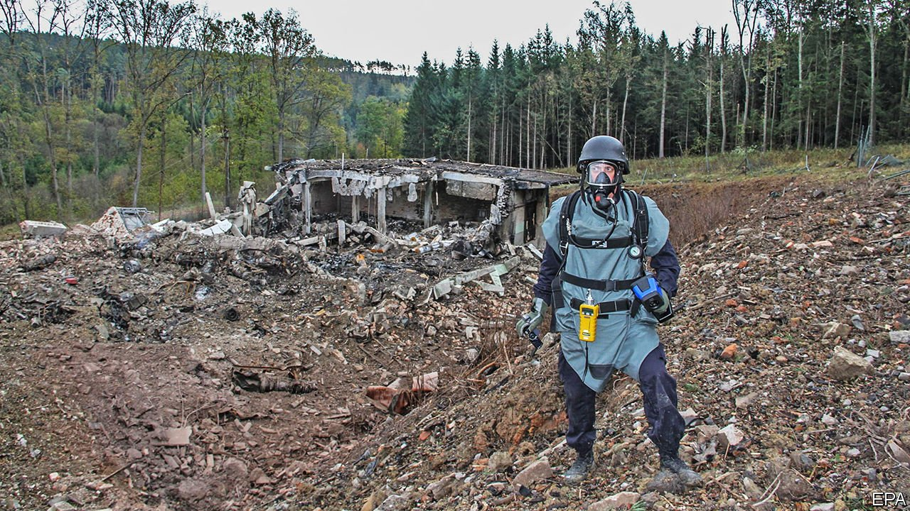

###### The spirit of ’68

# Russia puts the Czech Republic on an official enemies list 

##### Its sin was to have blamed Russian agents for a deadly blast on Czech soil 

 

> May 29th 2021 

UNLIKE TEENAGERS, countries rarely write down lists of their enemies. But Russia does. On May 14th it published a list of “unfriendly countries”. Oddly, it had only two names on it: the United States and the Czech Republic. The latter was unexpected, but explicable. In April the Czech government revealed that a deadly explosion in 2014 at an ammunition depot in the town of Vrbetice, previously thought accidental, was set off by Russian agents. (Some of the ammunition was destined for Ukrainian forces fighting Russian-backed rebels.) The Czechs and Russians have since expelled dozens of each others’ diplomats. Relations are now as sour as at any time since the Soviet Union collapsed (though not as bad as in 1968, when Moscow’s tanks rolled into Czechoslovakia to overthrow a reformist government).

That is inconvenient for the Kremlin. It needs friends inside the EU to stave off further sanctions over its latest misdeeds. Although most Czechs distrust Russia, it has long been able to count on the Czech president, Milos Zeman, a cantankerous populist who likes to set off explosions of a rhetorical kind. Mr Zeman questioned his own country’s intelligence agencies for blaming the blast on Russia. During a visit by Serbia’s president on May 18th he abruptly begged forgiveness for NATO’s bombardment of Belgrade in 1999, clearly trying to suggest that the Russians are not the only ones who go around blowing things up.


Mr Zeman also called Russia’s enemy list “silly”, and his powers as president are limited. But the government of Prime Minister Andrej Babis is hanging by a thread. The Czech Communist Party, an unreformed Russia-friendly outfit that has 8% of the seats in parliament, stopped backing the coalition in April, depriving it of its majority. If Mr Babis falls, Mr Zeman could decide who will run a caretaker government until an election in October.

The biggest consequence of the feud involves an upgrade to the nuclear power plant at Dukovany, originally built by the Soviet Union. The state power company plans to build at least one new reactor by 2036 for €6bn ($7.3bn), though analysts fear the cost may be twice as high. After the Vrbetice affair the government announced that Rosatom, the Russian nuclear consortium, had been excluded from bidding.

However, experts say that Russian companies have only been kicked out of the initial phase, and could end up winning contracts later. Having built Dukovany, they have an advantage over their competitors, France’s EDF, South Korea’s KHNP and the Japanese-American firm Westinghouse. “If you ask Czech engineers, they mostly say they would be for the Russians,” says Martin Jirusek, an energy industry expert at Masaryk University.

Czech views of Russia have often see-sawed. Last spring the two countries tussled over the removal of a statue of a Soviet general, Marshal Konev, hailed for liberating the country from the Nazis in 1945 but then reviled for planning the invasion in 1968. But views of the West can be wary as well. A survey in 2020 by CVVM, a pollster, found that by a two-to-one margin Czechs are glad that their country is a NATO member, but they are split almost evenly on whether that is a guarantee of independence or a form of subjugation to foreign powers. Enemies list or no, some Czechs are still reluctant to take sides. ■

