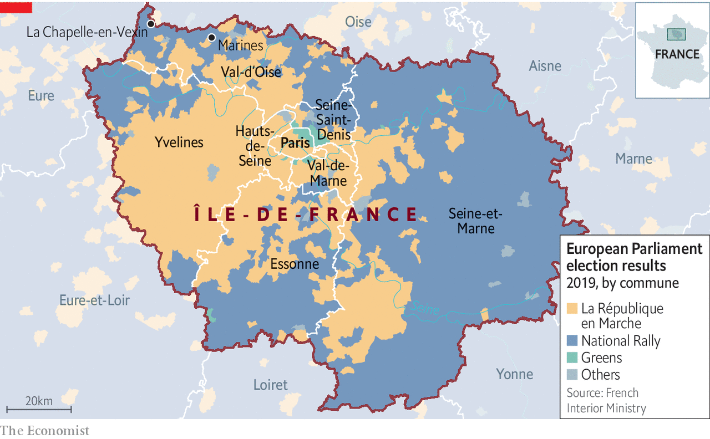

###### Beyond the fringe

# The hidden side to French suburban living 

##### What politicians in Paris might learn from the area around it 

 

> May 27th 2021 

CUTTING THROUGH farmland in a regional nature park, the approach to La Chapelle-en-Vexin is dominated not by its 12th-century chapel but by newly built two-storey homes. With their dormer windows, sloping tiled roofs and neatly hedged gardens, houses on such lotissements offer a French version of American suburban life: play space for children, a deck for the barbecue, and—crucially—off-street parking. In this village of just 333 inhabitants, an off-plan three-bedroom house with a garage is on sale for €260,000 ($320,000)—the same as a gloomy bedsit in central Paris.

Only 65km (40 miles) separate La Chapelle-en-Vexin from the cobbled boulevards of the French capital. Both belong to the greater Paris region, Île-de-France. Yet daily concerns could not be more different.


The suburban RER express line does not reach this far. Fully 85% of residents drive to work. Villagers worry about pollution. A big local issue is an effort to get a bypass built to divert heavy traffic from driving through the centre. But roads sustain daily life. Shopping is done by car at a hypermarket. Nobody in the village uses a bicycle to get to work. “We don’t feel close to Paris at all,” says Joëlle Valenchon, the mayor: “We are a bit forgotten.”

 


The French capital, with 2.2m people, is dwarfed by its region, home to 12.2m. Some 3m-4m of them live on its semi-rural edges. Such places, where 87% of trips are made by car, feel a world away from the capital’s concerns. Politics in Paris, governed by Anne Hidalgo, a Socialist backed by the Greens, is increasingly about bike-sharing, pedestrianisation, the végétalisation (greening) of concrete spaces and rooftop micro-farming. Paris aspires to be a “15-minute city”, a concept developed by Carlos Moreno, an urban planner. The idea is that everything—school, work, shops, sport, cafés—should be within 15 minutes from home on foot, or five minutes by bike. “Mine is actually more like a two-minute city,” says a Paris city-dweller, who rents an electric bike for more distant excursions.

The disconnect between Paris and the outer reaches of its region has political implications. One is that Ms Hidalgo, who is seen as an anti-car crusader and could run for the French presidency next year, may find it hard to appeal far beyond the périphérique. The Paris ring-road, built half a century ago, has turned into a gigantic concrete symbol of the capital’s division from its suburbs. Life on the lotissements on the region’s outer fringe has more in common with the villages and towns across France than it does with central Paris.

Divergent geographical interests also help explain why efforts over the years to merge the overlapping and competing administrative structures governing Paris and the region have come to little. As it is, the capital seems quite happy not to run the troubled banlieues, with their brutalist housing estates, which ring Paris itself. The semi-rural communes are more neglected still. “For 30 years the capital’s growth has benefited the nearer suburbs, but it has also reinforced the contrast with the outer periphery,” says Aurélien Delpirou, of the École d’Urbanisme de Paris.

The other Marine

The fringes of greater Paris carry a political warning too. At elections to the European Parliament in 2019, the Greens’ vote was concentrated in central Paris. A big swathe of the outer fringe, however, voted for Marine Le Pen’s populist National Rally. Studies by Hervé Le Bras, a geographer, show that the National Rally’s vote tends to rise with distance from a railway station. Isolation and fear of crime play a part, as does a sense that government ignores rural voters’ problems. At regional elections next month, the National Rally’s candidate, Jordan Bardella, is Ms Le Pen’s young deputy.

The campaign for the Île-de-France captures the rift between Paris and its region. Valérie Pécresse, the sitting centre-right regional president, is the favourite. All candidates with more than 10% go through to a run-off, where she may face both Mr Bardella and a candidate on the left, possibly the Greens’ Julien Bayou (the candidate of President Emmanuel Macron is polling fourth). Ms Pécresse, who moved the region’s headquarters from Paris to the suburbs, has distanced herself from Parisian politicians. She opposes the pedestrianisation of parts of central Paris, as it has pushed congestion and pollution out to the periphery. The fashionably bearded Mr Bayou, meanwhile, got into trouble last month for posters aimed at young voters, which hinted that “hunters” and “boomers” were not interested in climate change.

Greenery is at the heart of this tension, and competing interests are complex. In Marines, a small town with a cobbled central square, residents cherish the environment as well as their cars. Daniel Hermand, who works at the town hall, says he quit Paris for a calmer life close to nature and forests. If the pandemic and consequent home-working push more families out, they may bring their hobbies and politics with them. So Ms Pécresse has taken care to sound eco-friendly too. She has launched an electric-bike rental scheme, and promises a network of bicycle routes to match those of the RER train lines.

“Of course it’s good for people to use bicycles,” says Othman Nasrou, Ms Pécresse’s deputy. “But environmental policy can’t be to the detriment of those who need to use their cars.” Mr Macron learned this the hard way when gilets jaunes (yellow jackets) launched huge protests against a rise in tax on motor fuel. It is not fashionable politics to listen to car owners, nor to the quiet concerns of those on the fringes. But the lotissements of greater Paris and their voting habits suggest that policymakers who unthinkingly punish the car-dependent do so at their peril. ■

