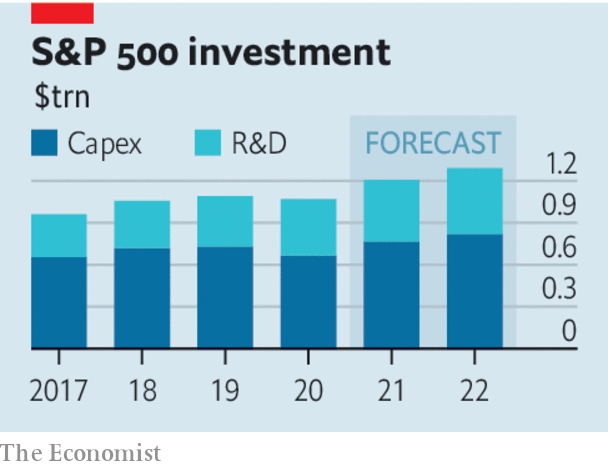

###### Innovation nation

# Firms are rediscovering their love for capex. Good 

##### That is both a radical change and an enormously important one 

 

> May 29th 2021 

AS THE RICH world reopens, the contours of the post-pandemic economy are becoming clear. The latest trend is a . Forecasters reckon that overall real investment worldwide will soon be a fifth higher than it was before the pandemic. America’s business investment is rising at an annual rate of 15%. By 2022 companies in the S&amp;P 500 are forecast to be spending over a tenth more on factories, technology, R&amp;D and the like. Barely a day goes by without a large firm boasting about how much it plans to splurge. AT&amp;T says it will throw $24bn a year at its networks. Sony is piling $18bn into an expansion push. Semiconductor firms are engaged in one of the biggest capital-spending (or capex) sprees in history.

That is both a sharp change and an enormously significant one. Sharp, because before covid-19 managers embraced capex austerity. America’s business investment had stagnated relative to GDP for several decades. Britain’s was 15% lower than in the late 1990s. Even as business profits soared, firms devoted a smaller share of their cashflows to capex and R&amp;D, and more to share buybacks and dividends. Significant, because investment in new technologies and business practices is the secret sauce behind higher living standards. Weak capital spending contributed to the rich world’s sluggish productivity and growth in the 2010s, and to the gnawing sense that capitalism was misfiring.


Now, though, all that is changing. Fiscal stimulus has put money in people’s pockets. In America real disposable income per person is 27% higher than it was in February 2020. And as economies reopen, people are in the mood to spend. Companies can thus be more confident there will be demand for their wares in the next few years—as good an incentive as any to expand capacity. Some firms, especially in consumer-facing industries, are low on inventory and are frantically trying to catch up.

 


Yet capital spending is rising not just because the economic cycle is on the up. Firms are also adjusting to permanent pandemic-induced shifts, from an emerging norm of “hybrid work” to greater online shopping. The big tech firms, whose products are so important to this shift, have led the investment charge. In 2020 they accounted for a third of total R&amp;D spending in the S&amp;P 500; this year they are boosting capex by 30% relative to 2019.

Other companies now recognise that they need to pull up their socks. High-street retailers are at last investing heavily in online offerings to compete with Amazon. Restaurants continue to improve their dine-at-home service even as dine-in reopens, allowing them to squeeze more sales out of preparing food. Consultancies are finding ways to let their staff remain connected when they are not in the office. Growth in global shipments of computers for companies will be even faster this year than last. All this promises a world in which people get more done in less time.

Firms in some industries still play by the rules of the 2010s. Mining companies seem cautious about shelling out in order to relieve supply bottlenecks in commodity markets. Big hotel chains appear to have no plans to install rainforest showers in every room. And it remains to be seen whether the post-pandemic norm will be one of structurally higher investment spending, or whether firms slip back into their old ways. For now, though, stand back and appreciate the global capex surge. It promises a more dynamic form of capitalism. ■

