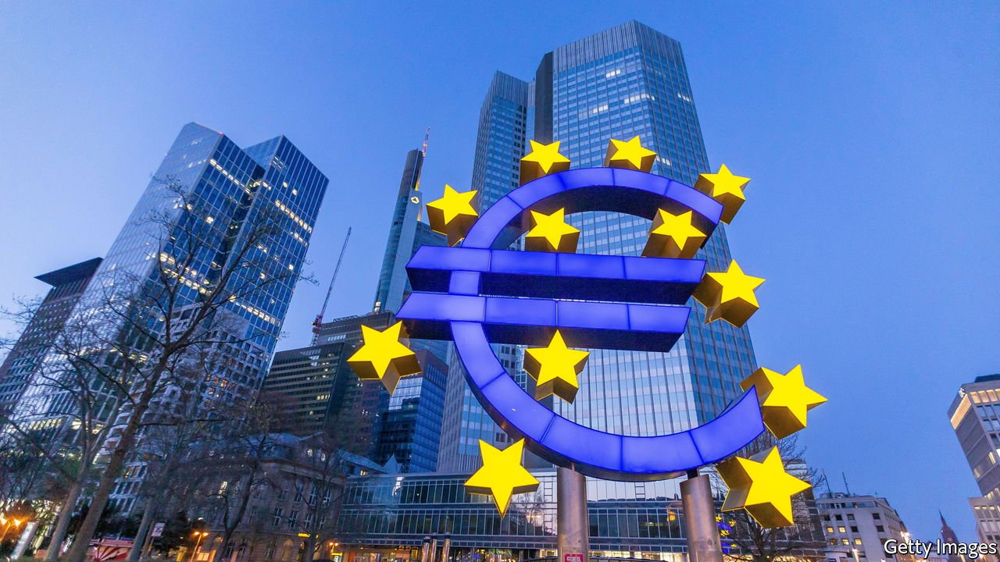

###### Take one for the team

# Germany must learn to live with a little inflation 

##### The alternative is a two-speed Europe 

 

> May 27th 2021 

INFLATION IN GERMANY exceeded 2% in April. If the Bundesbank’s latest forecasts prove right, it could soon reach 4% for the first time in nearly 30 years. Inflation angst is rising among the country’s monetary hawks. The exigencies of the pandemic muted German grumbling about the European Central Bank’s ultra-loose monetary policy. But as inflation rises, so will reflexive German demands that the bank should taper its bond-buying.

Such clamouring would be misguided. Europe’s recovery is more subdued than America’s, making the odds even better that the inflation spike will prove temporary. And the interests of the weaker members of the currency union, still crawling their way back to health, should come first.


The hyperinflation of the 1920s etched inflation-phobia deep into the German psyche. After the second world war the Bundesbank earned a fearsome reputation by being the first to tame the inflationary beast. In the early 2000s, shortly after the birth of the euro, Germany restrained wage costs and the southern European economies lost competitiveness against it. As the southerners recovered from their debt crises, they narrowed the gap by clamping down on their own labour costs, while Germany did too little to adjust. That set the euro zone on a demand-deficient, deflationary path. The area’s economy has never fully recovered, even as the ECB has used up most of its ammunition.

That lost decade is one reason why spiralling wages and prices in Europe are vanishingly unlikely, even as overheating is a possibility in America. What is more, the hit from the pandemic in Europe has been worse. Output in the euro zone fell further than in America last year. Despite this, its fiscal stimulus looks stingy compared with the Biden administration’s largesse. The EU’s new €750bn ($919bn) recovery fund will take years to be disbursed fully. Investors expect inflation in five years’ time to languish below the ECB’s target of “close to, but below 2%”. Expectations in America, by contrast, are above 2%.

Further reassurance can be gained from peering into the mechanics of Germany’s inflation spike. As in America, it reflects some transitory global factors, including the oil-price collapse last spring which depressed the base used to calculate the annual rate. Strip out food and energy prices, and inflation in Germany was only about 1% in April. Some temporary country-specific issues are also in play. A carbon charge has pushed up prices, and an emergency cut to value-added taxes last year will arithmetically boost inflation later this year. Look along the supply chain and you might take fright at Germany’s producer-price inflation, of more than 5% in April. But this should ease as factories and suppliers respond to a surge in orders.

Perhaps the biggest reason why Germany should tolerate a period of above-target inflation is that the euro area’s health depends on it. , as vaccines are administered and lockdown restrictions lifted. Germany has less lost ground to make up than most. It suffered a deep downturn last year, with the economy shrinking by 5%, but it fared far better than France, Italy and Spain, where output fell by nearly twice as much. Unemployment in Germany remains low, at 4.5%. Its reliance on manufacturing and exports has been a boon. Other countries, by contrast, must pray that spending on tourism, retail and hospitality returns to the levels of the old days. Goldman Sachs, a bank, reckons that Spain and Italy have twice as much economic slack as Germany.

The ECB sets monetary policy for the currency union as a whole, not its largest member alone. And so Germany must seek to keep its economy humming along while the others catch up and the stimulus is withdrawn. That is the price of being one of the strongest members of a currency union. After a lost decade, the euro zone has learned from some of the mistakes of the past crisis. The pursuit of balanced budgets and austerity has been abandoned for the time being. The EU is on the verge of issuing common debt to finance its recovery fund. Both shifts were possible because of a change of thinking in Berlin. A recognition that the German economy must run hot is the missing link in restoring confidence throughout the euro zone. ■

