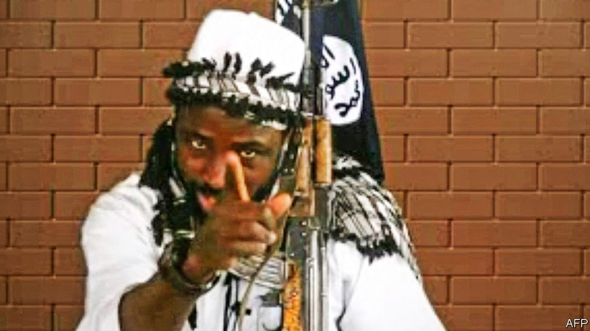

###### Sixth time unlucky

# Abubakar Shekau, Boko Haram’s vicious leader, is said to be dead 

##### This time it is probably true 

 

> May 27th 2021 

ONE CAN understand why Nigeria’s government has been slow to confirm the death of Abubakar Shekau. It has announced it five times before, between 2009 and 2016. Each time Mr Shekau, the leader of Boko Haram, a jihadist group, turned up very much alive and ready to continue terrorising his compatriots. The war between Boko Haram and modernity has left more than 30,000 people dead and 3.2m displaced across four countries. Mr Shekau made zany videos to taunt the government that failed to kill him. In them, he would wave a gun, chew on a stick and let derision froth from his mouth (see picture).


But this time it seems he is not coming back. On May 19th, according to trusted reports, Mr Shekau detonated an explosive vest to avoid capture by Islamic State West Africa Province (ISWAP), a splinter group that was attacking Boko Haram’s stronghold in Borno State in north-east Nigeria. His death marks the end of a bloody career. It also reflects the shifting power dynamics among west Africa’s jihadists.

The son of a local imam, Mr Shekau was born in a remote village near the border with Niger, sometime between 1965 and 1975. He left home as a child for Maiduguri, the capital of Borno State, where he was entrusted to the care of an itinerant Koran teacher. As a young man he met Muhammad Yusuf, the founder in 2002 of the sect that became Boko Haram. When Yusuf was killed in police custody in 2009, Mr Shekau took the group underground. But it soon resurfaced as an army of zealots who attacked village leaders, schools, the police and government buildings.

Vast swathes of Nigeria’s arid north-east fell under Boko Haram’s control. Attacks extended to Niger, Chad and Cameroon. Nigerian authorities say at least 10,000 boys have been abducted by the group and rifles forced into their hands. In 2014 the group won global notoriety by kidnapping some 276 schoolgirls in Chibok. Celebrities shared the slogan #BringBackOurGirls. Mr Shekau said the girls had converted to Islam—or would be sold into slavery. He became the most wanted African in the world, with a $7m bounty on his head.

Yet it was his fellow jihadists, not bounty hunters, who laid him low. In 2015 he crushed a breakaway faction and pledged allegiance to Islamic State (IS). But IS, based out of the Middle East, came to view Mr Shekau’s relentless killing of civilians and use of child suicide-bombers as counter-productive. It first tried to replace him. When that failed, in 2016, ISWAP broke away from Boko Haram.

It has the same stated goals: the creation of an Islamic state in northern Nigeria and the eradication of “Western influence”. But it prefers taxing civilians to murdering them, and tends to focus its attacks on military targets rather than schoolgirls. In 2018 it called Mr Shekau a “tumour” that needed removing.

It is unclear whether ISWAP intended to kill Mr Shekau. Regardless, his death will have knock-on effects. ISWAP will probably absorb hundreds of Boko Haram fighters, making it even more of a threat to the Nigerian armed forces, which are reeling from the death in a plane crash on May 21st of the army commander.

Mr Shekau’s demise also bolsters IS’s claim that, although it has lost ground in the Middle East, its affiliates in Africa, whether in the Sahel, Congo, Mozambique or Nigeria, are in the ascendant. A jihadist is most likely dead. His cause endures. ■

