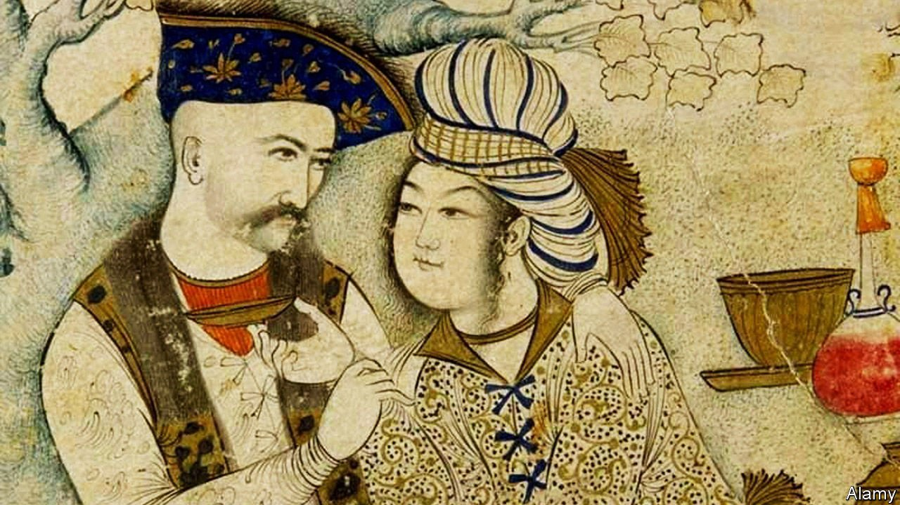

###### Muslim pride

# Gay people are reclaiming an Islamic heritage 

##### In the old days Muslims were quite tolerant of homosexuality 

 

> May 27th 2021 

FOR DECADES regimes in the Middle East have alleged that homosexuality is both morally unacceptable and a Western import. Many gay activists disagree on both counts. Homophobia is the Western import, they claim, introduced by puritanical Europeans. “Ban the colonial law,” cried campaigners in Tunisia in December, referring to a law criminalising gay sex written by the French more than a century ago. “All these homophobic laws in the Middle East were brought in by colonialism to undermine Islam’s permissive civilisation,” says Ramy Khouili, a Tunisian activist.

History is complicated, and prejudice has ancient roots. Nonetheless, activists can point to periods of the Islamic past when Arab rulers were more liberal about sex. They relate how the Caliph Amin in ninth-century Baghdad had a male lover and feted gay poets. They read poems from a classical genre called mujun, or hedonistic smut. And they recall that the Ottoman Turks, who ruled most of the Middle East in the 19th century, decriminalised homosexuality a century before America and Britain. Back then, “you could be with a man or a woman,” says the transgender founder of north Africa’s first gay movement, the Abu Nawas Association, named after a great Arab poet, who was gay. “There were men dressed as women and living as women—and it was normal.”


“A Promenade of the Hearts”, a collection of stories and poems compiled by Ahmad al-Tifashi, a 13th-century Arab sexologist, is experiencing a revival in Beirut’s libraries. The penis, he claims, is better shaped for anal than vaginal penetration. While much classical and Ottoman poetry features male lovers, gay groups are discovering lesbian poetry from the past. “How much have we grinded sister, ninety pilgrimages/ More delightful and invisible than the entries of the penis head,” reads a couplet.

Gay poetry is not the only art form undergoing a renaissance. Muhammad Issaoui, who calls himself “a queer dancer”, adapts the traditions of male belly-dancers once common in Cairo and Beirut. He performs in Tunisia’s clubs and theatres clad just in feather boas and underpants. “It was natural for men to express their feminine sides before,” he says. “It was just pleasure and art.”

Some activists are examining old legal texts—and finding contradictions. Classical jurists upheld the Koran’s clear prohibition of sodomy, yet debated how deep the penis must penetrate to be deemed a violation. (Up to the line of circumcision, according to a standard work written by Shia Muslims.) The present-day jihadists of Islamic State throw gay people off rooftops, citing a reported saying of the Prophet endorsing the practice. But scholars have struggled to find historical cases of anyone taking this verse literally.

This gay re-engagement with Islam has its critics. Many feminists are secular and see Muslim clerics as part of the patriarchy they want to topple. Still, most are willing to lend their support to gay people now facing arrest, torture and censorship by Arab rulers. “The problem isn’t Islam,” says Rasha Younes, a Lebanon-based researcher for Human Rights Watch, a monitoring group. “It’s the oppressive regimes who want to control us and the Middle East in its name.”

