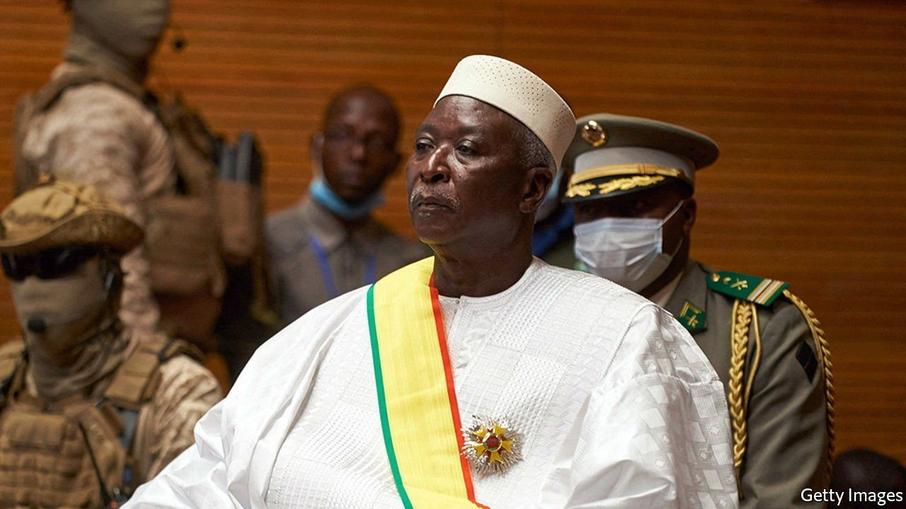

###### Recouping losses

# The leaders of Mali’s coup last August do it again 

##### The putsch is another disaster for the country 

 

> May 25th 2021 

“IT’S POLITICAL chaos,” says Kevin, a 32-year-old teacher in Bamako, the capital of Mali. The country, he laments, “has absolutely no future”. There was at least some cause for hope in September, when Bah Ndaw, the president, and Moctar Ouane, the prime minister, were appointed to prepare for elections after a military coup the month before. But Assimi Goita, who led that coup and then became vice-president, is at it again. Messrs Ndaw and Ouane did not respect the transitional charter or consult him about a cabinet reshuffle, claimed Colonel Goita. They were detained on May 24th, then stripped of their powers and forced to resign.

Malian politics have long been tumultuous. Last year Ibrahim Boubacar Keita, the president at the time, faced big protests led by an opposition alliance called the M5-RFP and a charismatic imam called Mahmoud Dicko. Some of the protesters welcomed the coup that ensued and hoped the army would clean up politics before handing over to civilians. After much wrangling between the junta and ECOWAS, a regional bloc, an 18-month transition to elections was planned, led by a nominally civilian government. The junta, though, took four plum cabinet posts, including minister of defence and minister of security. The M5-RFP received little.


The transition had not been going all that smoothly even before the latest coup. Frustration with the armed forces is growing, as they not only dominate the government, but are colonising the rest of the state, too. For example, a military doctor was recently installed as head of one of Bamako’s largest hospitals. Meanwhile, progress on reforms and preparations for elections have been sluggish. In mid-May the main trade union went on strike. Under pressure from the M5-RFP for a fresh start, Mr Ouane’s government resigned on May 14th. Mr Ndaw immediately reappointed him and consultations began to establish a more inclusive government, which was duly announced on May 24th. A few hours later the president and prime minister were detained.

The changes to the government were not dramatic. The army retained control of the same number of ministries, including defence and security. But different men in uniform, not members of the junta, were put into those jobs. That seems to have provoked the arrival of soldiers at the houses of Messrs Ndaw and Ouane (who have since been released). President Emmanuel Macron of France, which has troops in Mali, called it “a coup d’état within a coup d’état”. Western countries threatened sanctions; America suspended security aid. Colonel Goita is now clearly in charge—and mainly looking out for the army.

The leaders of the putsch may have been emboldened by the willingness of ECOWAS and Western countries to accept the government’s dubious civilian credentials. ECOWAS had called for a 12-month transitional period, but acquiesced to 18. The soldiers’ sense of impunity was probably also fortified by the limp response from the African Union, which is supposed to have a “no coup” policy, to a coup last month in nearby Chad. Ignoring Chad’s constitution, Mahamat Idriss Déby took over after his father, the president, had been killed in battle.

A French military spokesman called the events in Mali “a political episode” and said it would not affect French military operations against jihadists linked to al-Qaeda and Islamic State, who threaten swathes of Mali, Burkina Faso, Niger and Nigeria (see next story). France has 5,100 troops in the region. More than 13,000 UN peacekeepers patrol Mali itself. The EU has a large mission training the Malian army, too. Despite this, violence across the region has been rising sharply since 2016. Last year the conflict in Mali, Burkina Faso and Niger claimed about 6,200 lives.

A boon for the bad guys

The turmoil in Bamako will not go unnoticed among jihadists. Jama’at Nasr al-Islam wal Muslimin (JNIM), an al-Qaeda-linked group which operates across much of the Sahel, is not just a bunch of terrorists. It also holds out the promise of a different form of governance, says Yvan Guichaoua, an expert on the Sahel at the University of Kent. The endless machinations in Bamako will, he says, benefit JNIM.

With the Malian military leadership squabbling over power in the capital, “who is actually fighting on the ground?” asks Ornella Moderan of the Institute for Security Studies, a pan-African think-tank. In the chaos that ensued after an earlier coup, in 2012, separatists and jihadists swept towards Bamako, prompting France to intervene the following year.

The 18-month transition period since the coup in August was meant to end with elections in February 2022. Confirming that schedule will be a priority for a delegation from ECOWAS that came to Bamako in the wake of the latest coup. Colonel Goita himself claimed in his statement that those elections will go ahead as planned. But only the supremely credulous would believe a man who has staged two coups in nine months. ■

A version of this article was published online on May 25th, 2021

