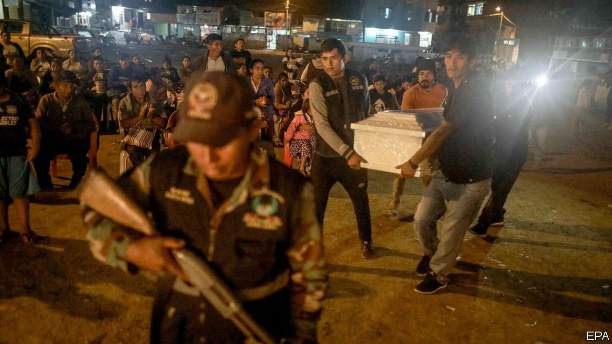

###### Commies, crooks and bloodshed

# A massacre adds to Peru’s election woes 

##### The government blames Marxist militants 

 

> May 29th 2021 

AS OMENS GO, it was a bad one. On May 23rd, less than two weeks ahead of Peru’s presidential run-off election, 16 people were massacred in a remote village in an area known as “VRAEM”, the valley of the Apurímac, Ene and Mantaro rivers, where coca is grown. The area has been under a state of emergency since 2003.

The motive of the killers remains unclear. The authorities in Lima rushed to blame remnants of the Shining Path, a radical left-wing insurgency. Leaflets justifying the murders were left behind with the bodies. In the 1980s and 1990s the Shining Path was responsible for tens of thousands of deaths. However, the mayor of Vizcatán del Ene district, where the massacre took place, told reporters that he thought drug traffickers were more likely to be responsible (though both could be true). The violence throws a grenade into Peru’s already tumultuous election.


On one side is Pedro Castillo, a rural school teacher who briefly shot to fame in 2017 when he led a long teachers’ strike. He is the candidate of Free Peru, a hard-left party. On the other is Keiko Fujimori, the daughter of Alberto Fujimori, who as president in 1990-2000 defeated the Shining Path, but who has been serving a 25-year sentence for corruption and other abuses since 2009. Mr Castillo and Ms Fujimori were never expected to reach the run-off. Neither polled well in the first round campaign. But in a crowded field of 18 candidates on April 11th, they came top, with 19% and 13% respectively, putting them through to the final vote.

Ms Fujimori had already been making much of Mr Castillo’s supposed Marxism. Billboards across Lima encourage people to vote against communism. On May 25th, after the massacre, she accused him of having ties to the militants she considers responsible, and thereby of threatening her father’s legacy. Mr Castillo denies any such connections. His supporters say he is not a communist. But a newly elected congressman from Free Peru, Guillermo Bermejo, is on trial for terrorism for collaboration with the Shining Path 13 years ago. (He calls the accusations “pure fantasy”.) He has been taped saying that if his party takes power, “we’re not going to give it up...we prefer to stay to establish a revolutionary process in Peru.” Mr Castillo has not rebuked him.

Ms Fujimori has problems of her own. She has been arrested three times and spent more than a year in prison in pre-trial detention on charges of accepting illegal campaign donations. She was released a year ago as part of a scheme to curb the spread of covid-19 in jails. The Castillo campaign argues that Ms Fujimori would turn the state into a patronage machine to benefit the rich and well-connected. Ms Fujimori says that she is innocent and the victim of political persecution.

Whoever wins on June 6th will face a mistrustful population and a fractured Congress, with ten parties splitting the 130 seats in the unicameral legislature. Thanks to a series of scandals and political feuds, Peru has rattled through four presidents in the past five years. This election may not end the instability. ■

