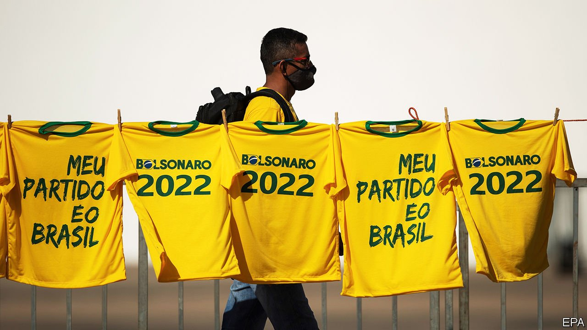

###### Losing traction

# Brazil’s President Jair Bolsonaro is under siege 

##### As his popularity fades, the populist turns to patronage 

 

> May 29th 2021 

THERE ARE many ways to describe pork-barrel politics in Brazil. They include tomá lá dá cá (give and take), troca de favores (trading favours), corporativismo (corporatism) and velha política (old politics). In 2018, on the campaign trail, Jair Bolsonaro used these and far ruder insults to disparage his fellow politicians, especially ones from the left-wing Workers’ Party (PT), which governed from 2003 to 2016 and was roiled by two big corruption scandals. As president, he vowed to advance his agenda without distributing cargos (jobs) or emendas (amendments: ie, pork).

The first sign he had given up on this “new politics” came in mid-2020, when he formed an alliance with a bloc of self-serving parties known as the centrão (big centre) in order to shield himself from impeachment petitions, of which there are now 117. Centrão support is never free. A recent investigation by Estado de S. Paulo, a newspaper, showed that last year Mr Bolsonaro’s government forked over 20bn reais ($3.9bn) through emendas do relator, or “chairman’s pork”, a reference to the chairman of the budget committee. At least 3bn reais were funneled through the development ministry to congressmen to fund public works and purchase farm equipment at inflated prices, sometimes through companies owned by relatives.


The scandal, which the press has dubbed tratoraço (roughly, “tractor-gate”), is the clearest proof yet of Mr Bolsonaro’s participation in pork-barrel politics. It is unfolding alongside an even bigger public-relations disaster: a parliamentary commission of inquiry ( CPI) into the government’s handling of the pandemic. The two crises demonstrate how Mr Bolsonaro has become increasingly weak and how Congress, which is known for virus-like opportunism, has used his vulnerability to strengthen itself. “The more fragile the president, the higher the cost of support,” explains Sylvio Costa of Congresso em Foco, a watchdog site.

Brazil’s political system, known as “coalition presidentialism”, is a hybrid between the presidential model of the United States and European-style parliamentary government. The president directs policymaking and drafts the budget but cannot get much done without Congress, where his or her party rarely has a majority. Most of Brazil’s 30 or so political parties lack ideological platforms; they back presidents in exchange for patronage. This favours vote-winning projects like paving roads or painting schools, rather than long-term planning, says Élida Pinto, a professor of public finances at Fundação Getulio Vargas (FGV), a university.

In 1994 six congressmen lost their posts as a result of a vote-buying scandal involving fake NGOs. In 2005 a centrão lawmaker admitted that the PT was funnelling 30,000 reais per month to congressmen in exchange for legislative support. (He was kicked out of Congress but is now an ally of Mr Bolsonaro.) In 2014 prosecutors launched a probe called Lava Jato (“Car Wash”) which revealed a vast kickback scheme among construction firms, political parties and the state oil firm.

In response to protests, Congress passed a series of constitutional amendments aimed at reducing corruption while keeping congressmen sweet. Most emendas became in effect an automatic allowance (not at the president’s discretion) for lawmakers to spend in their constituencies. They had to follow new rules, such as providing receipts. But such restrictions made it harder for presidents to cobble together a coalition. When Dilma Rousseff, a PT president, was impeached in 2016, it was technically because she had hidden the size of Brazil’s budget deficit; but also because she struggled to manage an increasingly unruly Congress. She expanded her cabinet to 39 ministries in order to dole out patronage, but a recession in 2014-16 limited her scope.

Mr Bolsonaro is experiencing something similar. Brazil has had one of the worst covid-19 outbreaks in the world, with an official death count of more than 450,000. His strategy of downplaying the pandemic seemed to work last year, when a third of Brazilians received emergency aid. But this year a second wave has coincided with rising inflation, slow vaccination and a reduction in handouts. Mr Bolsonaro’s approval rating has fallen from 40% to below 30%. The speaker of the lower house, Arthur Lira, the only person who can open impeachment proceedings, warned of “bitter political remedies”.

But impeachment is unlikely, partly because Mr Bolsonaro in effect reinvented chairman’s pork at the end of 2019. Most of the new allowances went to lawmakers who voted for Mr Lira and the centrão’s pick to head the Senate, Rodrigo Pacheco, in leadership elections in February. Documents on government sites account for only around 1bn of the 3bn reais spent by the development ministry. The budget chairman, Domingos Neto, sent 110m reais to a city of 59,000 people of which his mother is the mayor. The ministry agreed to pay 500,000 reais apiece for tractors listed as costing 200,000. It insists that there were no irregularities.

A bigger threat to Mr Bolsonaro’s popularity is the CPI, which began hearing testimony in the Senate this month. Its daily sessions are broadcast live on TV, creating a macabre oral history of Brazil’s pandemic disaster. Two former health ministers said that the government’s initial strategy rested on herd immunity and hydroxychloroquine, an anti-malarial drug promoted by Donald Trump. A Pfizer executive said that the government ignored six offers to sell Brazil vaccines. The health minister at the time, Eduardo Pazuello, a general who was also in charge when the city of Manaus ran out of oxygen, tried to skip testifying by saying he might have covid-19 himself.

Mr Bolsonaro “is becoming a prisoner of his unpopularity”, says Alessandro Molon, the leader of the opposition in the lower house. The latest polls show the president’s support falling in nearly every constituency, including among his strongest backers, such as evangelical Christians. His top rival in the 2022 election is likely to be Luiz Inácio Lula da Silva, a former PT president whose popularity has recently increased. One poll suggests that if a runoff election were held tomorrow, 55% would pick him against just 32% for Mr Bolsonaro (the rest said neither). When Brazilians see Europeans and Americans getting vaccinated, they realise “our president is a caricature,” says Ciro Gomes, a former governor who also plans to run.

Mr Bolsonaro could recover before next year’s election. Vaccination is at last progressing and the economy is doing better than feared. The economy minister, Paulo Guedes, has urged Congress to reform taxes and the public sector. This would free up money for vote-winning programmes, he argues. But lawmakers want handouts too. “The centrão is not loyal,” warns Rebeca Lucena of BMJ, a consultancy. “If the ship is sinking, it will jump to another.” ■

