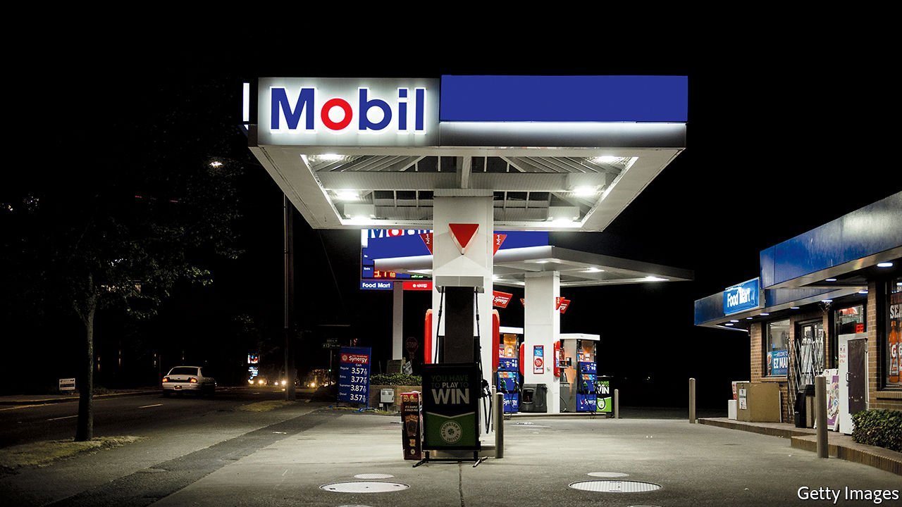

###### 

# Business this week 

#####  

 

> May 29th 2021 

At least two directors nominated by Engine No. 1, a small, environmentally minded hedge fund, were elected by shareholders to . It is the most significant victory yet in the push by activist investors to force big oil companies to do more on climate change.

Environmental legacy


In a ruling with ramifications for the whole oil industry, a Dutch court sided with green campaigners and found that Shell was in part responsible for climate change, ordering it to cut its carbon emissions by 45% by 2030 from 2019 levels. Shell currently aims to lower emissions by 20% in 2030 and 45% in 2035 from 2016 levels. It is to appeal against the verdict.

Activist investors have increased their clout during this year’s shareholders’ meetings in a wide range of industries. This week Aston Martin faced down a mini revolt, when 18% of shareholders opposed its pay policy for directors and 17% went against the re-election of Lawrence Stroll as chairman. Mr Stroll is credited with rescuing the struggling sports-car maker with an injection of capital in 2020.

Germany’s two biggest property companies, , agreed to merge, creating Europe’s largest residential real-estate group. The deal is controversial. Rents have soared in Berlin, producing a political backlash. The firms gave assurances that they would limit rent increases to 1% a year in Berlin for the next three years and provide flats for young families at below market rents.

Singapore’s first-quarter GDP figure was revised, revealing a much faster expansion than had been thought. The economy grew by 3.1% compared with the previous three months; manufacturing output was up by 10.8%.

Joe Biden confirmed that he would not impose sanctions on the corporation that built the Nord Stream 2 pipeline, which will transport gas from Russia to Germany. Critics contend the project’s main purpose is to increase European reliance on Russian energy, but Mr Biden said that sanctions would be counter-productive, given that the pipeline is almost complete. The decision is a win for the German government, and a blow to Ukraine, which will lose income from transit fees for Russian gas.

Turkey’s president sacked a deputy governor at the country’s central bank, the third defenestration of a senior official within two months. Recep Tayyip Erdogan has whittled away at the central bank’s independence over the years in his attempt to suppress interest rates, replacing the governor with a supporter in March. Since then the lira has slid by 15%.

Uber said it would allow its drivers in Britain to join a union, the first time that the ride-hailing company has given official recognition to a union in any country. In February Britain’s Supreme Court ruled that Uber must extend employee rights, such as a minimum wage, to its drivers.

The fallout from the collapse of Greensill Capital, a financing firm, spread to Italy, where the central bank pushed Aigis Banca, a specialist lender based in Milan, into liquidation. A basket of Aigis’s assets, were sold to another Italian bank for €1 ($1.20).

The city of Washington, DC, sued Amazon, claiming that the retailer forced third-party sellers to agree not to sell their wares at lower prices anywhere else on the internet. Amazon, which also faces investigations in Europe and India, said it would fight the lawsuit. Meanwhile, Amazon secured its deal to buy MGM, paying $8.45bn for the film studio.

WhatsApp, a popular encrypted-messaging service owned by Facebook, said it was suing the government of India over new rules requiring it to be able to trace messages sent on its platform. WhatsApp has long used privacy as a selling-point; it the most popular messaging-app in India.

The first private licence to operate mobile services in Ethiopia was awarded to a consortium that includes Vodafone. The bid for a second licence from MTN, a South African company, was rejected as too low. The liberalisation of Ethiopia’s telecoms is a proxy in the tech war between America and China. The winning bid is supported by Washington through low-cost foreign-aid loans; MTN’s proposal was backed in part by a Chinese state investor.

No passport required

Following an aborted launch in December, Virgin Galactic conducted a successful test flight of its VSS Unity spacecraft, which touched down in New Mexico after reaching an altitude of 55.45 miles (89.2km). The company hopes to put paying passengers into orbit next year. Blue Origin, a space-tourism venture backed by Jeff Bezos, will send its first paying passenger into space on July 20th. The current bid for the tourist seat to be occupied by the lucky (and brave) person on that mission is $2.8m.

