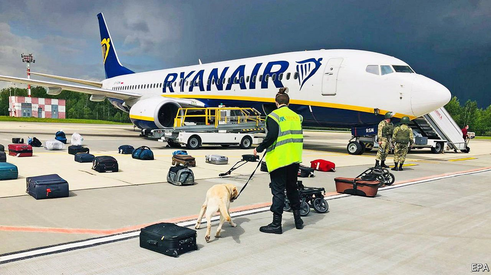

###### 

# Politics this week 

#####  

 

> May 29th 2021 

 flying from one EU country (Greece) to another (Lithuania) with more than 100 people on board. The plane was in Belarusian airspace. Citing a “bomb threat”, the authorities sent a fighter jet to make it land in Minsk, the Belarusian capital. They arrested two passengers: Roman Protasevich, an exiled journalist, and his girlfriend. Mr Protasevich had rallied opposition to Alexander Lukashenko, the despot who stole Belarus’s presidential election last year. No bomb was found. Russia applauded Mr Lukashenko’s boldness; the EU mulled sanctions on his isolated regime.

Switzerland said it was walking away from years of negotiations on a new treaty with the EU aimed at harmonising dozens of messy individual deals on trade, investment and the movement of people.


Police in India visited Twitter’s offices after it added a warning of misinformation to tweets posted by members of the ruling party. The tweets purported to detail plans drawn up by the opposition to discredit the government’s handling of the pandemic, but fact-checking organisations said the documents were fake.

America warned its citizens not to travel to Japan, after an increase in the number of covid-19 cases there. A survey suggested that 80% of Japanese believe the Olympic games, which are due to begin in Tokyo in July, should be postponed again or cancelled.

China responded angrily to an American call for . A foreign ministry spokesman accused America of smearing China and of ignoring the possibility that the virus originated in the United States.

Twenty-one competitors in a 100km ultra-marathon in a mountainous area of western China were killed by extreme weather, including hail.

 passed a bill that allows the state’s residents to carry a handgun without a licence. The law sets up an online course in gun safety for people unsure about how to handle weapons.

, the militant Islamist group that controls Gaza, stuck to a recently agreed ceasefire. To bolster the truce Antony Blinken, America’s secretary of state, held separate meetings with Binyamin Netanyahu, Israel’s prime minister, and Mahmoud Abbas, the president of the Palestinian Authority. He also went to Egypt and Jordan.

Republicans in the American Congress introduced legislation to beef up the government’s monitoring of anti-Semitic attacks. The conflict between Israel and Hamas has led to a “dangerous and drastic surge in anti-Jewish hate” in America, Britain and other countries, according to the Anti-Defamation League, a civil-rights group.

Iran’s Guardian Council disqualified most of the candidates who registered to run in the presidential election on June 18th. Only seven candidates, mostly hardline and pious, were allowed on the ballot. The conservative judiciary chief, Ebrahim Raisi, is the front-runner to succeed Hassan Rouhani, who is relatively moderate.

Iran reached a deal with the International Atomic Energy Agency to extend for a month an agreement that allows international monitors to inspect its nuclear programme. The head of the agency said he was very concerned about Iran’s claim to be enriching uranium to a purity level of 60%, a level only countries that are making bombs attempt to reach.

Abubakar Shekau, , a jihadist group that enslaves girls, reportedly died in Nigeria after blowing himself up to avoid capture by rival jihadists. Mr Shekau has been declared dead five times before, only to resurface. But this time the reports appear to be true.

Army officers in  forced the president and prime minister to resign because they were upset about a reshuffling of the cabinet. The same officers carried out a coup last September.

After years of dodge and deferment, Jacob Zuma, a former president of South Africa, appeared in court. He faces 18 charges relating to an arms deal signed by the government in the late 1990s, including an allegation that he accepted a bribe from Thales, a French defence firm. Both he and the firm deny the charges.

In Peru 16 people were massacred in a village in a region known for cocaine production. The authorities blamed Marxist , who killed tens of thousands of people in the 1980s and 1990s. The killings came two weeks ahead of a tense presidential run-off, which pits Keiko Fujimori, the daughter of a former president convicted of corruption, against Pedro Castillo, a left-wing activist.

In Mexico the police chief of Sinaloa state, the name of which is associated with a powerful drug cartel, was murdered by bandits who fired 200 bullets into his car.

A soldier in Canada was charged with mutiny for the first time in decades. The reservist is accused of trying to persuade other soldiers to join him to disrupt the distribution of covid-19 vaccines.

Coronavirus briefs


The number of officially recorded , on one day dropping below 200,000 for the first time in weeks.

Germany banned most visitors from Britain because of the spreading Indian variant of covid-19 in that country. French officials said people entering from Britain would have to quarantine, but stopped short of an outright ban. Research in Britain, meanwhile, found that two doses of either the AstraZeneca or Pfizer vaccine provide good protection against the Indian variant.

An outbreak of the variant in Melbourne led to a new lockdown in the Australian state of Victoria, a disappointment for the city, which last year had one of the world’s longest lockdowns. Vaccination rates in Australia remain very low.

Argentina entered a nine-day lockdown. Cases are surging amid a slow take-up of the jab.

