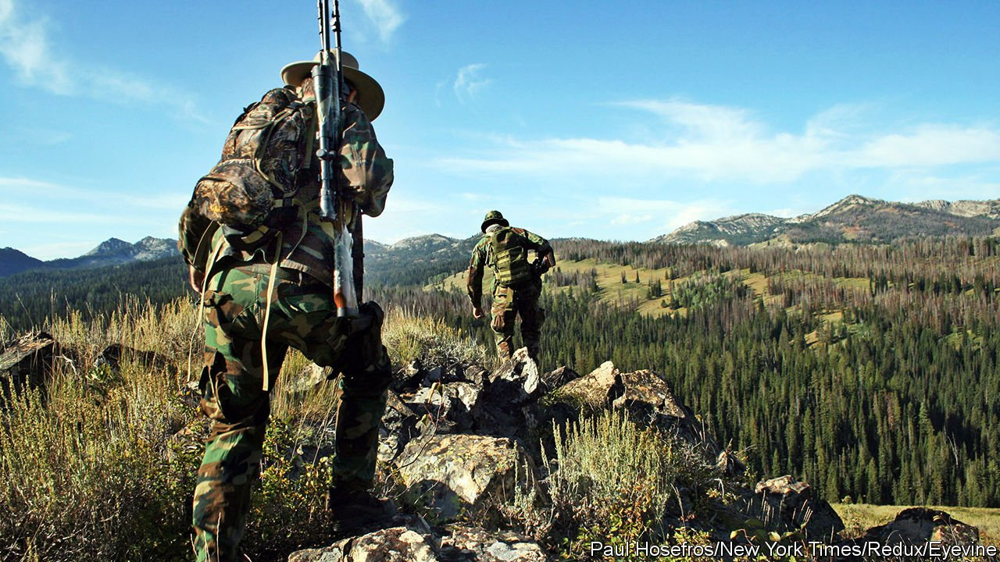

###### Wildlife wars

# America’s Sagebrush Rebellion never ended 

##### There is an ideological link between the 1970s movement and recent wildlife-management laws 

 

> May 29th 2021 

BACK IN February, Montana’s Republican governor killed a wolf without a proper permit. Greg Gianforte, who is best-known for body-slamming a reporter on the campaign trail in 2017, trapped the creature after it strayed out of Yellowstone National Park and onto a private ranch owned by one of his political donors—the director of Sinclair Broadcast Group, whose 191 local TV stations might not frown on trapping liberals. A satirist could be proud of this Western. It also exemplified what Chris Servheen, a wildlife biologist in Missoula, describes as a new bout of “anti-predator hysteria” in state legislatures in the northern Rocky Mountains.

Lawmakers in Montana and Idaho have recently passed a slew of measures to reduce the number of bears and wolves in their states. In Idaho one law allows wolf-hunting from snowmobiles and all-terrain vehicles. It devotes money to private contractors tasked with hunting the animals down and removes limits for the number of wolves one person can kill. The law says that wolves can be killed so long as their number still exceeds the state’s recovery goal of 150 animals. That means 90% of the Gem State’s 1,500 wolves are at risk. Next door in Montana, Mr Gianforte has signed bills that, among other things, will extend the wolf-hunting season and reimburse hunters and trappers for their expenses.


Wolves are not the only predators in legislators’ cross-hairs. Grizzly bears are still protected in the Lower 48 under the Endangered Species Act (ESA). But two new laws in Montana increase the likelihood that they will be killed, by banning state employees from moving bears that wander out of protected zones, and allowing people to kill a bear if they think it is threatening livestock. Republican senators from Idaho, Montana and Wyoming have also introduced a bill to remove grizzlies around Yellowstone from the endangered list. Mr Servheen, who led the Fish and Wildlife Service’s grizzly-bear recovery programme for 35 years, says the laws amount to the biggest attack on the region’s large predators since they were nearly wiped out by settlers in the 19th and early 20th centuries.

The laws’ proponents argue that the animals hurt ranchers and human hunters by preying on livestock and big game, such as elk. The data say otherwise. The number of cattle and sheep killed by wolves amounts to an insignificant fraction of Idaho’s livestock, and ranchers are compensated for their losses. There are also more elk today than when grey wolves were brought back to the state in 1995.

Why, then, are Republicans eager to kill the West’s big predators? The impulse behind these laws is not new. Andrew Isenberg, a historian at the University of Kansas and author of “The Republican Reversal: Conservatives and the Environment from Nixon to Trump”, says the threat wolves pose to ranchers is largely symbolic. The ESA was passed in 1973 and signed into law by Richard Nixon. The law called for the protection of threatened animals and, crucially, the ecosystems they inhabit. But those protections were viewed by many westerners as overreach by the federal government, which, they argued, should have little say over how western lands are managed.

The animosity towards the ESA and other federal regulations on land use in the West boiled over in the form of the Sagebrush Rebellion in the late 1970s. The rebels—a coalition of ranchers, miners, loggers, oilmen, local officials and western politicians—fought to pass bills that would transfer the management of public lands to the states. Ronald Reagan famously told Utahns to “Count me in as a rebel” on the campaign trail in 1980. The Gipper’s election quieted the rebels, but fights over federal land flare up whenever the interests of westerners in extractive industries, ranching or state government clash with those of conservationists and, lately, climate scientists.

More recently, Donald Trump’s rollback of environmental laws gave would-be rebels something to cheer. The Trump administration took grey wolves off the endangered list and reduced the size of protected lands. State parties have kept it up. Republicans in Montana enjoy a trifecta, which means the party controls both chambers of the legislature and the governor’s mansion. Steve Bullock, the state’s previous governor and a Democrat, would probably have vetoed the predator laws.

Conservation once had bipartisan support. That consensus, argues Mr Isenberg, broke down during the oil crisis in the 1970s when the environment took a back seat to the pursuit of energy independence. Perhaps that calculation will shift again. Meanwhile, the wildlife wars rage on. “It’s like watching a car wreck in slow motion,” Mr Servheen says about Montana’s new bear laws, “when it’s your car and your family in it.” ■

