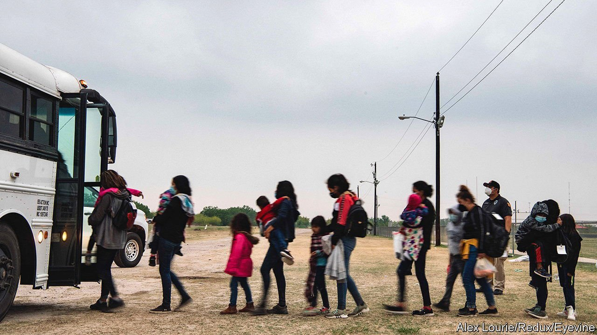

###### Foreign domestic policy

# For the Biden administration, the Northern Triangle poses a migration trilemma 

##### Reduce migration, reduce corruption or be humane? 

 

> May 29th 2021 

HAD THE protest not been on the Mexican side of the border, it could have been mistaken for a rally for Joe Biden. Migrants sported white T-shirts emblazoned with the president’s campaign logo and the message “Biden Please Let Us In”. Critics say the president’s folksy manner is to blame for a surge in arrivals at the border that his administration is scrambling to contain. That may be unfair, but it reflects the discontent many Americans feel over his handling of immigration. It is one of the few policy issues where a majority disapprove of the president’s performance.

While some migrants—particularly from the “Northern Triangle”, as Guatemala, Honduras and El Salvador are collectively known—may have been encouraged by Mr Biden’s promise of a “fair and humane immigration system”, most leave their homes for other reasons. Central America has the highest poverty rate, and some of the worst homicide and domestic violence rates, in Latin America. Families who have the means to legally move abroad do so, while those who do not will often take the long route north. Worsening natural disasters, such as back-to-back category-four hurricanes in 2020, also displace people.


Mr Biden is no stranger to the Northern Triangle’s woes. As Barack Obama’s vice-president he oversaw an effort to reduce migration by dealing with its root causes, a job he feels compelled to finish, says Paul Angelo, from the Council on Foreign Relations, a think-tank. He has requested $4bn in aid for the Northern Triangle and chosen vice-president Kamala Harris to lead talks there. Ms Harris will visit Mexico and Guatemala in June, her first official trip abroad. And he appointed Ricardo Zúñiga, a senior member of the foreign service, as special envoy to the Northern Triangle.

Donald Trump froze aid in the hope of forcing governments to detain northbound migrants. This may have contributed to a dip in arrivals. Mr Biden hopes to accomplish something similar with programmes to reduce crime and poverty. Some have met success: according to USAID, in 2014-2017 community violence-prevention schemes helped to lower murder rates by 45% across 50 municipalities in El Salvador and 36% nationally in Honduras (other experts point to a crackdown in prisons and rumoured negotiations between gangs and politicians). Mr Biden has not abandoned harder options, however. His administration struck an agreement with Mexico and the Northern Triangle to beef-up their border security.

Yet working with central-American governments goes against another of Mr Biden’s impulses: fighting corruption. Over the past decade the rule of law has eroded in the Northern Triangle, according to Transparency International, a watchdog. The Universidad de las Américas Puebla ranked Honduras and Guatemala among the worst countries for impunity (Mexico trailed not far behind). Both scrapped international commissions that investigated and prosecuted crooked officials.

Finding a balance now falls to Ms Harris and Mr Zúñiga. The vice-president has conspicuously avoided criticising Andrés Manuel López Obrador despite some of his autocratic inclinations, in part because his co-operation on immigration is necessary. Meanwhile the Mexican president has rebuked America for giving aid to an NGO that has criticised his administration.

Mr Zúñiga has had a rocky start with El Salvador’s president, Nayib Bukele, who has bristled at criticisms of his government’s tightening grip on power. And the Biden administration has given a wide berth to Juan Orlando Hernández of Honduras, who stands accused in a court case in New York of taking bribes from drug traffickers. The US-Northern Triangle Enhanced Engagement Act empowers the Department of State to identify corrupt officials and deny them entry into America. Several names have been added to the list, including Mr Bukele’s cabinet chief. The problem, warns Andrew Selee of the Migration Policy Institute, is that “in contexts where corruption is required to get things done, no one has clean hands.”■

For more coverage of Joe Biden’s presidency, visit our dedicated 

