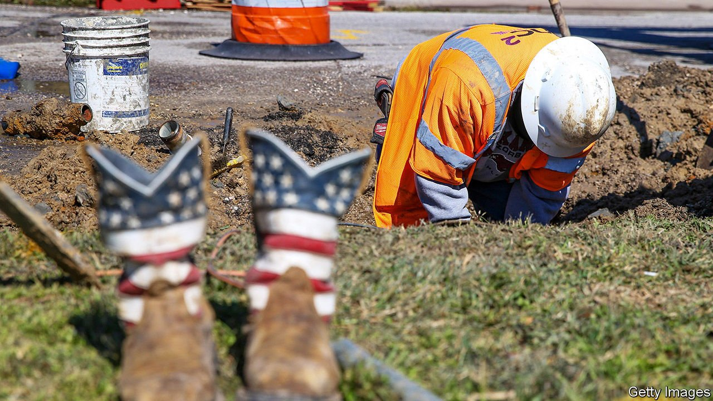

###### Infrastructure year

# How to build back under budget (maybe) 

##### Lessons from the construction of the James Wilson line 

 

> May 27th 2021 

“THIS IS A unique opportunity,” says Bent Flyvbjerg, an economic geographer who studies infrastructure projects. “There hasn’t been anything like it in the history of the United States.” He is referring to the Biden administration’s $1.7trn infrastructure plan. A group of Senate Republicans have countered with a $1trn offer. Whatever the final number, how can lawmakers make sure the money goes as far as possible?

The need to build new projects and repair old ones is not in dispute. Poor infrastructure costs trillions in foregone growth. A third of America’s bridges are structurally deficient. New structures, such as seawalls and storm barriers, are needed to help mitigate the effects of climate change. But productivity in public-sector construction has stagnated for decades and high costs abound, particularly where transport is concerned. The money needed to construct a mile of interstate highway rose threefold in real terms between the 1960s and the 1980s. American subway lines often cost between two and four times as much as typical projects in Europe or Asia.


Consider the James Wilson line, a hypothetical rail project named after The Economist’s founder and paid for with an influx of Biden bucks. Even before ground is broken, the cost forecasts are wildly inaccurate and prospective benefits dramatically inflated. A cost-benefit analysis is done, but elected officials discard its results in favour of political considerations. Mr Flyvbjerg argues that this all leads to the projects that look best on paper being implemented, “and the projects that look best on paper are the projects with the largest cost underestimates and benefit overestimates, other things being equal”.

Soon, a press release goes out announcing the construction of the Wilson line. Immediately vocal pressure groups demand expensive changes. By insisting on additional features like walls to contain noise and paths for pedestrians, this stirring display of participatory democracy adds new costs. Spooked by the response, the government takes expensive, pre-emptive steps to reduce the likelihood of litigation. A recent paper argues that such exercises of “citizen voice”—and governments’ fear of them—are a big cause of soaring highway-construction costs.

Leah Brooks, one of the paper’s authors, argues that legal and social changes in the 1970s set the stage for this situation. That decade saw the rise of homeowners’ associations, as well the introduction of legislation requiring more consideration of citizens’ concerns. New judicial doctrines increased the ability of citizens to sue executive agencies. The National Environmental Policy Act (NEPA), a landmark piece of legislation passed in 1969, delivered valuable environmental protections. Combined with a Supreme Court decision that enhanced citizens’ ability to sue the government, NEPA provided a “judicial toehold” from which to oppose new construction—whether or not the challengers’ concerns are genuinely motivated by a desire to protect the environment.

It is now time for a contract to be awarded for construction of the Wilson line. Best practice is to give out contracts on the basis of cost, speed, and a technical score determined by an in-house oversight team. But unfortunately the agency drawing up the contract does not have enough qualified staff to conduct a full review of construction proposals. The lowest bidder wins the job, as is typically the case in America. After winning, however, the contractor quickly tacks on additional costs, and the government is again in over its head. Unable to manage such a big project, it ends up relying on contractors and consultants who botch key segments of the Wilson line, requiring expensive do-overs. Inter-agency turf battles and co-ordination problems worsen the situation.

For the Wilson line’s underground sections, its builders choose to do things the hard way. Its stations, like those of New York City’s recently built Second Avenue subway, are unnecessarily large. And instead of digging the stations out from street level in a so-called “cut-and-cover” approach, which is the (cheaper) norm in sensible places like Denmark , the Wilson line’s builders choose to mine them from within a tunnel. Alon Levy, who studies transit infrastructure costs, says such mystifying choices come about because America has failed to copy other countries. Mr Flyvbjerg goes further: America has such an “island mentality”, he claims, that it doesn’t even consider outside ideas for long enough to reject them.

What can be done so that projects like the imaginary Wilson line do not go off the rails? State and federal agencies can ensure that teams have enough capacity to review multiple projects and to manage contractors. Being too punctilious can backfire, though: New York’s exacting requirements are partly responsible for the astronomical costs of subway construction there.

More advanced construction practices can also help. Standardisation of components like railway cars and subway stations can reduce variation, thereby shortening timelines and lowering costs. Transparency and accountability are vital as well. The Army Corps of Engineers, which is responsible for maintaining more than $300bn-worth of dams and levees, records cost data but does not make them public. Ms Brooks says it should. To mitigate the effects of citizen voice, she also suggests a statute of limitations on litigation for some infrastructure projects.

Donald Trump implemented NEPA reforms which he said would speed construction, but which also did away with some valuable environmental protections. The Biden administration is considering rolling back these changes. NEPA has been used to challenge not just polluting industrial facilities but renewable energy projects as well, and the threat of environmental lawsuits adds to infrastructure costs. Mr Biden is free to roll back Mr Trump’s changes— but he should consider making some of his own.■

