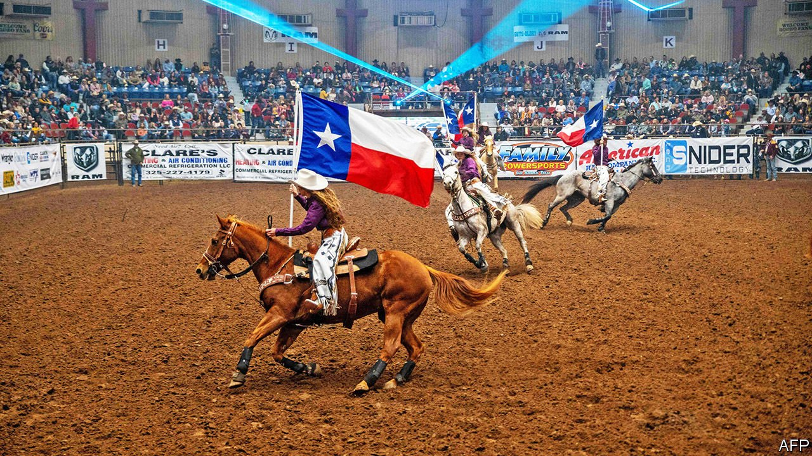

###### Texas politics

# In Texas, the most conservative legislative session in a generation is wrapping up 

##### Yes to guns, no to abortion and critical race theory (and please don’t mention the power blackout) 

 

> May 29th 2021 

TEXANS PRIZE efficiency. They like to elide “you” and “all” into a single-syllable word, and instead of the state government meeting annually, its citizen legislators are in session only every other year to discuss the budget and pass new laws. (This is despite Texas boasting the ninth-largest economy in the world, ahead of Brazil’s.) May 31st marks the end of the current legislative session in Austin, but the impact of the past few months will be felt for longer. “This was the most conservative session I’ve seen in 30 years,” says Evan Smith of the Texas Tribune, which keeps tabs on the state capitol.

If Texas is dancing the two-step, it is doing so with two right feet. Bills that might not have even been given a hearing in previous legislative sessions are passing both Republican-controlled chambers of the state legislature and being signed by the Republican governor, Greg Abbott. This includes one of the most restrictive abortion laws in the country, which bans the procedure as early as six weeks and makes no exception for rape or incest. “Permitless carry”, which enables those over the age of 21 to carry a handgun with them in public without going through training, fingerprinting or a background check, has also passed the legislature and will soon be signed into law. What once seemed a fringe preoccupation of a few lawmakers is now mainstream among Texas Repulicans.


The same is true of a new voting bill, which puts restrictions on polling places and their hours of operation, and was expected to be signed into law as The Economist went to press. The session also underlined where the front-line in the culture-wars is now: there was a bill banning the teaching of critical race theory (a particular approach to historical racial bias) in schools. One preventing transgender students from joining school sports teams that match the gender with which they identify narrowly missed a deadline. Another bill being considered would require sports teams that do business with the state to play the national anthem at every game. “Just when you think Texas couldn’t go further to the right, here we are,” says Mark Jones of Rice University.

This rightward-step took many by surprise, because the last time legislators convened the bills they passed were more concerned with governing than signalling. That session had followed Democratic gains in 2018, when Beto O’Rourke ran for the US Senate. In response Republicans adopted a strategy of self-preservation, mostly avoiding polarising social issues and focusing instead on priorities for mainstream voters, such as increasing funding for public education and capping property taxes.

Since then, the 2020 election has emboldened Republicans, who see self-preservation rather differently now. After boasting that they could well take control of the state House, Democrats failed to make inroads, both because campaigning was constrained by covid-19 and because national progressive rhetoric did not play well in Texas. Republicans have seized on this, and are using this legislative session to establish their credentials ahead of next year’s mid-term elections, when all 31 members of the Senate are up for election.

Members of the legislature fear Democrats less than losing to a conservative rival in the primary. “Nobody cares about November any more,” says Jason Sabo of Frontera Strategy, a lobbying firm. “The only thing that matters is March, and the only way to lose a Republican primary is if someone makes you look too liberal.” Mr Abbott, too, is using this legislative session to fend off conservative primary challengers next year, when he is up for re-election. He is believed to have presidential aspirations, and views the state’s fame for some of its more Trumpian laws as thoroughly good for his own national brand.

Texas may be a bellwether for national politics. It is also a showcase for the lingering influence of Donald Trump and his acolytes. Dan Patrick, the lieutenant-governor, twice chaired Mr Trump’s campaign in Texas. The state’s voting bill panders to the former president’s false claims of electoral fraud. “The only people who were at the Capitol in Austin were legislators and older white male lobbyists in pinstripe suits and cowboy boots,” says Mr Sabo. “I have seen more American-flag-wear in the last 25 days than I have in the last 25 years,” he adds. “It’s like a Trump rally.”

Meanwhile, plenty has been left undone. Consider Dallas Independent School District (DISD), the state’s second-largest. Michael Hinojosa, the superintendent, says his biggest priority was to see that funding promised in the last session was not cut, a worry eased by the federal stimulus. But now, on top of trying to ensure that pupils catch up with the learning lost during the pandemic and the huge snowstorm in February, he will have to eliminate all black and Mexican-American studies courses at DISD’s 37 high schools and redesign professional training for all 22,000 employees, because of a bill (which will probably pass) banning modish talk about accommodating people of different ethnic or racial backgrounds. Republicans enjoy bossing teachers around. Mr Abbott announced that public schools and other government entities can no longer require masks on their campuses from June 5th.

The trend of state government exerting power over local—largely liberal—cities and counties is playing out across Texas. The voting bill is another instance of the state trying to “micromanage” by telling counties where to put polling places and how long they can stay open, says Lina Hidalgo, the Democratic county judge of Harris County, which covers Houston. Other examples include new laws to stop local governments from allowing homeless encampments and to prevent them from defunding the police (which they are not actually doing). “We can finally retire the idea that local control is a conservative value,” quips Mr Smith of the Texas Tribune.

Legislators will be back in Austin this autumn for a special session on redistricting. Because the Democrats did not win control of the House, Republicans will have unchecked power to redraw districts to favour them. It will be hard to draw districts that last for more than a couple of election cycles, predicts Ed Emmett, a Republican who was county judge and lost to Ms Hidalgo. “If Republicans don’t start talking about issues that the general public cares about, we’re not going to be competitive,” he says. Yet similar pleas from moderate Texas Republicans have been heard before, and ignored.

Right now the headlines are focused on the bills being passed, but the session may be remembered just as much for what was ignored. This includes devising a plan for Texans who lack health-care coverage and shoring up the state’s electricity grid, after the February storm left millions without electricity and killed around 200. The legislature has not developed a substantive bill to prevent the grid from failing again, even though experts have warned that the summer heat could cause widespread blackouts. Their elected representatives may leave them without electricity, but at least Texans will not need a gun permit. ■

