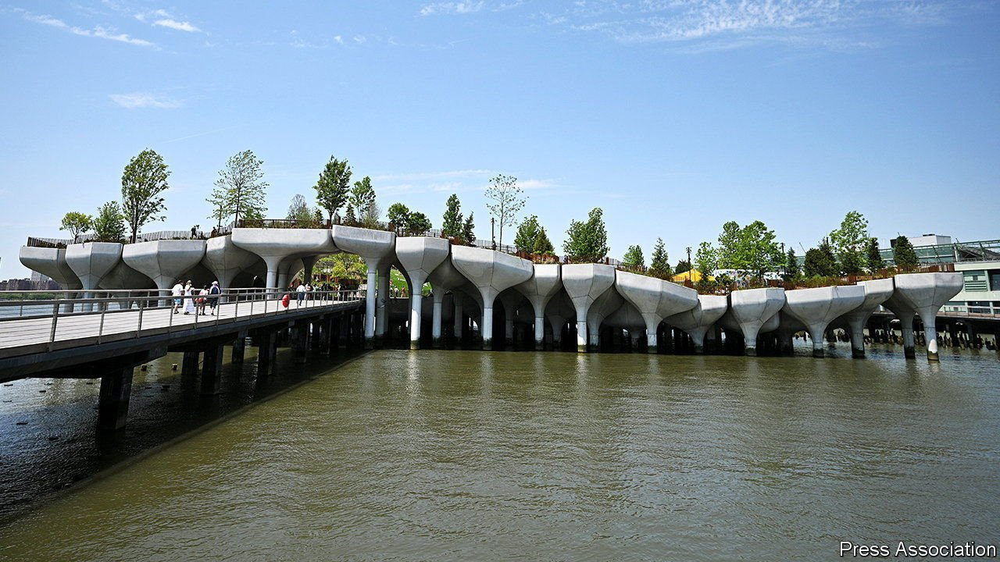

###### Island mentality

# New York’s newest island reflects the city’s spirit 

##### Mix a hurricane, a billionaire backer, a British designer and plenty of lawsuits. Garnish with tulips 

 

> May 29th 2021 

DEPENDING ON tide levels, New York City is made up of 40-odd islands. Some are famous, like Ellis Island, where 12m immigrants officially entered America. Hart Island is where the city buries its poor. Rikers Island is a penal colony. But mostly, as former mayor, Michael Bloomberg once noted, “New York City’s smaller islands are our secret treasures.” Governor’s Island is a car-free park. City Island is a fishing village. As of May 21st, New York has a new, manmade, one: Little Island.

Little Island rests on 132 concrete “tulips” of different heights, which create rolling hills and winding footpaths over 2.4 acres (1 hectare). Designed by Thomas Heatherwick, a Brit with a talent for eye-catching public designs, the island is a whimsical delight. Like its neighbour the High Line, an obsolete freight track converted to public space which (in the before times) drew 8m visitors a year, it will be much visited.


It is also characteristically New York, a city enlivened by madcap projects. This one was the brainchild of Barry Diller, a billionaire media mogul. Mr Diller was asked to help rebuild a pier destroyed by Hurricane Sandy. He was keen to do something more architecturally ambitious. The project faced several legal challenges: its creator almost gave up on what had become known as Diller’s folly. Then Andrew Cuomo, New York’s governor, intervened to keep it afloat.

Mr Diller’s and his wife Diane von Furstenberg’s foundation spent $260m on Little Island. It will continue to maintain the island for the next 20 years. He says he understands people who say, “Why should somebody with money dictate what public places are like?” But, he says, that misses the point. Having the resources means he can “braze it through” while public officials delay.

The island opened just as the city begins to lift restrictions. Dan Doctoroff, Mr Bloomberg’s deputy mayor, who steered the city’s tilt toward the west side, sees Little Island as a catalyst for New York’s recovery. It is also part of the west side’s rebirth, which includes the High Line (Mr Diller and his wife were early champions of that too) and Hudson Yards, a huge redevelopment project. Google has leased some of the pier next door. To the south a garage for rubbish lorries is being converted to a sports field and a sandy beach. “The key,” Mr Doctoroff says, is to “create conditions where people want to do extraordinary things.”

