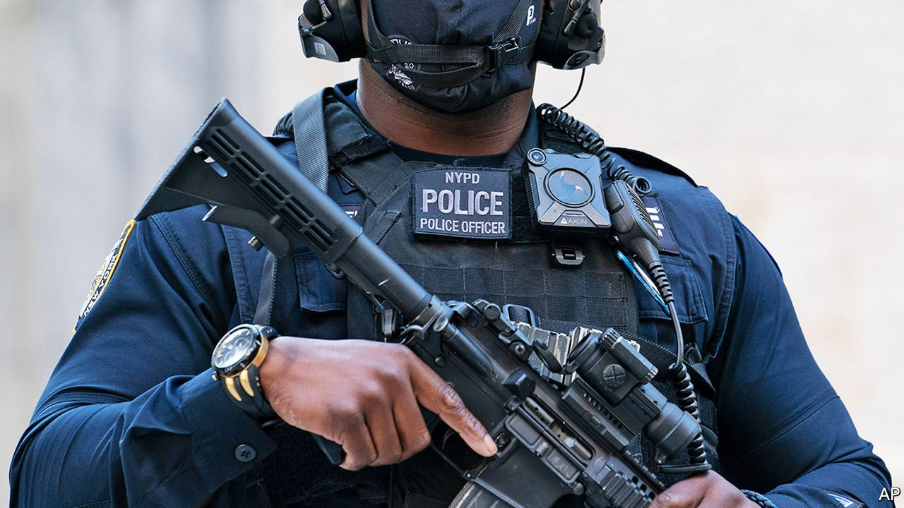

###### Body of evidence

# The George Floyd Act is a police-reform smorgasbord. Would it work? 

##### Assessing the evidence for and against the bill 

 

> May 27th 2021 

ACCORDING TO INITIAL reports from the Louisiana State Police, Ronald Greene died in a car crash. This was in May 2019, one year before the murder of George Floyd. Mr Greene’s family was suspicious, so they pressed the police to release footage from the cameras worn by six of the officers on the scene. Not all the devices were switched on, and it took a 17-month wrangle before they could watch the footage (the public did not see it until the Associated Press leaked it, seven months after that). It showed the troopers repeatedly stunning Mr Greene with a taser, punching him, and leaving him moaning face-down on the road for nine minutes; he died on the way to hospital. The assault was recorded on body cameras.

After the murder of Mr Floyd a year ago, a police-reform bill named after him was introduced in Congress. It was passed by the House of Representatives but is pending in the Senate. The House version encompasses a range of policies, including restrictions on the use of force (any application of physical restraint other than handcuffing), creating a national database of officer misconduct, requiring federal officers to wear cameras and limiting qualified immunity (a judicial doctrine that shields officers from civil liability). Would it actually improve policing?


A large-scale study by the Becker Friedman Institute at the University of Chicago found that body cameras reduce the number of police misconduct complaints by 17%. They also probably reduce the use of force. But in 2020 only about 8,000 departments (about 45%) used such cameras and just seven states required them. The Floyd Act, as currently written, requires federal uniformed officers to wear body cameras, and requires state and local law enforcement to buy them with federal funds. Much of the Floyd Act applies only to federal officials: the Federal Bureau of Investigation, United States Park Police, officers in the various federal departments, and others. They account for only about one-fifth of America’s 700,000 law-enforcement officers. But the bill could nevertheless serve as a standard for other departments, says Mark Levin, a lawyer at the Council on Criminal Justice, a think-tank.

Just putting cameras on officers is not enough, as shown by Mr Greene’s death. North Carolina requires a judge’s approval to release video footage, as does Louisiana, where Mr Greene was killed. Eleven other states also restrict public access to body-camera footage. By contrast, when Ma’Khia Bryant, a black teenager, was shot and killed by an officer in Ohio, the video footage was released publicly in a few hours. Ohio’s body-camera policy, signed by a Republican governor, John Kasich, in 2019, makes the footage part of the public record. As currently written, the Floyd Act requires federal agencies, in most cases, to release any footage showing a death or serious injury in police custody within five days of being asked to do so.

Some departments allow officers to decide themselves when to switch them on. Others have strict protocols for when a camera must be activated (at the start of any call, for example). Others use cameras activated automatically by sirens or drawing a gun from its holster. Such details matter. One study found that among officers systematically recording incidents on arrival, rather than using their discretion, use-of-force incidents decreased by 37% in comparison to officers not using body cameras. Among those who chose when to turn their cameras on and off, use-of-force incidents increased by 71% against this control group. Limiting discretion protects officers, too, argues Chad Marlow of the American Civil Liberties Union. “In the climate that we live in nowadays, if police officers have discretion and make the wrong call, a malevolent motive is going to be assigned to that officer.”

Some other parts of the bill are strongly supported by the evidence. De-escalation training—teaching officers techniques that require less frequent and less severe uses of force—was found to reduce use-of-force incidents by 28%, decrease citizen injuries by 26% and lower officer injuries by 36%. This sort of training, though effective, is required in only 16 states. But not all aspects of the Floyd Act are supported by rigorous evidence. Implicit-bias training, teaching officers about their unconscious biases, has been implemented in 69% of police departments. Yet the University of Chicago Crime Lab reckons that, as currently implemented, it is ineffective.■

A version of this article was published online on May 23rd, 2021

