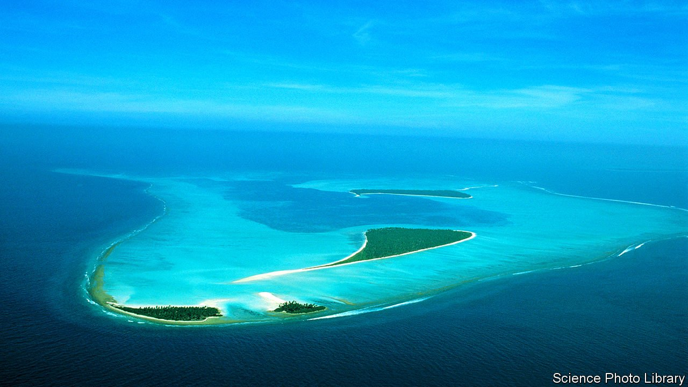

###### Run the jewels

# India plans to remake Lakshadweep for tourism 

##### Whether locals want it or not 

 

> Jun 5th 2021 

THE BROCHURE writes itself: a scattering of coral ringlets, each encircling its own turquoise lagoon within the Arabian Sea, Lakshadweep is India at its most alluring. These 36 islands, together totalling just 32 square kilometres of land, are peopled by a matrilineal, mostly Muslim society where families make their living through seafaring and coconut harvests.

In the past fortnight this drop in the Indian bucket, just 70,000 people among 1.4bn, has come to exemplify a sort of controversy that is becoming incessant. The national government of Narendra Modi and his Hindu-first Bharatiya Janata Party (BJP) is flexing little-tested executive muscles to push through a package of reforms for the far-off islands. They would open up the archipelago to development, of tourism in particular. Locals are dismayed.


In theory “union territories” such as Lakshadweep are protected from some of the vagaries of electoral politics, since they are not part of any state. But that leaves the central government with sweeping power over them, which it increasingly employs, as Delhi and Jammu &amp; Kashmir have lately discovered. Lakshadweep has an administrator—in effect, picked by the prime minister—who may rule without regard for local opinion. These days, that is just what he is doing.

Before the latest administrator, Praful K. Patel, arrived in December, the job had been held by career bureaucrats. Mr Patel is a politician, a BJP man from Mr Modi’s home state, Gujarat, where he was home minister. As administrator of Daman, a former Portuguese enclave north of Mumbai, he enraged tribal fishermen by demolishing 90 homes along a stretch of beach seized for development. Lakshadweep is even riper for such schemes.

Earlier this year Mr Patel published a slew of far-reaching draft laws that would give the administrator the right to acquire any land for “a public purpose”. Other changes are striking given that 97% of the people of Lakshadweep are Muslim. Mr Patel would ban the sale of beef and expand liquor permits, the better to attract tourists from the rest of India. A Prevention of Anti-Social Activities Act, modelled after a similar law in Gujarat, would allow locals to be jailed without a hearing for up to a year—supposedly necessary because smugglers have been caught in Lakshadweep’s waters. Sundry rules would displace a traditional port, replace local dairy with imports (from Gujarat) and disqualify politicians with more than two children from contesting local elections.

Some of the proposed changes are worthy of debate. Many in Lakshadweep are interested in fostering tourism. Few, however, seem to like Mr Patel’s plans to do so. Lakshadweep’s sole member of parliament, Mohammed Faizal, says that the most incendiary proposals, concerning liquor and beef, are diversions. Seizing land is the power the government really intends to exercise, he reckons.

On mainland India, the debate about Lakshadweep has tended to skirt the question of locals’ wishes. A spokeswoman for the BJP explained how, “with proper planning, Lakshadweep can thrive and become the jewel in India’s crown!” This is odd language to hear 74 years after India extricated itself from another country’s crown. ■

