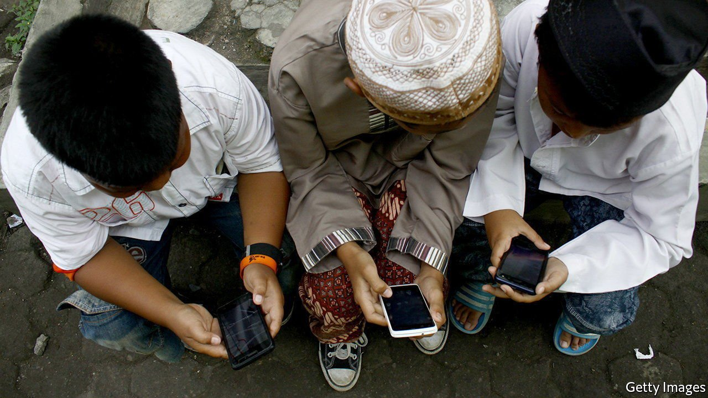

###### Regulating online content (2)

# Indonesia adds another weapon to its speech-suppressing arsenal 

##### A worrying new internet law from South-East Asia’s biggest democracy 

 

> Jun 5th 2021 

AFTER A SLOW start, citizens of South-East Asian countries have in recent years taken to the internet with gusto, using it, like their counterparts everywhere else, to shop, to chat with their friends, to watch movies and to listen to music—and to criticise their governments. And as in many parts of the world, governments have found that they do not much like that last feature of this whole internet thing.

In response, many simply charge troublesome individuals using laws against age-old offences like treason, blasphemy and sedition. More thorough legislatures, such as Singapore’s, have passed new laws prohibiting “fake news”. Some governments are even more heavy-handed. Myanmar has lately been choking off access to the internet. Cambodia plans to set up a government-controlled “gateway” through which all internet traffic must pass, the better to inspect it for wrongthink. They are in the vanguard. Asian countries are “leading the way on digital censorship”, says Linda Lakhdhir of Human Rights Watch, a pressure group.


As South-East Asia’s most robust democracy, Indonesia might have been expected to buck this trend. But under President Joko Widodo, known as Jokowi, who has been in power since 2014, many senior officials have succumbed to what Ben Bland, the president’s biographer, calls “knee-jerk authoritarianism”. A law passed in 2008, ostensibly to protect digital consumers, is commonly used to silence critics of the government. In 2019 authorities throttled the internet in Jakarta in response to riots ginned up by a defeated presidential candidate, and in Papua, a region racked by separatism, when violent protests broke out there. The government is also fond of trying to scrub the internet clean of content it dislikes. The communications ministry frequently orders internet service providers to block websites it deems false or indecent.

The latest weapon in Indonesia’s speech-suppressing arsenal is Ministerial Regulation no. 5 ( MR5), a new decree that requires internet platforms to remove prohibited content, defined as anything that violates Indonesian law, incites unrest or disturbs public order, within as little as four hours. The government says it is intended to “preserve and protect the country”. Many suspect it is designed chiefly to preserve and protect the government.

The law requires “private-sector electronic-service operators”, such as social-media platforms, search engines and financial, cloud-computing and data-processing services, to register with the government and to provide sensitive information. When the communications ministry issues a take-down notice, firms must comply within 24 hours—or four hours in the case of child pornography, material promoting terrorism or “content which disturbs society”. Penalties for firms which fail to comply include large fines and having their services blocked.

Critics say the law is vague and poorly worded, making it ripe for misuse. Online journalism websites, for example, could count as “private-sector electronic-system operators”. “Prohibited content” could include anything that would provide access to such content. Merely using a virtual private network—to log into an secure work network, for example—might become illegal.

Another concern is the requirement that companies provide law-enforcement agencies with “direct access” to their systems and data. What precisely that means is unclear, but it would expose platforms to all sorts of legal and business risks, according to the Asia Internet Coalition, which represents big international tech companies. It would also raise serious privacy concerns. The government insists that it respects the right to privacy and freedom of expression. Indeed it has postponed by six months the original deadline of June 2nd for companies to register. Citizens, firms and its less democratic neighbours will be watching to see which way it goes. ■

