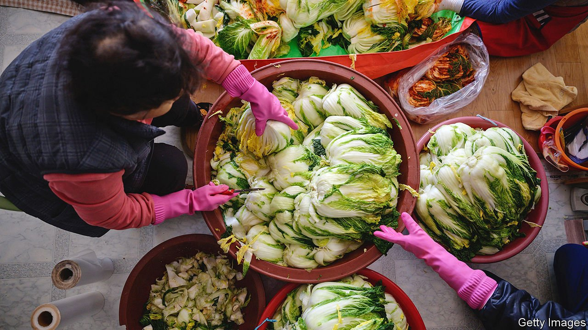

###### They’ll never take our kimchi

# South Korea’s cultural spats with China are growing more intense 

##### Helped by social media, citizens are sparring over food and history 

 

> Jun 5th 2021 

ASUPERNATURAL DRAMA about evil spirits trying to bring down a medieval dynasty is not, you might think, to be taken too seriously. Yet when “Joseon Exorcist’‘ hit South Korean screens earlier this year, it provoked apoplexy on social media. The show was historically inaccurate, fumed pedants. Not because it showed ancient Korean royals battling the undead, but because it showed them enjoying Chinese snacks, such as mooncakes and preserved eggs. Companies pulled their advertising. The show was taken off the air after just two episodes.

The incident is just one in a series of recent rows. In the past few months South Koreans have repeatedly taken to social media to rail against the “excessive” presence of Chinese brands on domestic television, forcing actors and broadcasters to apologise. They are even more outraged when Chinese state media, diplomats and social-media users suggest that important parts of Korea’s cultural heritage such as kimchi (fermented cabbage), samgyetang (chicken soup with ginseng) or hanbok (a traditional form of dress) are in fact Chinese. In April nearly 700,000 Koreans signed a petition asking the government not to “give our land to China” by permitting a China-themed cultural park and hotel in the north-eastern province of Gangwon. In response, the (Korean) developers called off the project.


These arguments are the latest version of an old clash of competing nationalisms. South Koreans are painfully aware of their country’s history as a tributary to Chinese empires, and of how Chinese troops slaughtered South Koreans during the Korean war to save the despotic regime in the North. They are proud of their country’s modernity, wealth and democracy. Many look down on China as poor, autocratic and altogether less sophisticated, while also resenting how important its vast markets are to South Korea’s own economic success. By contrast, Chinese sometimes view South Korea as a haughty minnow that derives its culture from its bigger neighbour, and that must occasionally be put in its place. “Koreans believe our culture is unique and was never dependent on China, whereas China thinks Korea only has a culture thanks to China,” says Lee Moon-ki of Sejong University in Seoul.

The tensions arising from such different interpretations of history—and the thin-skinned reactions to them—have surfaced periodically, ever since the two countries established diplomatic relations in 1992. A Chinese memorial to soldiers who died in the Korean war was the source of a big row in the 1990s. Ten years later there was another noisy quarrel over Chinese research into an ancient kingdom that once straddled what is now the border between China and North Korea. South Koreans saw it as an effort to reframe the history of their peninsula. The two countries appear to be sliding into another prolonged bout of mudslinging, this time intensified by social media.

South Koreans blame the bad blood on increasingly assertive nationalism in China. Xi Jinping, China’s leader, “keeps talking about the Chinese Dream, about rediscovering past glories after 100 years of pain,” says Mr Lee. Nationalist rhetoric from officials encourages ordinary Chinese to echo inflammatory claims, such as that China invented kimchi, reckons Min Kwi-sik of Hanyang University in Seoul. The combination of official needling and provocations by ordinary people riles Koreans. “It’s a sense of: they used to take our land, now they take our kimchi,” he says. And the viral, engagement-driven mechanism of social media tends to amplify the loudest, angriest voices, even if they belong to only a small minority. “The internet is a great place to spread conflict and bury solutions,” says Mr Min.

Still, the social-media spats reflect a deepening dislike of China. In two separate opinion polls conducted this spring, Koreans were about as favourably inclined towards China as to North Korea (with which they are technically still at war) and only barely more so than towards Japan, Korea’s former colonial oppressor. Opinions of China were better as recently as 2019, suggesting that the pandemic may have coloured views. But the real turning-point, says Kim Ji-yoon, an analyst in Seoul who specialises in polling, was an economic boycott launched by China in 2017 in response to South Korea’s deployment of an American missile-defence system known as THAAD. Shin Gi-wook of Stanford University agrees: “It was a bit of a rude awakening, alerting South Korea to the fact that China was an aggressive power.”

Young people take a particularly dim view of China, especially when compared with other neighbours and America. “I know that eating mala soup or going to shops run by Chinese-Koreans will benefit the Chinese Communist Party eventually,” says Kim Woo-jin, a 25-year-old from Seoul. Ms Kim, the polling analyst, is not surprised. Young people “don’t know as much about China as about, say, America, so they make fewer distinctions between the country, the people and the government,” she says.

The discontent is, for now, limited to the low-stakes cultural realms of food and television. Popular views of China have little bearing on the South Korean government’s carefully calibrated diplomacy, casting China as an important strategic partner while stressing the centrality of the security alliance with America. Even Chinese officials have made the occasional conciliatory noise about the origins of kimchi. Chinese shop-owners and restaurateurs in Seoul report no signs of a boycott like the one that hit Japanese brands and noodle joints during a spat two years ago.

However, during a meeting with President Joe Biden in Washington on May 21st, Moon Jae-in, South Korea’s president, was unusually explicit in his commitment to an American agenda aimed at containing Chinese influence. It is in everyone’s interest to keep the kimchi wars cold.■

