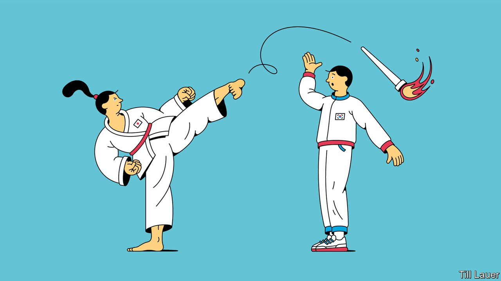

###### Banyan

# The impulse behind Japan’s decision to go on with the Olympic games 

##### Nationalism explains what rationality cannot 

 

> Jun 5th 2021 

F EWER THAN 50 days remain before the apparently unstoppable opening of the 2020 summer Olympic games in Tokyo. The pandemic led to their postponement last year. Today the clock is ticking down against a backdrop of resurgent infections of covid-19 in Japan, a state of emergency in Tokyo and nine other prefectures, hospitals filling up and widespread opposition to the games from the public, businessfolk and medical experts.

All this counts for little in the eyes of the government and the International Olympic Committee ( IOC). The games are a go “barring Armageddon”, as one IOC member unhelpfully put it. Yet Armageddon is the real fear. The pace of vaccination in Japan has been snail-slow. Many foreign athletes will arrive unjabbed. The games risk going down in history as a massive superspreader event.


One reason for Japan’s obduracy lies in its contractual obligations to the IOC. Another is the personal concern of the prime minister, Suga Yoshihide, not to lose face—and possibly support within the ruling party. But the establishment’s sense of the Olympic games as serving a patriotic purpose should not be underestimated. Tokyo’s Olympics were intended to banish a sense of being overtaken—“Japan passing”, in the anglicised phrase—by a rising China and others following years of stagnation and the Fukushima nuclear disaster. Bad enough was 2020 passing. The games’ total abandonment, in the herd thinking of the establishment, does not count as a blow for common sense. Rather, it could shatter the very notion that, as Mr Suga’s predecessor put it, “Japan is back.”

The country has been somewhere near here before. In the 1930s Japan lobbied hard to host the 1940 Olympic games in Tokyo. It was to be Japan’s moment to establish itself as a first-rate power. But like the pandemic today, war—Japan’s own invasion of China in 1937 and a looming global conflict—overshadowed everything. The games were cancelled.

Japan’s military adventurism contributed to the cancellation. Yet seeking to put a gloss on things, Kido Koichi, an adviser to Emperor Hirohito, declared that when peace reigned again, Tokyo would be ready to host the games and show the people of the world “the true Japanese spirit”. After the war, Kido was condemned as a war criminal, but Tokyo was true to his word. In 1964 it put on a splendid games, which served as a modern, democratic coming-out party for Japan.

Ever since, Asia’s hostings of the summer games have carried a broader significance for the host nation and even its neighbours. The 1988 games in Seoul, the South Korean capital, were a catalyst for democracy, helping to end decades of authoritarian rule. China’s communist leaders represented the Beijing games in 2008 as a return to historical greatness. In 2022 Beijing hosts the winter Olympics, as the Japanese government is all too aware. As Jeff Kingston of Temple University in Tokyo points out, not holding the games would hand a propaganda coup to China.

Yet such grand narratives, coupled with the region’s brittle nationalisms, can rub up against each other. Some South Koreans, led by two former prime ministers, are calling for their country to boycott the Tokyo games. At issue is a speck that appears on the official online map of Japan’s Olympic torch relay. It represents the rocky islets of Dokdo, controlled by South Korea but claimed by Japan, which calls them Takeshima. This week South Korea “strongly” urged Japan to amend the map.

Japan’s Olympic organisers appear to have tweaked the Dokdo dot to make it harder to spot. You now have to zoom in to see it. It has also been shaded, implying territorial ambiguity.

Yet regardless of how the dot got onto the Olympic map, or of the modifications made to it, Alexis Dudden of the University of Connecticut argues that it serves as “the ultimate dog whistle” to revanchist Japanese, many in the ruling Liberal Democratic Party, who think that nothing their country did during its militarist phase, including the occupation of Korea, warrants an apology. Whoever put in the dot knew it would get a rise out of easy-to-offend South Koreans. Again, Ms Dudden concludes, Japan’s far right shores up an unhealthy form of Japanese nationalism that is of no help in improving the rocky relationship between the two countries. And that is to say nothing about the want of sportsmanship in Japan’s riling its neighbour. But then nobody ever said the games are only about sport.

