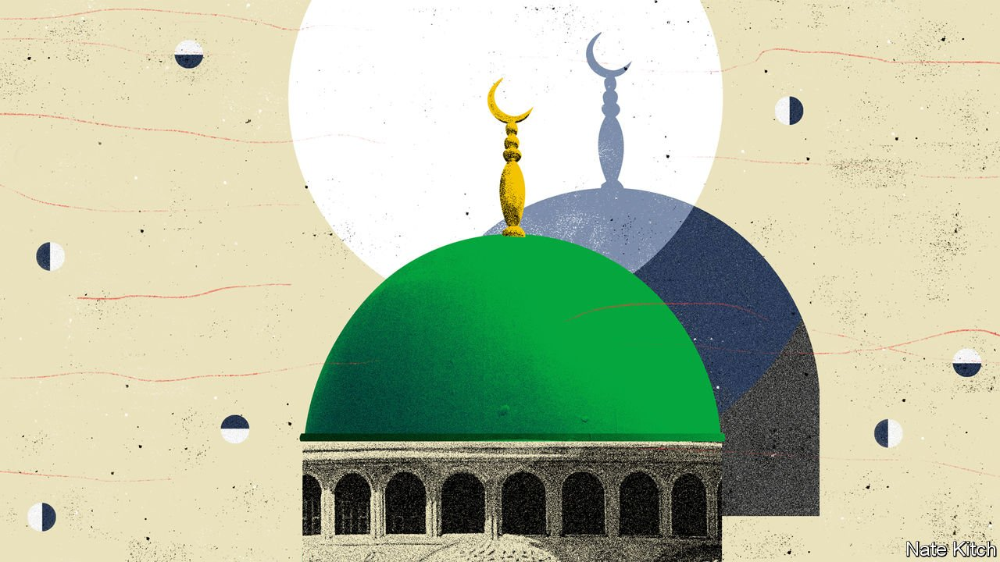

###### Bagehot

# A parallel society is developing in parts of Muslim Britain 

##### As a new book by Ed Husain explains 

 

> Jun 5th 2021 

BRITAIN HAS a glorious tradition of writers getting on their bikes, real or metaphorical, and pedalling off to discover the country. Two of the best examples of the genre were published during the Great Depression, J.B. Priestley’s “English Journey” (1934) and George Orwell’s “The Road to Wigan Pier” (1937). Bill Bryson had such a hit with “Notes from a Small Island” (1995), selling more than 2m copies, that he decided to repeat the exercise with “The Road to Little Dribbling” 20 years later.

Ed Husain’s new book, “Among the Mosques”, is a fascinating addition to this tradition, taking readers inside religious institutions that most non-Muslims only experience as domes on the horizon. The country’s first two mosques were founded in Liverpool in 1887, in a terraced house, and in Woking in 1889, on a grander scale. There are now almost 2,000 serving a Muslim population of more than 3m. Some heavily Muslim areas such as Blackburn’s Bastwell district have several in the same street. But what goes on inside? And what is their relationship with wider society?


Mr Husain is the ideal man to answer these questions. The son of an Indian father and a mother who migrated from what is today Bangladesh, he won a prize for reciting the Koran as a child and spent much of his 20s in the Middle East perfecting his Arabic. He has written two books on Islam and has a broad intellectual hinterland. He wrote a PhD thesis under the supervision of the conservative British philosopher, Roger Scruton, and has worked for a number of think-tanks including the Council on Foreign Relations in America.

Mr Husain discovered much to be pleased about. Britain has absorbed a big Muslim population better than its ancient foe, France. On May 6th London re-elected its first Muslim mayor, Labour’s Sadiq Khan. Several young politicians such as Naz Shah, MP for Bradford West, represent the modern face of the religion.

There is also a darker story. The British establishment that presided over the immigration which followed the second world war expected Islamic migrants to melt into wider society and relax their religious views. But in parts of the country Muslim communities are distancing themselves from wider British society and adopting stricter versions of their faith.

This is particularly true in the old mill towns of Yorkshire and Lancashire, which now contain parallel societies, where the faithful can live their day-to-day lives without mixing. Mosques run schools and pronounce on Islamic law. Restaurants offer gender segregation under the polite name of “family seating”.

These societies are dominated by a clerical class that extends its influence into secular society by, for example, endorsing candidates for Parliament. Mr Husain visited mosque after mosque that taught a highly literal interpretation of Islam, sometimes clinging to arguments that are being dropped in the Middle East. He saw shops displaying books that advocate stoning gays or keeping wives in purdah or waging jihad. Sayyid Qutb, Osama bin Laden’s favourite philosopher, appeared often.

Many of these clerics belong to religious groupings with roots far from these shores. Saudi Wahhabis pour money into British mosques and offer all-expenses-paid scholarships to young British Muslims. More surprising is the importance of the Deobandis. Mr Husain claims more than half of the country’s mosques now belong to the movement, which began in India and seeks to rebuild the caliphate from the ground up, convert by convert. Dewsbury, a historic market town in Yorkshire, is the European capital of the largest Muslim organisation in the world, the Tableeghi Jamaat, the movement’s evangelical arm.

Why does this matter? Religious minorities have always clung together, the better to preserve their faith. Look at the Quakers during the Industrial Revolution or Orthodox Jews in Manchester or London today. Isn’t “a parallel society” just a derogatory name for a flourishing subculture? And isn’t the Catholic church also an example of foreign influence? It is no business of the state to make windows into people’s souls.

There are nevertheless good reasons to be worried. One is the paradox of toleration. There are limits to how much liberal societies can tolerate people who call for gays to be stoned or who denounce Ms Shah as “a dog” because she fails to wear a hijab. The radicalised version of Islam being preached by clerics not only promotes intolerance but also fosters extremism.

A second is the paradox of diversity. The welfare state that liberals hold dear depends for its legitimacy on people feeling that they have a common identity. Robert Putnam, a Harvard sociologist, has demonstrated that support for the provision of public goods falls sharply if people think that the recipients are strikingly different from them. It is hard to be more strikingly different than the parallel communities of Dewsbury and Bradford.

State failure

The third is more practical. Britain is witnessing a struggle for the soul of Islam. But the state has repeatedly acted as if it is on the side of the forces of reaction rather than those of enlightenment. It has kowtowed to self-proclaimed community leaders, mistaking hardline beliefs for “authenticity”. It has tolerated schools such as Darul Uloom, in Rochdale, that combines GCSE instruction with requiring students to memorise the Hadiths, including ones about beating wives and stoning homosexuals. And it has failed to make a compelling case for Britishness. Mr Husain points out that many Muslim children get a warts-and-all account of British history from their schools, while hearing constant praise for Turkey and Saudi Arabia in their madrassas. The trauma of Brexit has created a palpable desire to cure many of the social and geographic divisions that threaten to divide the country into warring tribes. Mr Husain makes a compelling case that that quest should not ignore the world of the mosque. ■

