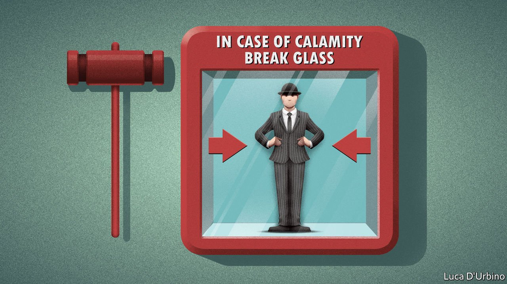
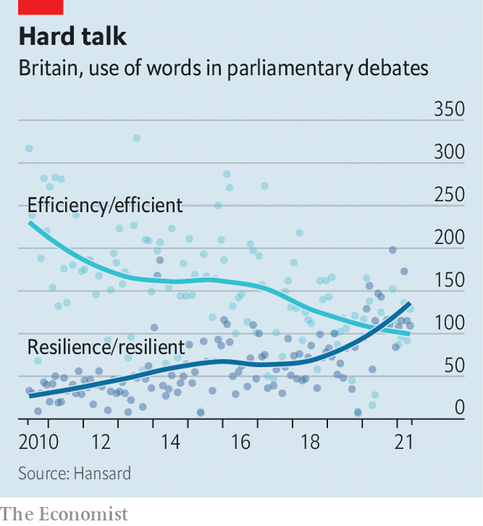

###### Defending the realm

# Boris Johnson seeks a state fit for crisis 

##### Efficiency gives way to resilience, and a new age of stockpiling, drills and imaging the worst 

 

> Jun 5th 2021 

THE BRITISH government thought its preparations for a pandemic to be among the best in the world. In 2016, 950 officials drilled for an outbreak of “swan flu”, a hypothetical illness which killed 400,000 people. It gave ministers some useful pointers on enlisting retired doctors and drafting emergency legislation.

Yet the planners did not prepare for a virus that could spread asymptomatically. Since they did not imagine a national lockdown, no plans for a furlough scheme were drafted. The permanent secretary at the business department was not even aware the exercise had taken place. The planners fretted about how the public would react to mass burials and soldiers on the streets. The resulting report stayed secret. Dominic Cummings, Boris Johnson’s former aide, told MPs last month that when a pandemic actually struck, Whitehall froze.


Mr Johnson now wants to build a more muscular state, which intervenes in the market, and tells judges and museum curators what’s what. He wants it to be harder, too: less permeable to hostile states and readier for emergencies. Successive governments have trimmed fat from public services, and chased foreign investment. Mr Johnson is twisting the dials back, from openness to guardedness, and from efficiency to resilience. Defence of the realm is the spirit of the age (see chart). Think-tanks that churned out papers on slimming the state under David Cameron, prime minister from 2010 to 2016, now bristle with ideas for how to toughen it up.

 


Covid-19 is one factor; concerns over China another. Brexit has shaken old certainties. Ministers are spooked by French sabre-rattling over electricity supplies in fishing negotiations. “For a long time we thought it was the ‘end of history’,” says Alan Mendoza of the Henry Jackson Society, a security-policy think-tank attuned to the government’s thinking. “We didn’t realise the system was being challenged on such a dramatic scale by others.”

Risk will be weighed differently. Since its creation in 2001, the Civil Contingencies Secretariat, Britain’s emergency-planning unit, has focused on likely emergencies, such as terrorist attacks and flooding. In future, it will prepare more for the improbable yet catastrophic, such as nuclear accidents, and crises unfolding simultaneously. Ministers plan a whizzy “situation centre”, bristling with data feeds.

Health policy will look more like counter-terrorism. England’s sluggish public-health agency has been broken up and replaced by a new body focused on epidemics and other emergencies. The new Joint Biosecurity Centre, which scans for outbreaks, has been built by securocrats and is modelled on Britain’s terrorism-analysis centre. The government wants PPE to be made in Britain, breaking its reliance on China. A new state vaccine factory is due to open in the autumn.

Britons, it turned out, didn’t panic, and will be expected to continue to do their bit. The “integrated review” of Britain’s defence and foreign policy published in March advocated a Scandinavian-style “whole-of-society” posture. Penny Mordaunt, a minister responsible for civil contingencies and co-author of “Greater: Britain after the storm”, wants the state to harness those who volunteered to battle coronavirus, directing them towards “national missions”, such as elderly care. Ministers plan to overhaul military reserves, and create a new cadre of civilian reservists, such as retired doctors and civil servants, who can be mobilised in crises. It is a radical shift, says Elisabeth Braw of the American Enterprise Institute, a think-tank, from the prevailing idea of government as “an umbrella that spreads across society, so the rest of us don’t have to do anything”.

Britain can only continue to be open, officials argue, if it is more secure against hostile states. A toughened foreign-investment screening law came into force in April. Ministers plan powers to block stock-exchange listings on national-security grounds, and to shield university research from espionage. The Home Office intends to modernise the Official Secrets Act, and to adopt an American-style register of lobbyists and ad men acting for foreign interests. Last year the government acknowledged the existence of JSTAT, a Whitehall body monitoring hostile states.

Most of these grand plans still have to be implemented, and the culture of Whitehall does not encourage crisis planning. Ministers churn through departments. The government has never held so much data, yet ministers say they feel in the dark about threats. Ms Mordaunt thinks they need mandatory crisis-training, and Whitehall rigorous and regular exercises.

At the moment, risks are divvied up among departments, and those that are not in charge often do little—thus the Department for Education had no plans for home schooling when the pandemic hit. Plans are not scrutinised by MPs, or external watchdogs. The answer, says Sir David Lidington, a former cabinet office minister, is greater pressure from the prime minister, and binding targets for improving resilience. “If you don’t get a clear direction from the most senior political level, inertia creeps in,” he says.

A more resilient state will be expensive, at a time when money will be tight. The trajectory for the public finances is uncertain, and Rishi Sunak, the chancellor, has already pencilled in further cuts to all departments other than health, schooling and defence. Mr Johnson has other priorities, including busting a backlog in courts and hospitals, and “levelling up” poor towns. Greater restrictions on foreign investment will mean lower tax revenues, and paying more for infrastructure.

Mr Cameron’s years of austerity left public services less able to handle covid-19. PPE stockpiles dwindled and municipal emergency-planning budgets were cut by 35% in a decade. Britain has fewer hospital beds than France and Germany per person. Ministers face difficult choices, say officials, over whether to direct spending to new projects or to put “contingent capability” (ie, slack) back into the system. That sort of capability was once hard to justify, but crisis has revived an old idea of the state; one that fears the worst, and attends to the just-in-case. ■

