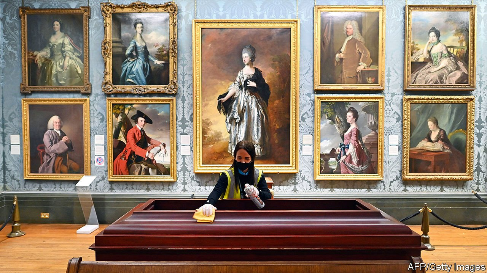

###### The long march

# Boris Johnson’s government wants more patriotic cultural institutions 

##### Grandees are appalled at ministerial interference 

 

> Jun 5th 2021 

DAYS BEFORE he retired at the end of 2015, Neil MacGregor addressed colleagues and friends at the British Museum. As they raised their glasses, he quoted T.S. Eliot: “For last year’s words belong to last year’s language. And next year’s words await another voice.” A few years on, however, the commanding voice in museumland is not his successor as director of the British Museum, nor is it another grandee. It is the government.

In February the chairman of the Royal Museums Greenwich, a devoted Tory, resigned after ministers blocked the reappointment of a trustee, an academic who reportedly advocated “decolonising” the history curriculum and had liked Labour Party content on Twitter. In March a trustee of the Science Museum withdrew her application for a second term after she was asked to “explicitly express support” for the government’s policy on the removal of contentious historical objects. “Today it is contested heritage. Tomorrow it may be another issue,” she wrote.


The interference is part of an effort by ministers to reshape British institutions to the tastes of the new Tory electorate—patriotic and more working-class than before—by shifting power from the country’s cultural elite. After a year in which commercial revenue has crashed, museums are vulnerable to being leant on (even before the covid-19 pandemic, they depended on the state for more than half their income). And Boris Johnson is clear about his preferences. He has lambasted Labour for “spending most of their time wondering which public statues to tear down or whether ‘Hereward the Wake’ should now be known as ‘Hereward the Woke’.”

This desire to reshape cultural institutions is not entirely new. After David Cameron became prime minister in 2010, the Conservative-led government wanted to root out the “Labour luvvies” it felt to have infiltrated the boards of Britain’s cultural institutions under Tony Blair and Gordon Brown. Most trustees serve two terms of four years, which means that almost all existing ones have been approved by a Tory government. Mr Johnson’s government is demonstrating a greater willingness to actually intervene in the process.

Museum leaders have been informed of new expectations. Oliver Dowden, the culture secretary, privately rebuked Mr MacGregor’s successor, Hartwig Fischer, for moving a terracotta bust of the British Museum’s founder, Sir Hans Sloane, from a pedestal to a nearby cabinet. (As well as being an energetic collector, Sloane was a slave owner.) Mr Dowden went on to argue that: “The people who run [heritage organisations] need the courage to stand up to the political fads and noisy movements of the moment.”

He has also written to museum leaders to tell them that they should notify the government of any planned changes or public statements regarding controversial bits of history. Failure to comply could put funding at risk, the letter explained. One former museum director called the move “unprecedented”, saying “in terms of direct engagement of a government with the content of a museum, it marked an extraordinary constitutional step”.

Under the British trustee system, national museums are answerable to Parliament, rather than government ministers (as they are in France, for example). Yet at the first meeting of the newly formed government Heritage Advisory Board, in mid-May, Mr Dowden argued that museums should be bound by guidelines the government is drawing up which say to “retain and explain” controversial objects rather than removing them. The board includes Trevor Phillips, a broadcaster, and Robert Tombs, a Cambridge historian, both of whom have written in defence of controversial statues. It does not contain any museum directors.

European museums are heading in a different direction. On May 18th the Dutch king opened an  examining how the country benefited from slave labour. Germany has agreed to return hundreds of objects that were stolen during the colonisation of Nigeria. Neither would now happen in Britain, a museum director says. The difference does not reflect public opinion. According to YouGov, a pollster, just one in three Britons believe the empire is something of which to be proud, compared with one in two Dutch.

Museum executives see the government’s moves as a breach of their historic independence, which, in the case of the British Museum, is enshrined in a parliamentary act from 1753. Twenty years ago Labour made free entry to museums a key government policy, but interference on questions of governance and programming is new. Insiders see the government’s moves as a breach of the arms-length relationship between museums and ministers that has lasted for decades. For the government to flex its muscles in this way is, a former director reckons, a “clear sign that this is about controlling and neutralising sources of opposition of all sorts.”

Historic opportunities

Along with the Royal Museums Greenwich, the National Gallery will soon start to search for a new chair, following the sudden resignation of Tony Hall on May 22nd after he was revealed to have ineffectively investigated journalistic malpractice at the BBC. Sir Richard Lambert is due to step down as chair of the British Museum next February. Many in the museum world will be watching carefully to see exactly how, rather than whether, the government will try to interfere. ■

