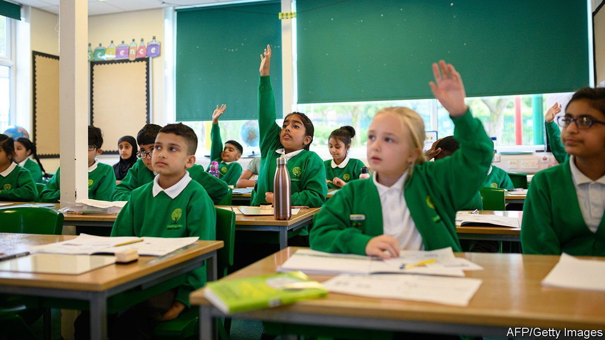

###### An F for effort

# England’s school catch-up tsar resigns in protest 

##### He says the government is failing to pull out the stops 

 

> Jun 5th 2021 

I N FEBRUARY THE government appointed Sir Kevan Collins, a former teacher, council boss and head of an education charity, to advise it on how to help children catch up on learning lost as a result of the covid-19 pandemic. Boris Johnson, the prime minister, said he was “absolutely determined” no child would be held back by the crisis. Just four months later, on June 2nd, Sir Kevan resigned as “education-recovery commissioner” because of a lack of ministerial determination.

He stepped down hours after the government announced details of its plans, which included an additional £1.4bn ($2bn) on top of the £1.7bn already set aside for school catch-up programmes. Most of the new money will boost efforts to provide struggling pupils with tutors. Schools will also be able to use some of it to pay for extra instruction from existing teachers and for staff to go on training courses. The government says its investment will allow England’s pupils to share an additional 100m hours of tutoring over the next three years, mostly bundled into courses lasting 15 hours each.


Although the announcement almost doubles the government’s spending on catch-up, it was nonetheless a shadow of the grand recovery plan that teachers, parents and education wonks had expected. Hopes had been raised by the appointment of Sir Kevan, who is widely respected. On June 1st the Times newspaper reported that he was trying to convince the government to support a package of measures that might cost around £15bn over three years. As well as more tutoring, his proposals reportedly included providing all pupils with an extra 100 hours of schooling a year, an amount equivalent to adding 30 minutes to every school day.

According to the Education Policy Institute (EPI), a think-tank, the latest spending commitment means the government has stumped up around £310 for every schoolchild. By contrast, American lawmakers have provided £1,600 per pupil. The Netherlands has provided £2,500. An official study published in February found primary-school children in England had fallen two-to-three months behind in reading and maths. The EPI guesses that as a result of additional school closures they may now have fallen back another month or so. The think-tank notes that during a typical year the government spends £16bn providing education for four months, roughly the amount Sir Kevan had sought to extract from ministers.

Boris Johnson has denied the government is being miserly. He said that prioritising spending on tutoring is the best way of reaching pupils who most need help, and that more money for schools is “coming down the track”. Gavin Williamson, the secretary of state for education, said the government is still looking into the idea of longer school days and that it would make a decision later in the year. In his letter of resignation, Sir Kevan bemoaned the government’s “incremental approach to recovery”. The longer struggling pupils wait for assistance, the more likely they are to continue falling behind. ■

