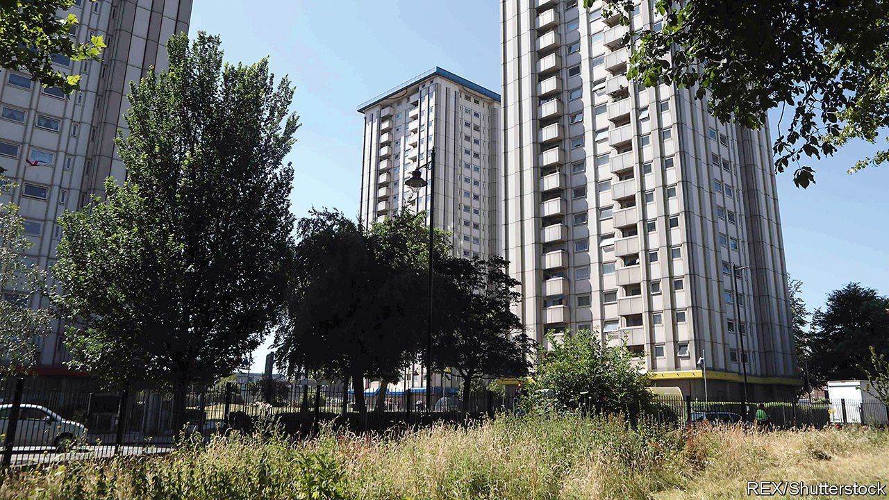

###### Housing

# London is starting to build more council homes 

##### Overcoming NIMBYs and space constraints to do so 

 

> Jun 5th 2021 

TO THE UNTRAINED eye, the small football pitch and bumpy grass mounds between two post-war council flat blocks in Bells Garden estate do not look like much. To Lewis Schaffer, a professional comic from New York who lives nearby, they are the front line in a battle with Southwark council. If the council gets its way three new blocks will soon fill the space. Mr Schaffer sees this as the height of stupidity. “You wouldn’t build on Central Park, would you?”

London’s councils were once big housebuilders, building the majority of new homes in the capital in the 1960s and 1970s. Sadiq Khan, the mayor, wants a return to past glories. He promises 10,000 new council homes by 2023, funded by a £1bn ($1.4bn) investment pot. Things are heading in the right direction. Last year councils started on 3,156 residences, up from 454 in 2015. They are building at their fastest rate since the early 1980s.


To do so, they have to overcome two obstacles. One is a lack of land. Some 85% of the capital is built on and the remaining slivers are mostly parkland or protected by the “green belt”. Thus councils are left with little option other than to slot houses on their own land. The low-hanging fruit is unused bits of existing estates, says Tom Copley, the deputy mayor for housing.

Such an approach requires little demolition of existing homes but NIMBYs, the second obstacle, still object. In Southwark the waiting list for council homes stands at 15,000. Infill developments are proposed on some 28 post-war estates, replacing parks, garages and ballcourts with new flats, as part of plans to build just 11,000 new homes by 2043. But even this is proving heavy going.

These post-war estates were built to satisfy an ambitious new vision of working-class life. Developers bulldozed slums, replacing them with (often prefabricated) “streets in the sky”. Communal gardens meant residents could mingle and relax. Bells Garden might look shabby but its residents’ continued use of communal spaces lives up to these ideals (even if their relaxation comes tinged with a noticeable whiff of cannabis).

Sacrificing such small luxuries has driven protests. In Southwark locals have held rallies, fixed banners to ballcourts and raised funds for legal advice. A plan to build nine flats in Nunhead was shelved in March. Southwark council’s housing chief was forced to resign after he was found to be running an anonymous Twitter account called @SouthwarkYIMBY, which took pleasure in skewering the campaigners.

But not all infill meets opposition. By removing concrete dead space, one project in Islington was able to create gardens for local residents, ensuring their support. Alice Brownfield of Peter Barber Architects pulled off a similar trick in Camden by stitching 15 smart new brick homes into the existing estate. Gardens and extensions do, however, reduce the number of new residences.

In Southwark Mr Schaffer remains hopeful of victory, and in the justness of his cause. “We shouldn’t be made to feel resentful and selfish for caring about our homes,” he says. But Southwark’s rebellions have not deterred other councils from building. On May 19th next-door Lewisham announced plans to build on nine estates. NIMBYs have long had a hold on the capital. It is now loosening. ■

