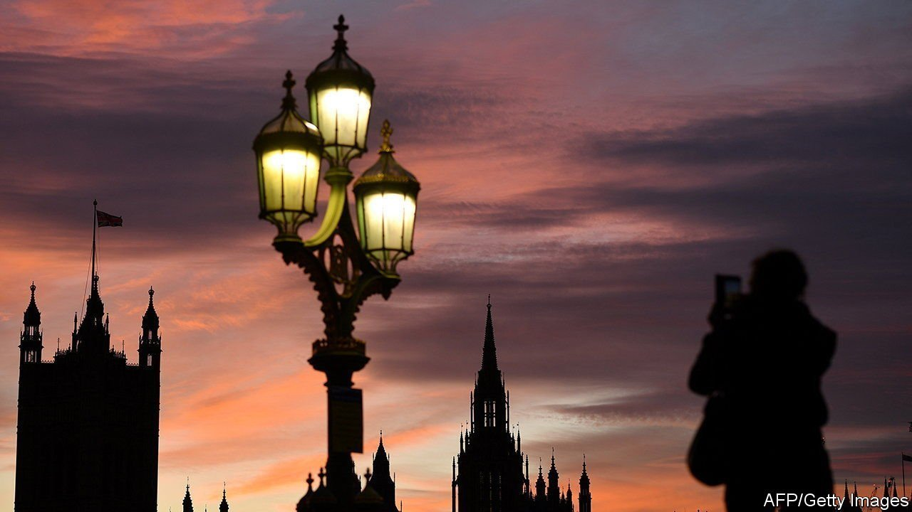

###### Back with a bang

# MPs are returning to Parliament in a rebellious mood 

##### Remote working weakened them and strengthened the executive 

 

> Jun 5th 2021 

“REMOTE DEBATES are absolutely poisonous,” says a Conservative MP. “They need to go as soon as possible.” Almost all parliamentarians acknowledge that covid-19 made remote working necessary—few are keen to see it continue beyond the pandemic.

Parliament is preparing for the return of 650-odd MPs on June 21st. By then it will have been more than a year since they all gathered at the Palace of Westminster, let alone in the House of Commons chamber. Many worry that the “hybrid parliament” has weakened them and bolstered the executive. They are ready to kick back.


Early in the pandemic, MPs voted by app. But this was quickly ditched in favour of proxy voting, concentrating power in the hands of a few individuals, mainly whips who enforce party discipline—something one backbencher terms “an absolute scandal”. While the proxies must cast votes as instructed, the worry is that the system has made newer members more susceptible to pressure.

Chances to register dissent have faded. Parliamentarians may participate remotely in debates, but technological limitations mean there are no interventions (spontaneous questions on topics under discussion, which MPs co-ordinate to put ministers under pressure). The Coronavirus Act allows ministers to make key decisions—such as imposing lockdown—via statutory instrument, rather than using primary legislation. Secondary legislation committees, which examine rules passed this way, do not allow for remote participation.

Informal ways to exercise influence have also disappeared. Catching ministers and whips in corridors to raise concerns is no longer possible. The same goes for bumping into colleagues in the crannies of Parliament, removing a method of identifying common complaints. WhatsApp, more ubiquitous than ever, lacks the same immediacy, and the omnipresent threat of screenshotted conversations leaking to the press reduces candour.

The result is growing discontent. Some MPs complain ministers are growing complacent, as they become used to exercising power with little challenge and riding out scandals wirh covid-19 sucking up oxygen. Government shenanigans over remote proceedings—including not allowing remote debates at all from June to December 2020—has bred resentment. “Jacob Rees-Mogg [the leader of the House of Commons] has had to be dragged kicking and screaming through most changes,” complains one MP.

As parliament returns, this discontent may prove dangerous to the government. In recent decades MPs have grown more rebellious, a trend supercharged by Brexit. So far covid-19, and the sense of emergency it engenders, have shielded the government from seditious parliamentary instincts. Labour support helped the government defeat a backbench rebellion over renewing the Coronavirus Act.

However, this will wane. Boris Johnson has a comfortable majority, but as one rebellious Tory explains: “It’s now so easy to stand up 40 MPs on a controversial subject like planning permission.” The party’s MPs are preparing to defy the government on cuts to foreign aid. Other flashpoints may include extensions to lockdowns, farming and China, where a pre-pandemic rebellion forced a U-turn on giving Huawei 5G access. After a year of taking it easy, whips will have to find form fast. ■

