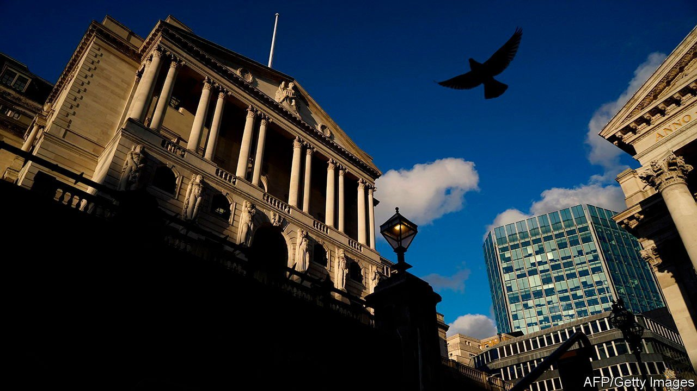
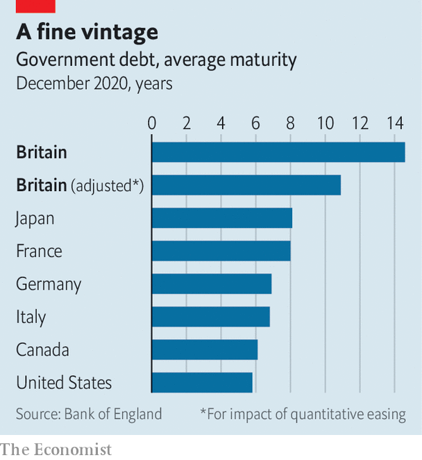

###### Public finances

# Rishi Sunak is worried about rising interest rates. He should relax 

##### British debts are unusually mature 

 

> Jun 5th 2021 

PANDEMICS ARE an expensive business for governments. In the past year the British state’s borrowing came to more than 14% of GDP, the highest figure in over seven decades. All that extra borrowing helped push the ratio of government debt to GDP from around 80% to nearly 100%.

For the moment this is proving less costly than expected. Debt may have risen but interest costs have fallen. In the financial year to March, interest payments amounted to 1.1% of GDP, down from 1.7% the year before. But that could change. Like a homeowner with a large mortgage nervously eyeing an interest-rate calculator, Rishi Sunak, the chancellor, is worried about what will happen if it does.


The Office for Budget Responsibility, a fiscal watchdog, has helpfully done the sums for Mr Sunak. He has taken to peppering his speeches with a warning that if interest rates and inflation were both to rise by one percentage point then the exchequer’s interest bills would increase by £25bn ($35bn), an amount equivalent to the Department for Transport’s annual budget. Underpinning the Treasury’s worry is a fear that quantitative easing has had a paradoxical impact on public finances: helping to contain borrowing costs for now, but increasing the government’s exposure to short-term interest rates.

Since 2009 the Bank of England’s quantitative-easing programme, through which it electronically creates reserves to purchase bonds, has made it a big player in the government-debt markets. In April the bank became the largest holder of British government gilts, with around a third of the outstanding stock now sitting on its balance-sheet.

One advantage of quantitative easing for the government is that debt held by the bank is cheaper to service. It only has to pay the rate of interest charged on reserves at the Bank of England, which is 0.1%, rather than higher rates on the market. But there is a potential downside. Whereas a rise in Bank Rate would once have taken years to feed through to government-borrowing costs, because much of the debt would have been issued when rates were lower, nowadays its impact would be felt straight away.

 


The Treasury should nevertheless relax a little. Over the past decades, and especially since 2010, the Debt Management Office, which issues Britain’s government debt, has worked to lengthen the maturity profile of that borrowing, insulating the government from short-term rate rises. Indeed, Britain has the longest average maturity of any advanced economy. On May 27th Gertjan Vlieghe, a member of the Bank of England’s monetary-policy committee, pointed out that even if one accounts for the impact of quantitative easing by assigning a maturity of zero to all debt held by the bank, Britain still compares favourably with its peers (see chart).

A scenario in which interest rates and inflation rise would see the cost of government borrowing increase. But such a scenario would almost certainly include healthier tax receipts, since rising interest rates normally follow economic growth. All of this means that Britain’s public finances are more sustainable than the usual headline measures suggest. Mr Sunak has no need to panic. ■

