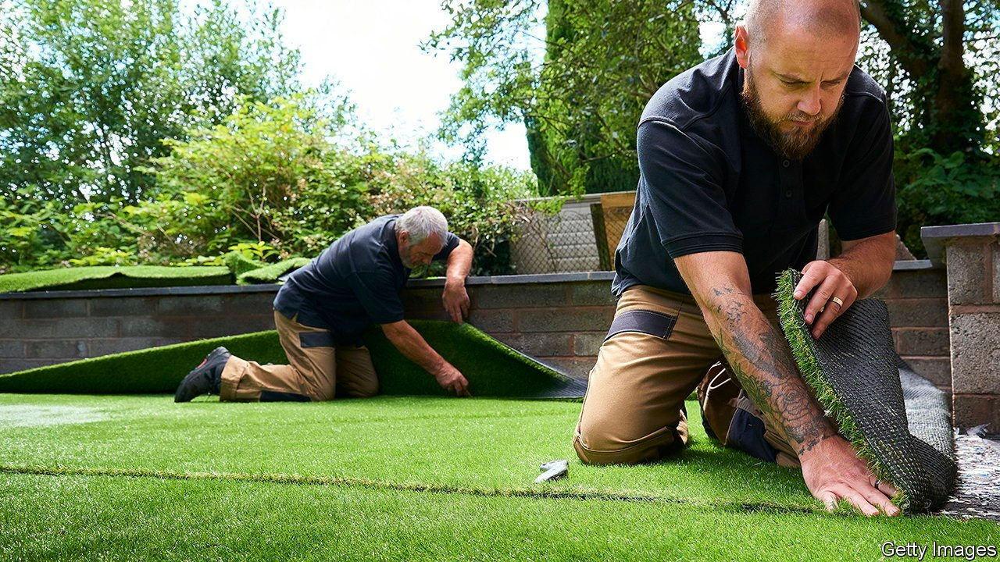

###### Turf wars

# The fight to define the great British garden 

##### Hot-tub lovers battle eco-gardeners 

 

> Jun 5th 2021 

IN GARDENS across Britain the grass has stopped growing. They are not parched or drought-stricken. In fact, they are greener and more immaculate than before. That is because the lawns are actually synthetic substitutes made from thermoplastic polymers.

Britons are fascinated by lawns. Country estates have long competed to have the most perfectly manicured grassland. “What you’re saying in big loud capital letters, is ‘I’m so flipping wealthy’,” says Fiona Davison of the Royal Horticultural Society (RHS). With the advent of the lawnmower in 1830, the middle classes joined the fun.


But now Britons have fallen in love with artificial grass. Evergreens UK, which sells the stuff, says it has seen a 120% rise in sales since 2015. Grass Direct reports they are up by 50% this year. Betap, a Dutch firm, has launched its first British designs. These match different regions: Scottish turf is darker than Cornish turf.

Artificial grass is popular with families who have children or dogs and don’t want mud traipsed through their houses. It has a glamour factor, too. Andy Driver of Evergreens UK says people now see gardens as “outside rooms”—pairing carpets of artificial turf with elaborate decked seating and hot tubs.

Not everyone is a fan. Artificial grasses contain microplastics that ruin soil, impede drainage and risk flooding. A study finds earthworms gain 14% less body weight when operating under crumb rubber, a form of artificial grass. That might not be a problem for its fans, as worm holes are a regular nuisance, but it dismays green types. Extinction Rebellion dug up artificial turf outside a church in Harrogate in protest.

Ms Davison says a rival tribe of wildlife-loving gardeners is blooming, many having caught the bug during covid-19 lockdowns. Jack Wallington, a landscape designer, says they like things less manicured and try “to capture that wild element”. These eco-gardeners are influenced by rewilding projects and are more likely to be environmentalists.

Three petitions have tried to stop artificial grass spreading. The government says regulating what people do in their backyards is wrong. The RHS is concerned about artificial grass, but prefers persuasion to legislation. “Like Mao we say ‘Let a hundred flowers bloom’,” says Ms Davison. The Hundred Flowers Campaign, where Chinese people could openly criticise the Communist Party, preceded an ideological crackdown. Britain’s earthworms may be hoping that the RHS’s vanguardists manage the same.

