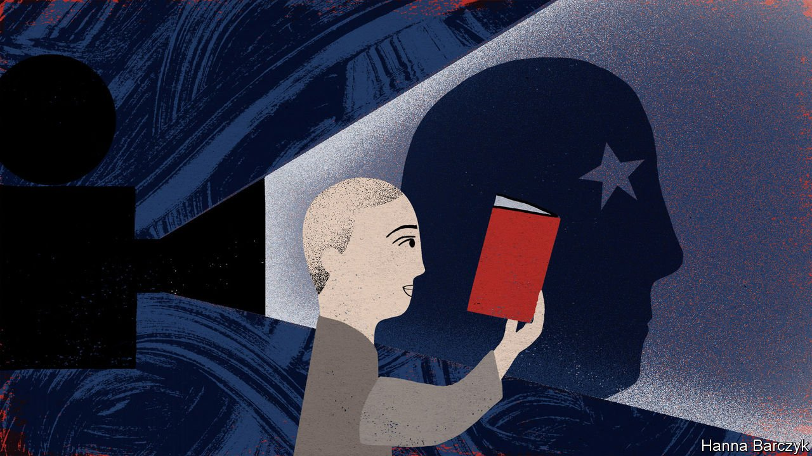

###### Chaguan

# A new children’s film about Zhou Enlai reveals a lot about China today 

##### It is a deeply conservative country, even as it prepares to celebrate its revolution 

 

> Jun 5th 2021 

COUNTRIES HAVE to make revealing choices as they craft patriotic messages for children. To put it kindly, young minds are tiny treasure-houses that deserve to be stocked with only a nation’s most precious beliefs. To be more blunt, small children are easily distracted, so are best taught only a few important things.

It is therefore worth studying what China’s propaganda chiefs have in store for youngsters this summer. As usual, June 1st was marked this year in China as International Children’s Day, a festival of visits to museums, school picnics and wholesome games. A month later there will be a much larger event: celebrations on July 1st of the 100th anniversary of the party’s founding in 1921.


China’s leader, President Xi Jinping, is presented to the young as “Xi Dada”, or “Uncle Xi”, an austere but caring patriarch. Mr Xi stresses the importance of loyalty, which is why children’s choirs are busy performing such songs as “Me and My Country” and “Follow the Leadership of the Communist Party of China”. Party history is being used to inspire the masses. That explains reports of kindergarten pupils being dressed up in miniature combat fatigues and told to crawl on their bellies while clutching straw-wrapped “rations”, to re-enact Red Army supply runs. There is much talk of China entering a “new era” of prosperity, national strength and global influence. It is not hard, as a result, to find children’s drawings on public display, showing high-speed trains and space rockets adorned with Chinese flags. The young are urged to be proud of ancient glories too, as heirs to what they are told is the oldest continuous civilisation on Earth.

This year’s Children’s Day saw the release of a new patriotic film made especially for children. It depicts the pre-teenage life of Zhou Enlai, who was China’s prime minister from 1949 until his death from cancer in 1976. This brilliant, disappointing man is a puzzle for historians. To this day, many Chinese revere Zhou as a moderate who tempered Mao’s worst excesses, especially during the Cultural Revolution of 1966-76. Too often, alas, the record shows Zhou enabling Mao’s follies and failing to defend close allies from political attack. Born in 1898 into a once-grand family of scholar-officials, Zhou was a precocious student of the classics. But his childhood was blighted by the deaths of his mother and adoptive mother and by money woes that, at the age of 12, forced him to leave his birthplace, Huai’an, in the plains between the Yellow and Yangzi rivers, to seek a new life with an uncle in the north.

During the first decades of Communist rule, his privileged class background had to be explained away. A biography published in 1977, “The Early Life of Zhou Enlai” by Hu Hua, depicts Zhou as a “rebel against feudal society”, who as a boy came to hate the gentry class into which he was born. Deepening poverty turned him into a “great proletarian revolutionary”, it relates. That official history manages to praise Zhou’s traditional education while reflecting the party’s then-noisy disdain for pre-Communist codes of ethics, such as those taught by Confucius. Describing Zhou poring over books from his grandfather’s library, Hu asserts that the boy was stirred by histories of “laudable national heroes” fighting foreign invaders, but was uninterested in Confucianism.

Biographies written in the 1990s by historians in the West, including Chae-Jin Lee, Barbara Barnouin and Yu Changgen, take a different view. They find that Zhou had a conventional Confucian education, which marked him for life. Nor do they agree that he was an angry rebel, noting his later, loving praise for his two mothers. Both were educated, tradition-minded daughters of scholar-officials. Indeed, they link Zhou’s survival at Mao’s side to a reverence for Confucian teachings about self-restraint and the need for officials to swallow small insults in the national interest.

The new film appears to agree. Chaguan watched “Zhou Enlai in his Childhood” on Children’s Day in a cinema in Huai’an. The movie does not hide Zhou’s ancestral wealth. It portrays him as a solemn little boy in a silk gown, visiting relatives in antique-filled mansions. Confucian customs are shown as expressions of love. The young Zhou kowtows to his elders and studies cobwebbed texts to make his dying mother proud. His adoptive mother teaches him to swallow an unjust punishment with tales of an ancient general who endured humiliations on his way to greatness.

The film is not fast-paced. There is much fidgeting in the cinema, though children perk up at a brief shot of a boy’s bare bottom, and again when Zhou urges his adoptive mother to drink ink as a medicine. The Zhou family’s struggles to afford a middle-class life are crafted to resonate with older cinema-goers. Zhou’s father, a petty official in another town, is depicted as a migrant worker—largely absent, always fretting about money, and emotionally distant from his own son. The film shows health crises that wreck family finances and trigger rows about whether to spend money on medicine or school fees. Such dilemmas remain common today. The film’s ending unites all ages. Over swelling chords, young Zhou waxes indignant on learning that Russia and Japan have taken territory from the ailing Chinese empire, then declares that he studies hard so that China may rise. That phrase of Zhou’s is taught in schools to this day, and triggers murmurs of recognition.

Nationalism instead of class struggle

After the film, a mother in the audience, Lu Ye, calls it “very educational” to see the orphaned Zhou confront debt-collectors, endure hardships and assume responsibilities beyond his years. Ms Lu’s 12-year-old son, Rongye, says that he “really liked” the film. He praises an episode in which Zhou picked and sold wild vegetables to help repay those debts, until his hands bled. “For the welfare of the family, he didn’t care,” Rongye notes approvingly.

The film-makers say that their aim is to promote education and family harmony. China is a deeply conservative place, even as it prepares to celebrate its revolutionary past. Chinese children, told constantly to be diligent and obedient, sensed that all along. ■

