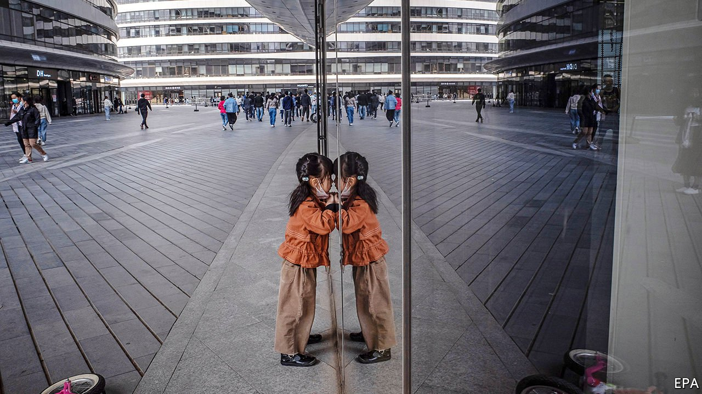
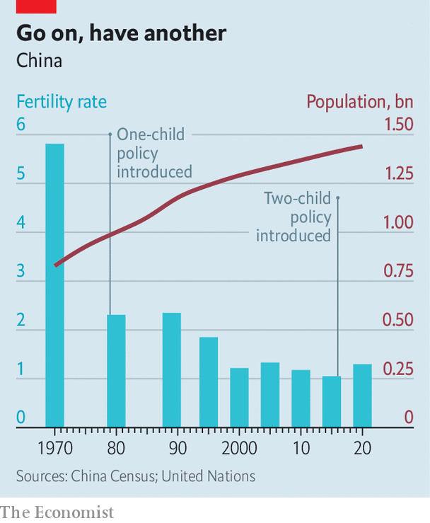

###### A third is the word

# China rapidly shifts from a two-child to a three-child policy 

##### But women’s fertility is still very much the ruling party’s business 

 

> Jun 3rd 2021 

FOR A GENERATION, China’s government had ordained that “one child is enough” for married couples. Then, in 2016, it allowed them to have a second. On May 31st the ruling Politburo declared that a further relaxation of birth-control regulations would help China to achieve its goal of “coping” with a rapidly ageing population—a pressing task. It called for a three-child policy. Some parents will respond with glee, but most will shrug.

The government’s previous fears of galloping population growth now seem quaint. At 1.3, China’s fertility rate (the number of children an average woman is likely to have during her lifetime) is among the lowest in the world. Data from the , released on May 11th, showed that only 12m babies were born last year, a drop of almost 20% from 2019. It was China’s lowest population growth since the 1960s, when the country was reeling from a famine. The population now looks likely to peak in the next few years—almost a decade sooner than experts at the Chinese Academy of Social Sciences had, until recently, predicted.


No indication was given of when the three-child policy will take effect. But it will not end young people’s growing disdain for baby-making. Reactions online—which on many topics tend to side with the Communist Party—brimmed with scepticism. “Do they not yet know that most young people are exhausted just supporting themselves?” said one netizen on Weibo, a Twitter-like site. “This policy is totally out of touch with the people,” wrote another. An online poll by Xinhua, a state news agency, asked whether people would consider having three children. Just 5% of respondents said they would. Most others said it was “out of the question”. At least 31,000 took part in the survey before it was hastily taken down. Netizens gave a new twist to a common idiom, minbuliaosheng, which means “people have no means of livelihood”. They used it to suggest that couples “cannot even speak of giving birth” (the characters are the same).

For parents who do wish to have a third child, the change of policy will be a relief. Illicit births can incur a large fine or, in the case of civil servants, result in dismissal. Some women are put under pressure—illegally—by zealous local officials to undergo abortions if giving birth would cause a quota to be exceeded. With the three-child policy, the government is sending a signal that it is “moving very decisively to a pro-fertility policy”, says James Liang of Peking University. Mr Liang predicts that limits will “very soon” be scrapped altogether.

 


That would be a huge blessing for . But any impact on the overall birth rate is unlikely to be a lasting one. When China loosened its one-child policy, it hoped for a baby boom. After a brief initial uptick, however, births drifted downwards again. The fertility rate edged up slightly (see chart 1). Mr Liang estimates that the three-child policy could boost the fertility rate to about 1.4, still well below the level of 2.1 which is required for a population to replace itself.

Encouraged by decades of indoctrination, Chinese parents often feel—in cities as well as in villages—that a family’s resources are best devoted to one child. The high cost of housing and education, the burden of caring for elderly parents, as well as crushingly long work hours also deter young couples from having more babies, or from reproducing at all. As more women pursue careers, many are delaying marriage and motherhood.

The Politburo said it would provide better child-care facilities, improve state-funded provisions for looking after the elderly, expand maternity benefits and lower the cost of education. It also promised to “protect the rights of women in employment”. It has been doing a poor job of it. In 2019 the government vowed to make more firms comply with existing anti-discrimination laws. These ban employers from asking women about their child-rearing plans in job interviews and from stating a preference for male applicants when recruiting. Offenders can be fined up to 50,000 yuan ($7,800). In practice, they are rarely punished. In a survey released in November by Boss Zhipin, a recruitment website, more than one in three women said that managers had immediately begun looking for someone to replace them permanently after learning they were pregnant. Some firms illegally force female recruits to sign contracts promising not to have children for several years.

An image circulated by Xinhua of a poster promoting the three-child policy features two girls and a boy, probably to suggest that girls are good: a cultural preference for boys has encouraged sex-selective abortions and contributed to a highly unbalanced sex ratio. But some female netizens have noticed an irony. Lu Pin, a feminist who has been living in America since the arrest of fellow campaigners in 2015, wrote that by promoting larger families, the state was, in effect, trying to “exploit the unpaid labour of women”. The government has made no effort to encourage men to spend more time with their children.

The Communist Party is in denial. It does not admit that its coercive efforts have been misguided since the one-child policy was launched in 1979. Most of the fall in the fertility rate has been caused by urbanisation, education and the greater participation of women in the workforce. The same factors have caused similar declines in other countries with no brutally enforced birth quotas.

The party may not want to abolish caps immediately. To do so would be to acknowledge error. It would also make redundant many of the hundreds of thousands of people who work for the fertility-control apparatus. And maintaining a limit could help the party to justify some of its abuses in the far-western region of Xinjiang. Ethnic minorities there, most of whose members are Muslim, once had higher birth quotas. In 2017 the government began a campaign of forced abortions and sterilisations among Uyghurs, even targeting women within their quota. Birth rates in Xinjiang plunged. The party fears a surge of births of people whom it regards as potential troublemakers. ■

A version of this article was published online on May 31st 2021

