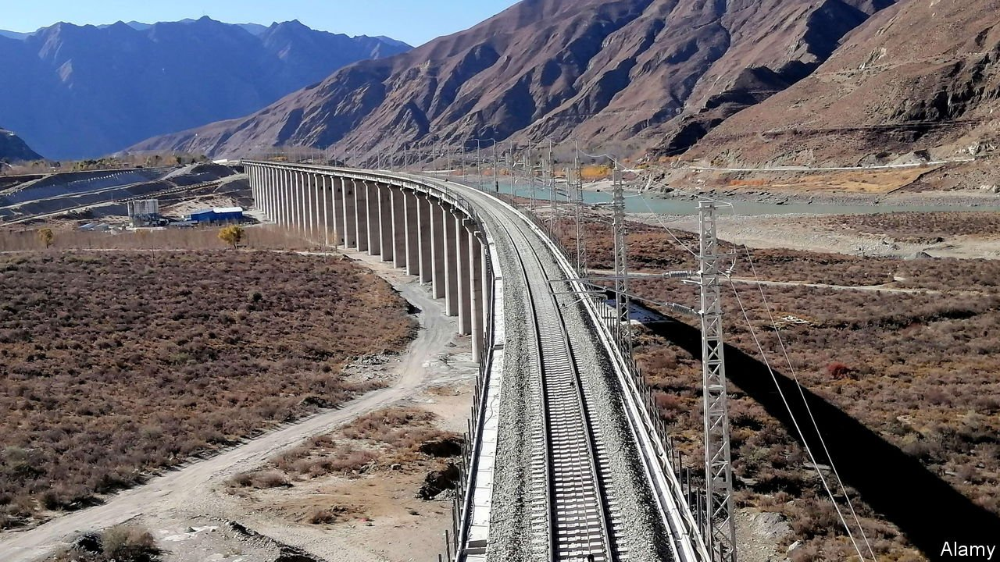
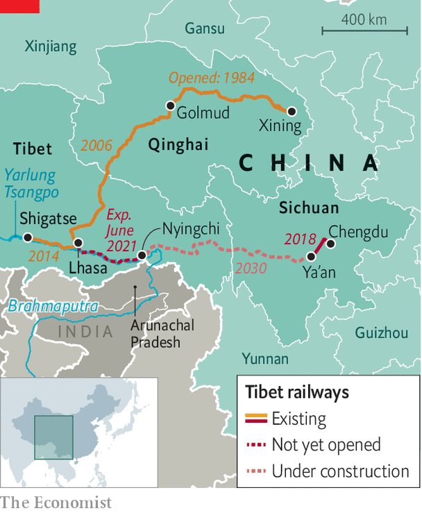

###### Fast track to the throne

# China will soon open a new stretch of rail across Tibet 

##### It is one of the country’s costliest civil-engineering projects 

 

> Jun 5th 2021 

AS BIRTHDAY PRESENTS go, a 435km railway line that is expected to open this month in Tibet will be among the most lavish. To seekers of high-altitude thrills, it is one that will be cherished. The 37bn-yuan ($5.7bn) track extends from the region’s capital Lhasa eastward to the city of Nyingchi, which is Tibetan for “Throne of the Sun”. It is the region’s first electrified railway; its trains will be Tibet’s fastest. Officials call it a gift for the , which will be officially celebrated on July 1st.

But the new line is only part of what China calls the “project of the century”. This involves building Tibet’s second rail link with China’s interior at a total cost that state media say could be about ten times that of the Lhasa-Nyingchi stretch, with even greater engineering challenges yet to come. The section about to open was no pushover. Tunnels comprise nearly half of its length. Workers had to brave landslides, poisonous gas from broken rock, intense cold as well as an oxygen-starved atmosphere at more than 5,000 metres above sea level—roughly the altitude of Mount Everest’s base camps. When completed in 2030, the railway will connect Lhasa with Chengdu, the capital of neighbouring Sichuan province. At a maximum speed of 160kph, the journey will take just 12 hours, a third of the time now required by road.


To the party, it appears no expense is too great in its campaign to integrate the vast, isolated region more closely with the interior. The first rail link, which opened in 2006, was also an engineering feat. Long lengths of that line from Qinghai province had to be laid over permafrost, using high-tech means to prevent temperature fluctuations from damaging the track.

 


The most obvious impact has been on tourism. In 2005 Tibet received fewer than 2m visits by tourists. By 2018 the number had soared to 33m trips (only 0.7% of them by foreigners). The government is aiming for 61m by 2025—about 17 times the number of Tibet’s inhabitants. Some Tibetans worry their culture is being swamped. An influx of Han Chinese migrants, including shopkeepers and others cashing in on the tourism boom, may have fuelled ethnic tensions that caused an explosion of unrest in Lhasa and elsewhere across the Tibet plateau in 2008. Since then the government has clamped down even harder on dissent in the region.

Strategic thinkers in India worry, too. The new railway runs close to the Indian state of Arunachal Pradesh, which Chinese officials sometimes refer to as “south Tibet” and claim as Chinese territory. China’s army swept into it during a brief but bloody border war in 1962, before pulling back again. India is annoyed enough by China’s other big infrastructure project in the area: the damming of the Yarlung Tsangpo river (as it calls the upper reaches of the Brahmaputra), which the new railway crosses 16 times. It accuses China of threatening India’s water security. There is little India can do. China is telling it “you are not in my league,” says Ashok Swain of Uppsala University. The trains will keep on running regardless of any complaints. ■

