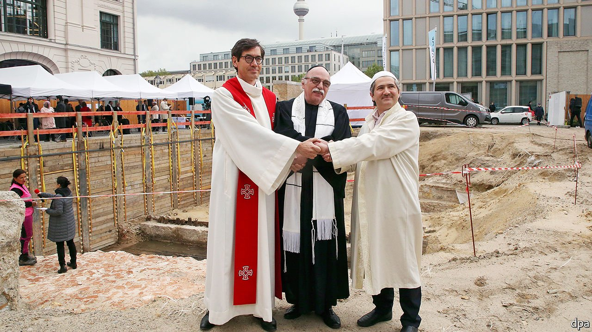

###### One roof, three faiths

# A Christian, a Jew and a Muslim walk into the same house of worship... 

##### Berlin’s new House of One seeks to cater for them all 

 

> Jun 5th 2021 

IT IS USUALLY bad news when multiple religions claim the same place of worship. It can lead to conflict, as illustrated by the recent violence at Jerusalem’s holiest site. Or it can be a sign that flocks are dwindling, forcing congregations to share space. But Berlin’s House of One intentionally puts a church, mosque and synagogue under a single roof.

The cornerstone of the €47m ($57m) place of worship was laid last week near Alexanderplatz. In four years’ time, it will be a structure housing three separate prayer rooms and a 46m-high domed hall for the faiths to mix. “We are building the House to make a statement,” says Rabbi Andreas Nachama, one of the project’s leaders.


The idea has been in the works for a decade, since local leaders from the three Abrahamic religions came together to think up a plan for a religiously significant spot: the former site of one of Berlin’s oldest churches.

An interfaith project made more sense than another church, says Father Gregor Hohberg, a Protestant pastor whose congregation once worshipped at the site. “In Berlin we have a lot of very wonderful churches,” he points out. “And all of these churches are not full of people on Sunday mornings.” Berlin, after all, is better known for sex clubs and party drugs than piety. Still, another 120 people have already joined Father Hohberg’s congregation, years in advance. Supporters can also sponsor bricks for €10 each.

An ecumenical mega-sanctuary comes with disagreements. In the synagogue, Orthodox Jews insisted on separate seating for men and women. In the church, the big debate was whether the altar should face east or west.

Even before the doors have opened, the House of One is yielding revelations. Archaeologists have discovered around 4,000 skeletons at the site, dating back to the middle of the 12th century, suggesting Berlin is a century older than previously thought.

