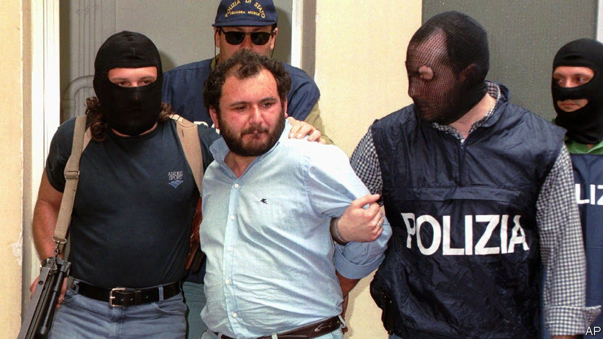

###### The price of success

# A law to break the Mafia’s code of silence lets a killer go free 

##### Giovanni Brusca served only 25 years for multiple murders 

 

> Jun 5th 2021 

SHORTLY AFTER nine o’clock on a Monday night, Giovanni Brusca, his brother, their wives and children had abruptly to abandon their roast-chicken dinner. Armed, masked police burst into their rented villa and arrested both men.

That was in 1996. On May 31st Mr Brusca left prison in Rome, a free man after serving 25 years of a 30-year sentence imposed for, among many murders, that in 1992 of Italy’s most renowned anti-Mafia prosecutor, Giovanni Falcone. Few recent events have stirred greater revulsion than the release of this former Mafia boss, nicknamed u Verru, (the Pig) in Sicilian. “This is not the justice Italy deserves,” railed Matteo Salvini, the leader of the populist Northern League.


The emotional reaction was surely understandable. Mr Brusca was a leading associate of the late capo dei capi, the boss of bosses—namely the psychopathic Salvatore “Totò’” Riina. In the early 1990s Riina launched a terrorist campaign against the Italian state that involved lethal bombings in several mainland cities, the assassination of Falcone and the later killing of Falcone’s colleague, Paolo Borsellino. It was Mr Brusca who detonated the bomb that killed Falcone, his wife and bodyguards. And when one of the other members of the hit squad, Santino Di Matteo, was arrested and turned state’s evidence, it was Mr Brusca who conspired to silence him by kidnapping his 12-year-old son. After holding him captive for more than two years, he had the boy strangled and his body dissolved in acid.

Ironically, Mr Brusca himself turned state’s evidence after his own arrest. After initially misleading interrogators, he began giving them valuable intelligence on the Sicilian Mafia, better known as Cosa Nostra. His co-operation let him escape a life sentence because of a law sponsored, just as ironically, by Falcone. That law has helped police and prosecutors turn several other top Mafiosi and helped steadily to weaken the Mafia over the past 25 years. Cosa Nostra is now less powerful than either the Calabrian ’Ndrangheta or the Neapolitan Camorra.

Falcone’s sister, Maria, has said she is saddened by Mr Brusca’s release. But, she added, “That is the law—and a law that my brother wanted—so it must be respected.” Her brother, one suspects, would have been proud of her. ■

