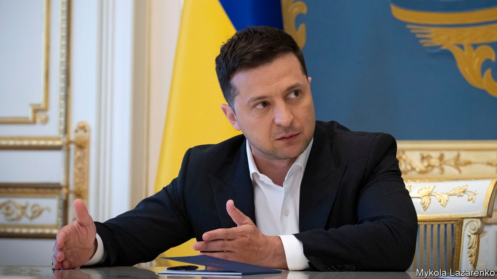

###### A celebrity with power

# An interview with Ukraine’s president, Volodymyr Zelensky 

##### The former comedian is clobbering oligarchs but ducking serious reform 

 

> Jun 5th 2021 

“I STILL DON’T feel comfortable here,” says Volodymyr Zelensky, the president of Ukraine, as he walks briskly into an opulent presidential meeting room. A former comedian in a hit TV series, “Servant of the People”, that tells the story of a humble schoolteacher who accidentally becomes president, he is still, it seems, more used to a studio than a palace.

But two years ago his chutzpah, and the failures of his predecessors, won him nearly 75% of the vote in the runoff round of a presidential election. In a country where politics has long been dominated by oligarchs and treated as a means for personal gain, the victory of a man whose only asset was his popularity seemed a miracle. “People saw a Cinderella story and identified themselves with the life behind the screen,” Mr Zelensky tells The Economist.


He promised to overhaul the political system. “I have been impetuous in my drive for change, but I am not the kind of person who starts off with an exit strategy,” he says. For all his good intentions, however, he came into office lacking political experience or even a coherent plan. His presidency has been eventful, but reform has been slow and the results are mixed.

On the positive side, worries that Mr Zelensky would be manipulated by oligarchs such as Ihor Kolomoisky, who financed the TV channel on which Mr Zelensky appeared, and who is under investigation in America, have not been borne out. Neither have the fears that Mr Zelensky would be pushed around by Russia. He has stuck to his red lines when negotiating over the future of Donbas, the south-eastern region of Ukraine that was plunged into war in 2014 by Russia-backed separatists; and he held his nerve when Moscow massed troops on his border a few weeks ago.

He showed guts when he took on Viktor Medvedchuk, a powerful oligarch and a friend of Mr Putin. Mr Medvedchuk, whose TV channels peddled pro-Kremlin propaganda while the pipeline he controlled pumped Russian diesel into Ukraine, is now under house arrest, charged with treason. His TV channels have been shut down and his assets have been frozen. (Mr Medvedchuk, who also leads the most popular opposition party, denies any wrongdoing.) Vladimir Putin, who is said to be a godfather to Mr Medvedchuk’s daughter, has promised to respond “promptly and properly” to the arrest.

On the other hand…

Yet although the worst expectations of Mr Zelensky have not come to pass, nor have the hopes that he would bring in a effective team of reformers. Although Mr Zelensky’s government has pushed through a law establishing a market in farmland, the country’s justice system remains unreformed and the rule of law is as patchy as ever. Marking the second anniversary of the president’s inauguration, Novoe Vremya, a weekly, summed up the sentiment in a headline: “Not as bad as we thought…but still quite bad.”

Having fired an opening shot against Mr Medvedchuk, Mr Zelensky has now pitched a new anti-oligarch law. He wants to create a legal definition: that an oligarch is someone who controls a big business, finances a political party and controls significant media channels. He wants to create a register of oligarchs that will, he hopes, make them toxic to investors and drive down the value of their assets if they refuse to change their ways.

Most Ukrainians would agree that their country’s oligarchs are too powerful. They have typically used their wealth to capture the state, arranging deals involving the country’s resources that benefit them not the taxpayer. However, Mr Zelensky’s critics worry that he is simply trying to clobber individual tycoons into submission and grab their media assets, rather than opening up the economy to genuine competition. A leaked draft of the new law suggests it will not grant greater powers to the anti-monopoly body or require oligarchs to reduce their market dominance. Yet it bars anyone worth more than $80m from owning media assets. Meanwhile, he says, the state needs its own TV channel.

Mr Zelensky has no obvious rivals for now, and seems to like it that way; he is, some say, driven more by vanity than by greed. He is trying to knock out another celebrity-turned-politician: Vitaly Klitschko, a former world heavyweight boxing champion who is now the elected mayor of Kyiv. Mr Zelensky has accused his office of corruption and dispatched law enforcers to conduct dozens of searches. Mr Klitschko says he is still on his feet. “I am an independent political player with a success record. I am building up my party ahead of the next parliamentary elections,” he says.

Some of Mr Zelensky’s critics detect a whiff of authoritarianism in his actions. Yet Ukraine is not Russia, and attempts to grab too much power there rarely succeed. Faced with a threat, Ukraine’s oligarchs may work together to ensure that Mr Zelensky never gets comfortable in the presidential office. But that is not necessarily good news for a country that desperately needs reform.

Mr Zelensky has turned his presidency into a quest: he has broken into a closed political system and stuck up for ordinary people. They have cheered him on. His attack on the oligarchs is popular, as is his defiance of Russia and his government’s big investment in new roads. He is still, by far, the most trusted politician in Ukraine: 30% say they would vote for him today, the same number that did in the first round of voting two years ago. With the summer coming, despite covid-19 and the continuing war in the east, there is a feel-good atmo sphere in Kyiv. “People are still in love with Zelensky—or rather with his character,” says Yulia Mostovaya, the editor of Zerkalo Nedeli, an online newspaper. ■

