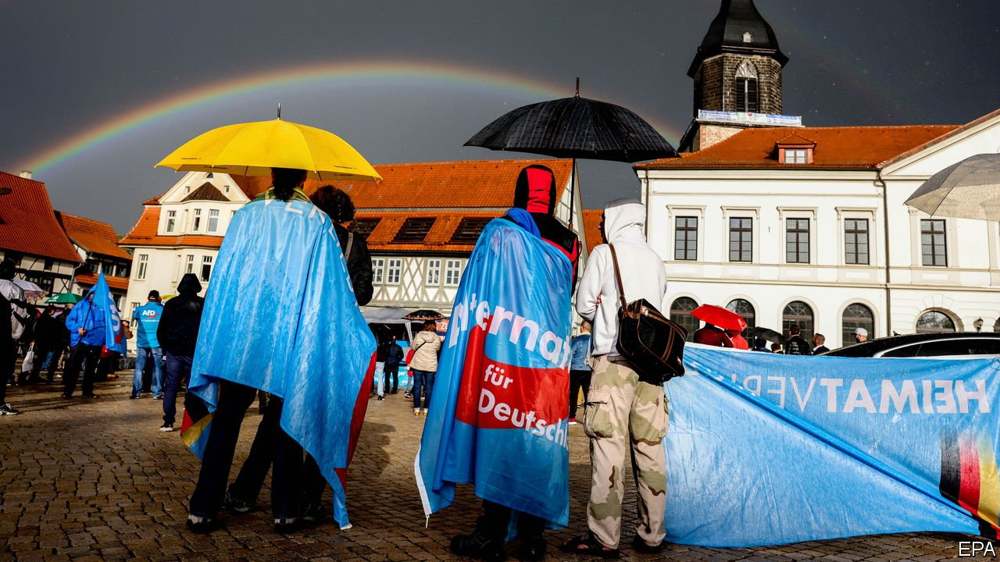
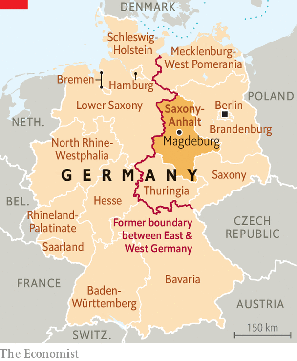

###### No Alternative

# Germany’s Christian Democrats struggle against populists in the east 

##### The Alternative for Germany will run them close in Saxony-Anhalt’s election 

 

> Jun 5th 2021 

THE SMALL east German state of Saxony-Anhalt is run by a so-called “Kenya” coalition, comprising three parties whose colours match that country’s flag: the conservative Christian Democrats (CDU), the Social Democrats and the Greens. But so bad is the infighting it should be named after the similar hues of Afghanistan’s flag, chuckles Oliver Kirchner, local head of the hard-right Alternative for Germany (AfD).

He should know. Five years ago the AfD—an extremist outfit shunned by all other parties—won a quarter of the vote, forcing the Kenya trio into their ill-matched arrangement. The AfD’s enduring support could oblige them to keep it going after Saxony-Anhalt’s election on June 6th.


Parts of this state offer a grimly familiar east German tale of deindustrialisation, depopulation and resentment of know-it-all Wessis (westerners). The AfD’s strength in such places gives the CDU, which leads the federal government, a persistent headache. The weird coalitions it dictates are bad enough: Saxony-Anhalt’s government has often teetered on the verge of breakdown. In Brandenburg and Saxony the AfD’s muscle has forced the CDU into similar awkward contraptions.

 


But many in the CDU, in Saxony-Anhalt and other eastern states, also bitterly resent the cordon sanitaire their leaders have erected around the AfD. Perhaps a third of the CDU’s MPs in Saxony-Anhalt would prefer to work with the populists, reckons Wolfgang Renzsch, professor emeritus at the University of Magdeburg. Many regularly flirt with AfD policies, most recently in December during a row over TV-licence fees that nearly toppled the government. (That episode, like others before it, was defused by Reiner Haseloff, the wily CDU premier.) Concerned CDU members have circulated a letter to colleagues urging them to hold the line against the AfD.

Eastern states are small, but their dramas still resonate. Last year in Thuringia the local arm of the CDU backed a premier also supported by the AfD. The furore finished off Annegret Kramp-Karrenbauer, at the time the CDU’s national leader and Angela Merkel’s heir apparent. Her successor, Armin Laschet, takes a robust stance against the AfD. This message is likely to carry Mr Haseloff to a narrow victory over the AfD, giving Mr Laschet a tailwind for September’s federal election. Yet he faces a dilemma: the CDU’s main rival in the west is the Green party, but in the east it is the AfD. This pair are poles apart. CDU wallahs admit that this makes it hard to find a consistent national message.

One idea is simply to write off a chunk of the eastern vote. Last week Marco Wanderwitz, the government’s commissioner for eastern Germany, revived an old debate by claiming that some of the electorate there had been “socialised by dictatorship” and did not understand democracy. Other parties, he said, should leave them to the AfD and await a new generation.

Yet 30 years after German reunification, the AfD’s strength suggests it cannot just be waited out. In the east it is more popular among younger voters than older ones. And it always manages to find a popular theme, sighs Sven Schulze, the CDU’s chair in Saxony-Anhalt: ten years ago it was the euro; five years ago refugees; now covid-19. (Mr Kirchner has vowed to launch investigations into what he argues was an excessive lockdown.) The CDU leadership is determined to lock out the AfD. But it still has no remedy for its eastern headache. ■

