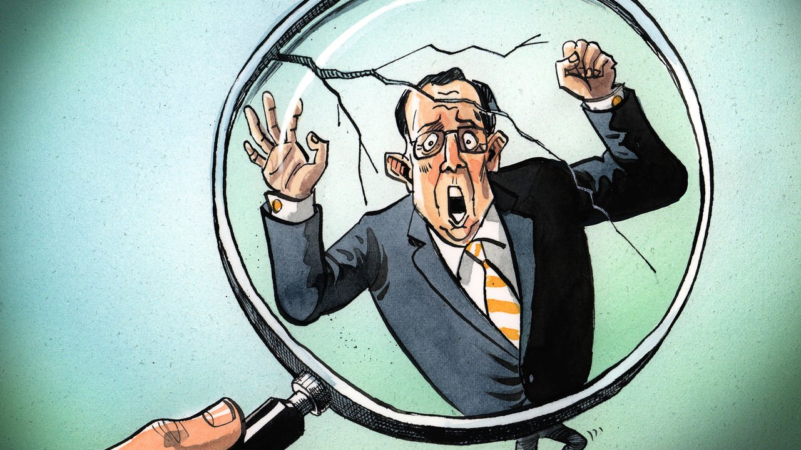

###### Charlemagne

# The era of small-state privilege in Europe is coming to an end 

##### Luxembourg and Malta still have vetoes, but power is shifting to big states 

 

> Jun 5th 2021 

“O NE PERSON, one vote” is a good principle. The ratio in the European Union is a bit more complex: “One Luxembourger, or nine Germans, one vote.” Germany has one MEP for every 860,000 citizens. By contrast Luxembourg—a country roughly the size of Düsseldorf—has one per 100,000.

A disproportionate parliamentary weighting is one of many perks enjoyed by the EU’s gang of small states. Three-quarters of the bloc’s population live in just seven countries; the remainder is spread over the other 20. For them, membership is a sweet deal. Their politicians can wangle top jobs, usually as compromise candidates. A common currency gives smaller European economies a say in monetary matters, rather than being thrown around like a ragdoll by the Bundesbank, as they were before the euro. When it comes to topics such as tax, foreign policy, or changing the EU’s treaties, they wield vetoes. This means Malta (population: 500,000) can have as much say as Italy (population: 60m) when shaping a club of 450m. The EU acts as a geopolitical magnifying glass, making small countries appear much larger.


Within the EU, small states can, for once, shape history rather than be victims of it. In times of crisis, leaders used to running a country with a GDP equivalent to the turnover of a middling S&amp; P 500 company sit round the table with Angela Merkel and Emmanuel Macron, ostensibly as equals. It is little wonder that at their first such meeting, some leaders have the giddy demeanour of a weekend footballer meeting Cristiano Ronaldo. For big countries, the EU is about clinging on to the remains of their former clout; for small ones, the EU has made them more powerful than they could ever have dreamed.

Alas, for the EU’s army of tiddlers, this golden era of tiny but mighty states is drawing to a close. Take tax, an area where small countries have long enjoyed their own exorbitant privilege. In a bloc where capital can flow freely, imposing lighter taxes than a near neighbour is a lucrative trick. Ireland and Luxembourg transformed themselves from nations of farmers and steelmakers respectively into two of the richest countries on the planet by undercutting larger neighbours on tax. Capital flooded in, along with complaints from next door. Since the EU can legislate on tax only by unanimity, there was little the bloc could do. It asked them nicely to change. They said no.

Times, however, are changing. Joe Biden, America’s president, has launched a crackdown on companies that book improbable shares of their profits in low-tax jurisdictions, promising to whack punitive taxes on them. Ireland, which has a 12.5% corporate-tax rate, is sweating. With America leading the way, other big countries are set to sign up to the scheme. There is not much Ireland and friends can do to stop it. The commission, meanwhile, is still eyeing innovative ways of bypassing a country’s veto when it comes to tax, making ingenious but legally questionable use of provisions in the EU’s treaties. However it is done, the main perk of the small-country club is on the way out.

Citizenship, like tax, is another fundamental right of states. Who but the Maltese government ought to decide who is Maltese? Malta and Cyprus have used this power to make easy money, hawking the right to live and work in the EU to anyone willing to spend a few million euros on government bonds or an expensive flat overlooking the Mediterranean. But when a national passport also confers citizenship of the EU, it becomes every member’s business, some feel. The commission is taking steps to crack down on the practice. Another small-country privilege—to dish out passports however they see fit—is disappearing.

A passport from a small country was once a shortcut to high office in the EU. In European politics, the scale of the job used to be inverse to the size of their home country. People were happier to be bossed around by a Portuguese or a Luxembourger, rather than someone from France or Germany. (Luxembourg has produced as many commission presidents as France and Germany combined.) Things are moving on. Germany, in particular, is now more comfortable laying claim to big jobs. Ursula von der Leyen was the first German to lead the European Commission since the 1960s. The European Central Bank, the institution which has done most to keep the euro together, has been led by bigger countries since its inception. Big countries want their people in senior posts.

If anything symbolises the outsized power of small countries, it is the veto. On certain topics, a solitary “no” can still derail plans. But patience with this arrangement is wearing thin. Hungary, in particular, has adopted an obstructive instead of merely bombastic approach to Brussels. Rather than noisily railing against the EU while quietly going along with it, the country has made a virtue of blocking foreign-policy moves on such things as human rights in China. Yet whenever a sovereigntist like Viktor Orban wields a veto, the EU’s federalists begin to cheer, arguing that he is making their case for them. An EU that relies more on qualified-majority voting is grinding forwards.

The small-country conundrum

One unspoken consequence of the EU becoming more democratic is that its small states must become less powerful. While national governments still hold sway in the EU, they create an imbalance. The EU was founded to rein in the excesses of big European powers, not to replace them with the (admittedly less bloody) excesses of their smaller peers. A bloc where some citizens have more say than others is not a healthy one. True, other continental-sized polities struggle with this question. In America, South Dakota has the same number of senators as California. But that is no excuse to copy their mistakes. Europe’s small countries should not fear losing clout. Until now they maintained their individual power as part of a weaker whole. In the future, they will play a smaller role in a stronger bloc. It is a different deal, but still sweet. ■

