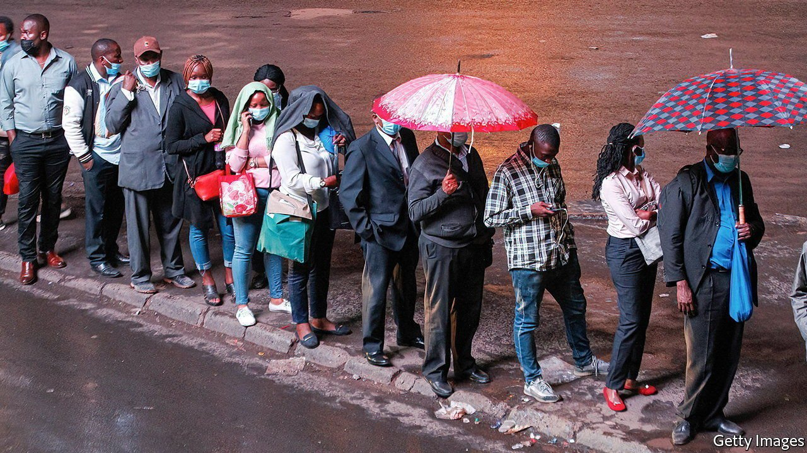
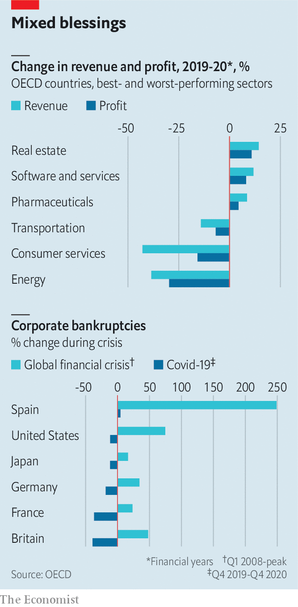

###### Divergence, big time

# Covid’s unequal effect on companies 

##### The winners and losers, according to the OECD 

 

> Jun 5th 2021 

 


IN ITS LATEST Economic Outlook, the OECD argues that economies are likely to diverge, as some (America and China) recover from the pandemic faster than others (many poor countries). Covid-19 has also struck different sectors differently: tech and pharmaceutical firms prospered; transport and energy firms suffered. Despite such disparities governments’ policies successfully put the economy into “hibernation”: in many places there were fewer bankruptcies in the final quarter of 2020 than in 2019. The trickiness now is in judging when activity is strong enough for support to be withdrawn.

Dig deeper

All our stories relating to the pandemic and the vaccines can be found on our . You can also listen to , our podcast on the race between injections and infections, and find trackers showing ,  and the virus’s spread across  and .

